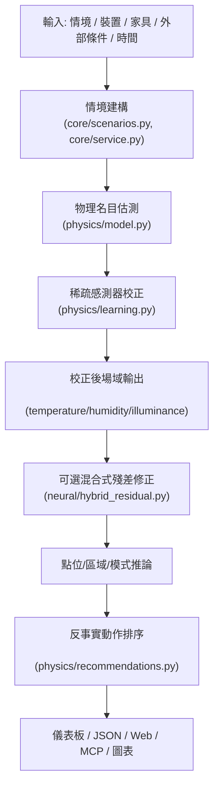
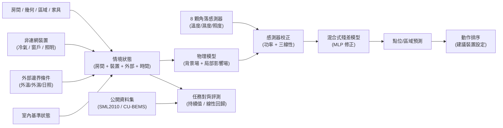

# Three-Factor Digital Twin 專案導覽（OPEN_SPEC）

> 正式、可驗證的研究 OpenSpec 已建立在 [`openspec/`](openspec/README.md)。
> `openspec/specs/` 是目前研究與系統行為的契約，
> `openspec/changes/` 用於後續方法、實驗、指標與主張變更。
> 本檔保留為快速專案地圖，不再作為規格唯一來源。

## 目的

本檔案為專案導覽，供每次代理程式啟動時快速掌握整體架構、資料來源、處理鏈、執行方式與知識關係。正式需求、驗收情境、研究證據邊界與變更流程以 `openspec/` 為準。

目標是讓代理程式與開發者能快速理解：
- 這個專案的研究目標與系統邊界
- 主要資料集與資料流
- 主要程式模組與服務層次
- 可執行腳本、編譯/建置方式
- 知識圖譜式的關係網絡

---

## 1. 專案概覽

專案名稱：`mcp-single-room-spatial-digital-twin`

核心研究問題：在單房間內，僅用稀疏角落感測器、非連網設備（冷氣、窗戶、照明）狀態，以及外部邊界條件，估計室內三因子空間場：
- 溫度 `temperature`
- 濕度 `humidity`
- 照度 `illuminance`

系統主張：

- 先用可解釋的物理模型作為主估計
- 再利用稀疏感測器進行校正
- 最後以混合式殘差神經網路做結構性殘差修正
- 並提供多種存取介面：命令列 / 腳本 / Web 展示 / MCP / Gemma 橋接

---

## 2. 目錄與模組層次

### 2.1 主要程式碼模組

- `digital_twin/core/`
  - `entities.py`：場景、房間、感測器、設備、家具、區域資料結構
  - `scenarios.py`：標準情境、窗戶矩陣、真實房間情境建立
  - `service.py`：情境建構、模型執行、輸出整合
  - `demo.py`：示範流程編排與例程呼叫
  - `public_dataset_alignment.py`：公開資料集正規化
  - `public_dataset_benchmark.py`：公開資料基線評測
  - `public_dataset_model_comparison.py`：公開資料集模型比較

- `digital_twin/physics/`
  - `model.py`：背景場 + 局部影響場模型、裝置影響、校正流程
  - `learning.py`：影響學習、功率校正、三線性殘差修正
  - `baselines.py`：IDW 基線、持續值與線性回歸基線
  - `recommendations.py`：反事實動作排序與建議

- `digital_twin/neural/`
  - `hybrid_residual.py`：混合式殘差資料集、MLP 殘差修正模型、訓練與推論

- `digital_twin/mcp/`
  - `mcp_server.py`：MCP 伺服器主流程、工具定義、資料結構
  - `gemma_bridge.py`：Gemma/Ollama 與本專案橋接

- `digital_twin/web/`
  - `web_demo.py`：本地 Web 展示伺服器與 API
  - `render.py`：SVG / JSON / CSV 圖表渲染、前端資料格式

- `scripts/`
  - `run_demo.py`：完整示範流程
  - `run_window_matrix.py`：48 組窗戶時段/天氣/季節矩陣
  - `run_hybrid_residual_experiment.py`：混合式殘差模型訓練與評估
  - `run_public_dataset_benchmark.py`：公開資料集任務對齊基線評測
  - `run_public_dataset_model_comparison.py`：公開資料集一對一模型比較
  - `run_oh2024_inspired_comparison.py`：Oh et al. (2024) 啟發的 additive residual 方法移植比較
  - `run_next_day_temperature_comparison.py`：次日溫度 seasonal-delta、validation selection 與 adaptive exploratory comparison
  - `normalize_public_benchmark_data.py`：公開資料正規化
  - `build_architecture_diagrams.py`：產生架構圖 SVG
  - `build_thesis_docx.py` / `build_thesis_pdf.py`：中文論文輸出
  - `build_thesis_pptx.py`：簡報投影片產生
  - `run_mcp_server.py`：啟動本地 MCP 伺服器
  - `run_web_demo.py`：啟動 Web 展示
  - `verify_thesis_results.py`：論文結果驗證流程

- `docs/`
  - `thesis/`：中文論文草稿、系統架構、訓練路線、實驗結果
  - `models/`：模型說明、參考模型、混合式殘差模型說明
  - `mcp/`：MCP 與 Gemma bridge 文件
  - `web/`：Web 展示使用說明
  - `experiments/`：實驗計劃、評測與結果說明
  - `templates/`：房間設計與訓練資料模板

### 2.2 檔案分類規則（A-H）

為了讓 agent 與開發者能快速定位檔案，本專案採用以下分類規則：

- A 類：專案根目錄與設定檔（規範、說明、建置設定）。
- B 類：核心程式碼（`digital_twin/`）。
- C 類：研究文件（`docs/`）。
- D 類：執行輸出與資料產物（`outputs/`）。
- E 類：自動化腳本（`scripts/`）。
- F 類：測試程式（`tests/`）。
- G 類：隱藏目錄與開發工具設定（`.github/`、`.vscode/`、`.roo/` 等）。
- H 類：快取與中繼檔（`__pycache__/`、`.pytest_cache/`、`.DS_Store`、`*.pyc`、`*.aux`、`*.log` 等）。

補充分類原則（處理原先未細分或容易重疊項）：

- C-文件中繼檔：位於 `docs/` 下的編譯中繼與暫存（如 `docs/papers/ieee/*.aux`、`*.log`、`*.bbl`、`*.blg`，以及 `.ql_tmp`）邏輯上視為 H 類。
- D-交付輸出：`outputs/papers/` 為可交付成品（`docx`、`pdf`、`pptx`），與 `outputs/data/` 的資料輸出分開管理。
- D-圖像輸出：`outputs/figures/` 為視覺化輸出，與資料表格或 JSON 報告分開追蹤。
- G/H 重疊處理：`.pytest_cache/` 優先歸 H 類；G 類保留為開發工具設定。
- B/H 重疊處理：`digital_twin/**/__pycache__/` 與 `*.pyc` 優先歸 H 類，不算核心程式碼。

完整檔案清單與分類結果請參考：

- `docs/thesis/project_file_classification_zh.md`

---

## 3. 主要資料集與來源

### 3.1 自製模擬評測資料

- 位置：`outputs/data/`
- 內容：包含受控標準情境、48 組窗戶矩陣、完整 dense field 重建結果
- 用途：主要用於全場域重建、模型元件驗證、可解釋物理結構測試

### 3.2 真實房間稀疏校正

- 位置：`outputs/data/bedroom_01_weekly/`
- 來源：`bedroom_01` 真實快照資料
- 內容：8 顆角落感測器、裝置狀態、外部環境、枕頭位置參考點
- 用途：驗證稀疏校正流程能否改善未參與校正位置的預測

### 3.3 公開資料集任務對齊評測

- 主要資料集：SML2010、CU-BEMS
- raw 資料存放：`outputs/data/raw_public/`
- 正規化中介格式：`outputs/data/normalized_public/`
- 評測輸出：`outputs/data/public_benchmarks/`

用途說明：

- 只做「任務對齊評測」，不當作完整 3D 稠密場真值
- 主要比較持續值、線性回歸與 hybrid twin readout
- 強調資料支援任務層級，而非本研究完整情境層級

### 3.4 模板與房間設計格式

- `docs/templates/room_design_template.json`
- `docs/templates/room_design_standard_room_example.json`
- `docs/requirements/room_design_format_requirements_zh.md`

---

## 4. 整體處理鏈

### 4.1 核心資料流



### 4.2 訓練與評測流程

- 原始資料：角落感測器時序、裝置事件、外部環境、情境描述
- 時間對齊與情境整併
- 物理名目模型模擬
- 稀疏校正：功率校正 + 三線性殘差修正
- 影響學習：前後差值最小平方學習
- 混合式殘差訓練：殘差特徵 + MLP
- 公開資料集：正規化 → 評測 → 模型比較

### 4.3 服務與介面層

- 命令列 / 腳本：`scripts/run_demo.py`、`scripts/run_window_matrix.py`、`scripts/run_hybrid_residual_experiment.py`
- Web UI：`digital_twin/web/web_demo.py`
- MCP：`digital_twin/mcp/mcp_server.py` + `scripts/run_mcp_server.py`
- Gemma/Ollama：`digital_twin/mcp/gemma_bridge.py`

---

## 5. 程式執行與建置方式

### 5.1 Python 執行環境

- Python 3.9+
- 本專案採用 `pyproject.toml` 描述專案中繼資訊
- 無獨立 C/C++ 編譯步驟，主要依賴 Python 腳本執行

### 5.2 常用執行命令

```bash
python3 scripts/run_demo.py
python3 scripts/run_window_matrix.py
python3 scripts/run_hybrid_residual_experiment.py
python3 scripts/run_mcp_server.py
python3 scripts/run_web_demo.py
python3 scripts/run_public_dataset_benchmark.py --dataset cu-bems --horizons 15,60
python3 scripts/run_public_dataset_model_comparison.py --dataset sml2010 --horizons 15,60
python3 scripts/run_oh2024_inspired_comparison.py
python3 scripts/run_next_day_temperature_comparison.py
python3 -m unittest discover -s tests
```

### 5.3 輸出建置命令

```bash
python3 scripts/build_architecture_diagrams.py
python3 scripts/build_thesis_docx.py
python3 scripts/build_thesis_pdf.py
python3 scripts/build_thesis_pptx.py
cd docs/papers/ieee && tectonic --keep-logs --keep-intermediates paper.tex
```

### 5.4 重要資料與輸出位置

- `outputs/data/`
- `outputs/figures/`
- `outputs/papers/thesis_draft_zh.docx`
- `outputs/papers/thesis_draft_zh.pdf`
- `outputs/papers/thesis_presentation_zh.pptx`
- `outputs/papers/thesis_presentation_zh_30min.pptx`

---

## 6. 知識圖譜與實體關係

以下是專案主要實體與關係，可供 agent 快速理解領域知識網絡。



### 6.1 核心實體解釋

- `Room`：房間幾何、標準感測拓樸、家具阻隔
- `Sensors`：8 顆角落感測器觀測
- `Devices`：冷氣、窗戶、照明等非連網裝置狀態
- `Outdoor`：外氣溫、外氣濕、日照強度
- `Baseline`：未加裝置前的室內基準狀態
- `Scenario`：模型運算時的完整狀態資料
- `Physics`：物理結構場估計
- `Calibration`：透過真實 sensor 修正模型參數
- `Residual`：學習物理模型殘差的資料驅動補正
- `Benchmark`：公開資料上的任務對齊比較分析

---

## 7. 參考文件

- `openspec/README.md`
- `openspec/config.yaml`
- `openspec/specs/*/spec.md`
- `README.md`
- `docs/thesis/system_architecture_diagrams_zh.md`
- `docs/thesis/chatgpt_project_data_summary.md`
- `docs/thesis/thesis_draft_zh.md`
- `docs/models/system_architecture_and_training_roadmap_zh.md`
- `docs/mcp/mcp_service_zh.md`
- `docs/web/web_demo_zh.md`

---

## 8. 代理程式啟動建議流程

1. 先讀取 `AGENTS.md`、`openspec/config.yaml` 與受影響的
   `openspec/specs/*/spec.md`，確認研究契約與同步規則。
2. 再讀取本 OPEN_SPEC.md，快速建立專案全局知識。
3. 根據需求定位目標模組：
   - 若要理解模型：查看 `digital_twin/physics/` 與 `digital_twin/neural/`
   - 若要理解資料：查看 `outputs/data/`、`docs/thesis/chatgpt_project_data_summary.md`
   - 若要理解互動：查看 `digital_twin/mcp/`、`digital_twin/web/`
4. 若變更研究內容：先在 `openspec/changes/` 建立 `research-first` change。
5. 如需驗證或執行：使用 `scripts/` 中的對應腳本，並執行
   `python3 scripts/validate_research_openspec.py`。

---

## 9. 版本與同步策略提醒

本 repo 的論文與實驗產物應保持同步，任何方法或架構變更後，應同時考慮：

- `openspec/specs/` 與對應的 `openspec/changes/`
- `docs/thesis/thesis_draft_zh.md`
- `docs/papers/ieee/paper.tex`
- `scripts/build_thesis_pptx.py`
- 相關 `outputs/` 檔案

此提醒與 `AGENTS.md` 中的論文同步規則一致。
