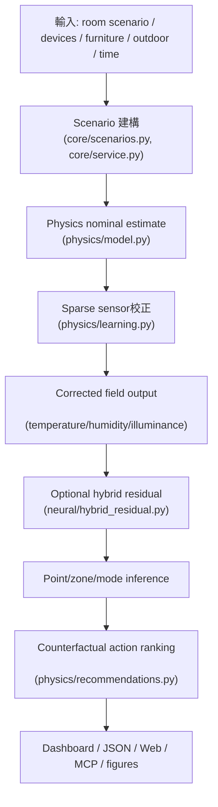
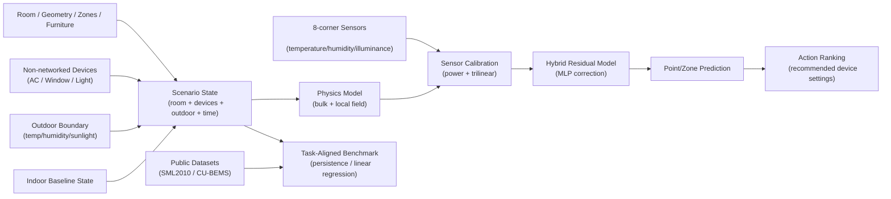

# OPEN_SPEC for Three-Factor Digital Twin

## 目的

本檔案為專案的開放式規格說明，供每次 agent 啟動時快速掌握整體架構、資料來源、處理鏈、執行方式與知識關係。

目標是讓 agent 和開發者能快速理解：
- 這個專案的研究目標與系統邊界
- 主要資料集與資料流
- 主要程式模組與服務層次
- 可執行腳本、編譯/建置方式
- 知識圖譜式的關係網絡

---

## 1. 專案概覽

專案名稱：`mcp-single-room-spatial-digital-twin`

核心研究問題：在單房間內，僅用稀疏角落感測器、非連網設備（冷氣、窗戶、照明）狀態，以及外部邊界條件，估計室內三因子空間場：
- 溫度 `temperature`
- 濕度 `humidity`
- 照度 `illuminance`

系統主張：
- 先用可解釋的 physics-based model 作為主估計
- 再利用稀疏 sensor 進行校正
- 最後以 hybrid residual neural network 做結構性殘差修正
- 並提供多種存取介面：CLI / script / web demo / MCP / Gemma bridge

---

## 2. 目錄與模組層次

### 2.1 主要程式碼模組

- `digital_twin/core/`
  - `entities.py`：場景、房間、感測器、設備、家具、區域資料結構
  - `scenarios.py`：標準情境、窗戶矩陣、真實房間情境建立
  - `service.py`：情境建構、模型執行、輸出整合
  - `demo.py`：demo orchestration、例程呼叫
  - `public_dataset_alignment.py`：公開資料集正規化
  - `public_dataset_benchmark.py`：公開資料基線 benchmark
  - `public_dataset_model_comparison.py`：公開資料集模型比較

- `digital_twin/physics/`
  - `model.py`：bulk + local field model、裝置影響、校正流程
  - `learning.py`：impact learning、power calibration、trilinear residual
  - `baselines.py`：IDW baseline、persistence / linear regression baseline
  - `recommendations.py`：反事實動作排序與建議

- `digital_twin/neural/`
  - `hybrid_residual.py`：hybrid residual dataset、MLP 殘差修正模型、訓練與推論

- `digital_twin/mcp/`
  - `mcp_server.py`：MCP server 主流程、tool 定義、schema
  - `gemma_bridge.py`：Gemma/Ollama 與本專案橋接

- `digital_twin/web/`
  - `web_demo.py`：本地 Web demo 伺服器與 API
  - `render.py`：SVG / JSON / CSV 圖表渲染、前端資料格式

- `scripts/`
  - `run_demo.py`：完整示範流程
  - `run_window_matrix.py`：48 組窗戶時段/天氣/季節矩陣
  - `run_hybrid_residual_experiment.py`：hybrid residual 訓練與評估
  - `run_public_dataset_benchmark.py`：公開資料集 shared-task baseline
  - `run_public_dataset_model_comparison.py`：公開資料集 head-to-head 比較
  - `normalize_public_benchmark_data.py`：公開資料正規化
  - `build_architecture_diagrams.py`：產生架構圖 SVG
  - `build_thesis_docx.py` / `build_thesis_pdf.py`：中文論文輸出
  - `build_thesis_pptx.py`：簡報投影片產生
  - `run_mcp_server.py`：啟動本地 MCP 伺服器
  - `run_web_demo.py`：啟動 web demo
  - `verify_thesis_results.py`：論文結果驗證流程

- `docs/`
  - `thesis/`：中文論文草稿、系統架構、訓練路線、實驗結果
  - `models/`：模型說明、參考模型、hybrid residual 說明
  - `mcp/`：MCP 與 Gemma bridge 文件
  - `web/`：Web demo 使用說明
  - `experiments/`：實驗計劃、benchmark、結果說明
  - `templates/`：房間設計與訓練資料模板

---

## 3. 主要資料集與來源

### 3.1 自製 synthetic benchmark

- 位置：`outputs/data/`
- 內容：包含受控標準情境、48 組窗戶矩陣、完整 dense field 重建結果
- 用途：主要用於 full-field reconstruction、模型元件驗證、可解釋物理結構測試

### 3.2 真實房間 sparse calibration

- 位置：`outputs/data/bedroom_01_weekly/`
- 來源：`bedroom_01` 真實快照資料
- 內容：8 顆角落感測器、裝置狀態、外部環境、pillow 參考點
- 用途：驗證稀疏校正流程能否改善未參與校正位置的預測

### 3.3 公開資料集 task-aligned benchmark

- 主要資料集：SML2010、CU-BEMS
- raw 資料存放：`outputs/data/raw_public/`
- 正規化中介格式：`outputs/data/normalized_public/`
- benchmark 輸出：`outputs/data/public_benchmarks/`

用途說明：
- 只做「task-aligned benchmark」，不當作完整 3D dense-field 真值
- 主要比較 persistence、linear regression 與 hybrid twin readout
- 強調資料支援任務層級，而非本研究完整情境層級

### 3.4 模板與房間設計格式

- `docs/templates/room_design_template.json`
- `docs/templates/room_design_standard_room_example.json`
- `docs/requirements/room_design_format_requirements_zh.md`

---

## 4. 整體處理鏈

### 4.1 核心資料流



### 4.2 訓練與 benchmark 流程

- 原始資料：角落 sensor 時序、裝置事件、外部環境、情境描述
- 時間對齊與情境整併
- physics nominal 模擬
- sparse 校正：power calibration + trilinear residual correction
- impact learning：before/after delta least squares
- hybrid residual training：residual features + MLP
- 公開資料集：normalize → benchmark → model comparison

### 4.3 服務與介面層

- CLI / script：`scripts/run_demo.py`、`scripts/run_window_matrix.py`、`scripts/run_hybrid_residual_experiment.py`
- Web UI：`digital_twin/web/web_demo.py`
- MCP：`digital_twin/mcp/mcp_server.py` + `scripts/run_mcp_server.py`
- Gemma/Ollama：`digital_twin/mcp/gemma_bridge.py`

---

## 5. 程式執行與建置方式

### 5.1 Python 環境

- Python 3.9+
- 該 repo 採用 `pyproject.toml` 描述專案 metadata
- 無獨立 C/C++ 編譯步驟，主要依賴 Python 腳本執行

### 5.2 常用執行命令

```bash
python3 scripts/run_demo.py
python3 scripts/run_window_matrix.py
python3 scripts/run_hybrid_residual_experiment.py
python3 scripts/run_mcp_server.py
python3 scripts/run_web_demo.py
python3 scripts/run_public_dataset_benchmark.py --dataset cu-bems --horizons 15,60
python3 scripts/run_public_dataset_model_comparison.py --dataset sml2010 --horizons 15,60
python3 -m unittest discover -s tests
```

### 5.3 輸出建置命令

```bash
python3 scripts/build_architecture_diagrams.py
python3 scripts/build_thesis_docx.py
python3 scripts/build_thesis_pdf.py
python3 scripts/build_thesis_pptx.py
cd docs/papers/ieee && tectonic --keep-logs --keep-intermediates paper.tex
```

### 5.4 重要資料與輸出位置

- `outputs/data/`
- `outputs/figures/`
- `outputs/papers/thesis_draft_zh.docx`
- `outputs/papers/thesis_draft_zh.pdf`
- `outputs/papers/thesis_presentation_zh.pptx`
- `outputs/papers/thesis_presentation_zh_30min.pptx`

---

## 6. 知識圖譜與實體關係

以下是專案主要實體與關係，可供 agent 快速理解領域知識網絡。



### 6.1 核心實體解釋

- `Room`：房間幾何、標準感測拓樸、家具阻隔
- `Sensors`：8 顆角落 sensor 觀測
- `Devices`：冷氣、窗戶、照明等非連網裝置狀態
- `Outdoor`：外氣溫、外氣濕、日照強度
- `Baseline`：未加裝置前的室內基準狀態
- `Scenario`：模型運算時的完整狀態資料
- `Physics`：物理結構場估計
- `Calibration`：透過真實 sensor 修正模型參數
- `Residual`：學習物理模型殘差的資料驅動補正
- `Benchmark`：公開資料上 task-aligned 的比較分析

---

## 7. 參考文件

- `README.md`
- `docs/thesis/system_architecture_diagrams_zh.md`
- `docs/thesis/chatgpt_project_data_summary.md`
- `docs/thesis/thesis_draft_zh.md`
- `docs/models/system_architecture_and_training_roadmap_zh.md`
- `docs/mcp/mcp_service_zh.md`
- `docs/web/web_demo_zh.md`

---

## 8. Agent 啟動建議流程

1. 先讀取本 OPEN_SPEC.md，快速建立專案全局知識。 
2. 再根據需求定位目標模組：
   - 若要理解模型：查看 `digital_twin/physics/` 與 `digital_twin/neural/`
   - 若要理解資料：查看 `outputs/data/`、`docs/thesis/chatgpt_project_data_summary.md`
   - 若要理解互動：查看 `digital_twin/mcp/`、`digital_twin/web/`
3. 如需驗證或執行：使用 `scripts/` 中的對應腳本。

---

## 9. 版本與同步策略提醒

本 repo 的論文與實驗產物應保持同步，任何方法或架構變更後，應同時考慮：
- `docs/thesis/thesis_draft_zh.md`
- `docs/papers/ieee/paper.tex`
- `scripts/build_thesis_pptx.py`
- 相關 `outputs/` 檔案

此提醒與 `AGENTS.md` 中的 thesis synchronization rule 一致。