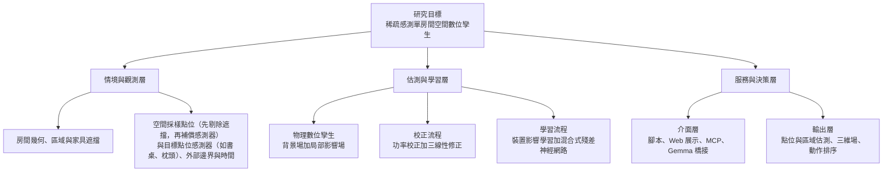
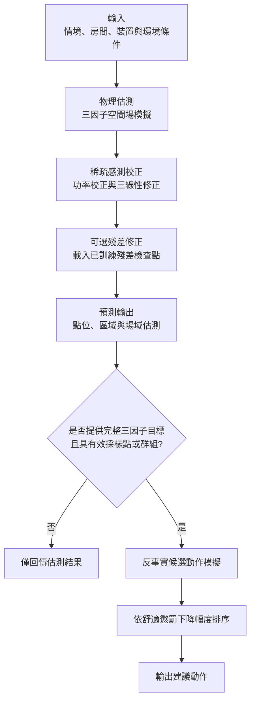
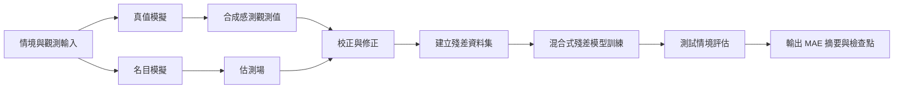

# 專案學術架構總覽

本文件整理 Three-Factor Digital Twin 專案的研究架構、資料切分（訓練集/驗證集/測試集）與整體模型運作流程，供口試與研究討論快速檢視。

## 1. 研究定位與核心問題

- 主題：以稀疏感測（空間可用點位採樣）重建單房間三因子空間場。
- 三因子：溫度、濕度、照度。
- 研究重點：在裝置非連網、無 API 直接回報狀態下，學習裝置環境影響並支援控制決策。
- 點位策略：先剔除障礙物遮擋點，再加入補償感測器，並在目標預測點位（如書桌、枕頭）配置感測器。
- 方法定位：
  - 第一層是可解釋物理/參數化模型（非黑盒）。
  - 第二層是資料驅動殘差修正（混合式殘差神經網路）。
  - MCP/Web 為服務介面層，不是方法本體。

## 2. 專案學術架構（分層）



## 3. 子系統對應到程式模組

- digital_twin/core/：情境建構、資料結構、服務編排。
- digital_twin/physics/：主模型、基線比較、影響學習、推薦排序。
- digital_twin/neural/：混合式殘差模型與訓練。
- digital_twin/mcp/：MCP 伺服器與語言模型橋接。
- digital_twin/web/：可視化展示與互動。
- scripts/：實驗執行、圖表與論文輸出建置。

## 4. 訓練集、驗證集、測試集設計

### 4.1 模擬驗證（Validation Suite）

- 驗證情境集：8 個核心情境。
  - idle
  - ac_only
  - window_only
  - light_only
  - ac_window
  - window_light
  - ac_light
  - all_active
- 每個情境統一使用：
  - 空間解析度 16 x 12 x 6
  - 可用空間採樣點位（角落若有障礙物則剔除遮擋點）
  - 遮擋後加入補償感測器（例如角落被櫃子遮擋時，補入 4 個感測器點）
  - 目標預測點位（如書桌、枕頭）同步加入感測器配置，並納入最終回傳與評估
  - 同一舒適目標與候選動作集合
- 驗證比較項目：
  - field_mae（主模型估測對 truth）
  - idw_field_mae（IDW 基線對 truth）
  - zone_mae / idw_zone_mae
  - sensor_mae_before / sensor_mae_after（含採樣點、補償感測器點與目標點位感測器誤差；沿用既有欄位命名）

### 4.2 混合式殘差神經網路（訓練/測試切分）

- 情境切分規則：情境層級保留法，不隨機打散點位。
- 預設參數：holdout_stride = 4。
- 切分邏輯：索引滿足 index % 4 == 3 的情境為測試集，其餘為訓練集。
- 在 8 個核心情境下：
  - 訓練情境數 = 6
  - 測試情境數 = 2
- 點位樣本數：預設 max_points_per_scenario = 96。
- 預設樣本量：
  - 訓練樣本數 = 6 x 96 = 576
  - 測試樣本數 = 2 x 96 = 192
- 標籤定義：residual = truth - estimated（分別對溫度/濕度/照度建模）。

### 4.3 Window Matrix 驗證集

- 額外 48 組開窗情境：
  - 時段：morning / noon / afternoon / night（4）
  - 天氣：cloudy / sunny / rainy（3）
  - 季節：spring / summer / autumn / winter（4）
- 總計：4 x 3 x 4 = 48。
- 用途：檢查模型在不同外部邊界條件下的穩定性與可遷移性。

### 4.4 公開資料集 Benchmark（任務導向）

- 資料集：CU-BEMS、SML2010。
- 任務族群：
  - CU-BEMS：C1/C2/C3
  - SML2010：S1/S2/S3
- 單一任務的切分規則：時間序列前 70% 為訓練集，後 30% 為測試集。
- 基線比較：Persistence、Linear Regression。
- 模型比較：Hybrid digital twin readout 與上述基線一對一比較。

## 5. 整體模型運作流程（推論與決策）



### 5.1 功率校正與三線性修正（解釋）

- 功率校正（Power Calibration）：
  - 目的：先校準裝置影響強度，修正「整體幅度太強或太弱」的問題。
  - 作法：以可用採樣點、補償感測器點與目標點位感測器的觀測誤差，調整各裝置的影響係數，使主模型的場域強度貼近觀測。
  - 直觀意義：先把「裝置力道」調對。
- 三線性修正（Trilinear Correction）：
  - 目的：在 3D 空間內平滑分配局部誤差，修正「空間分布位置偏差」的問題。
  - 作法：將採樣點、補償感測器點與目標點位感測器上的殘差依空間位置做三線性插值，對全場或目標預測點位加上位置相關修正量。
  - 直觀意義：再把「空間形狀」修對。
- 兩者關係：
  - 先功率校正，後三線性修正。
  - 前者對齊全域強度，後者補足局部空間細節。
  - 這樣可同時提升整體穩定性與目標點位預測精度。

## 6. 學習與驗證流程（實驗管線）



## 7. 主要輸出物

- outputs/data/validation_summary.json：核心驗證情境結果。
- outputs/data/window_matrix_summary.json：48 組開窗矩陣結果。
- outputs/data/hybrid_residual_summary.json：混合式殘差模型訓練與測試摘要。
- outputs/data/hybrid_residual_checkpoint.json：混合式殘差模型權重檔。
- outputs/data/public_benchmarks/*：公開資料集 benchmark 與模型比較。
- outputs/figures/：2D/3D 圖像輸出。
- outputs/figures/architecture/：系統架構圖 SVG。

## 8. 重現指令（研究報告附錄可用）

```bash
python3 scripts/run_demo.py
python3 scripts/run_window_matrix.py
python3 scripts/run_hybrid_residual_experiment.py
python3 scripts/run_public_dataset_benchmark.py --dataset all --horizons 15,60
python3 scripts/run_public_dataset_model_comparison.py --dataset all --horizons 15,60
python3 scripts/build_architecture_diagrams.py
```

## 9. 總結

本專案採用「可解釋物理主模型 + 稀疏感測校正 + 殘差神經網路」的雙層架構，在單房間非連網裝置場景中，透過明確的訓練/驗證切分與任務導向 benchmark，提供可重現的三因子空間估測與控制建議流程。