# 系統架構圖

本文件將目前單房間三因子空間數位孿生原型的實作架構整理成 GitHub 可直接顯示的 Mermaid 圖表，方便用於 README、論文方法章、口試簡報與系統說明。

正式論文與簡報輸出的 SVG 由 `scripts/build_architecture_diagrams.py` 產生。該腳本目前使用統一的 16:9 local SVG renderer，讓研究整體邏輯圖、圖 3-1、圖 3-2、圖 3-3、圖 3-4、圖 3-5 與圖 5-1 保持相同字級、色彩、框線與箭頭風格。研究整體邏輯圖先回答「研究問題如何連到方法、證據與有界結論」，既有系統分層圖再回答「系統責任如何分層」。下方 Mermaid 區塊保留作為語意草稿與 GitHub 預覽。

## 1. 研究整體邏輯架構

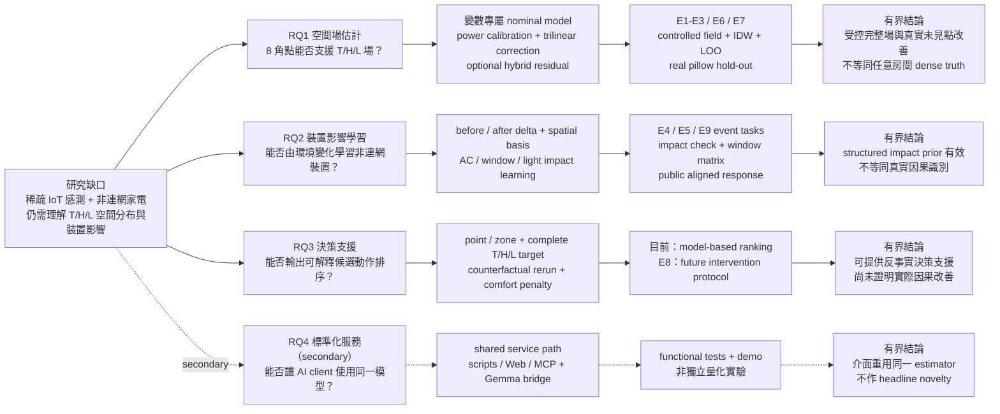

這張圖是整篇論文的 argument map，而不是另一張 runtime flow。閱讀順序固定為：

1. 一般房間同時面臨稀疏感測與非連網裝置限制。
2. RQ1--RQ3 構成主要研究線，RQ4 是服務化的次要系統線。
3. 每個研究問題都必須對應到方法與明確證據層。
4. 結論只能落在證據能支持的範圍；controlled、real snapshot、public aligned 與 future intervention 不可互換。

## Overall Research Logic Architecture

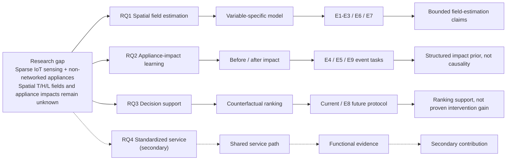

此英文對應圖與中文研究整體邏輯圖使用相同的節點、證據邊界與版面，專供 IEEE 稿使用，避免英文論文出現中文主圖。

## 2. 整體分層架構

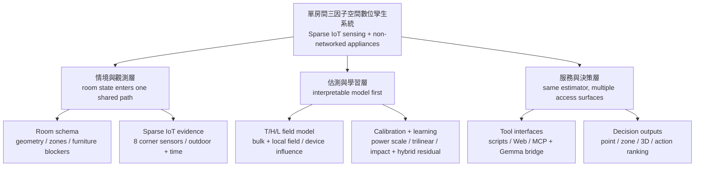

## 3. 主要執行資料流

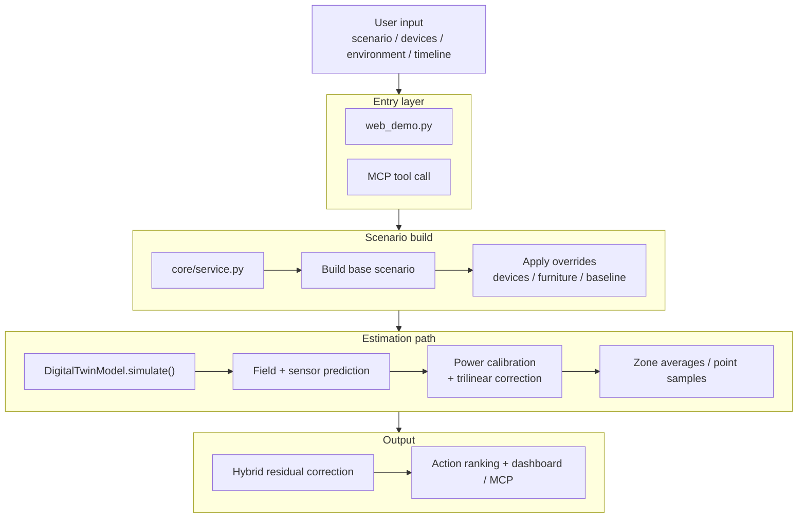

## 4. 感測器校正與學習流程

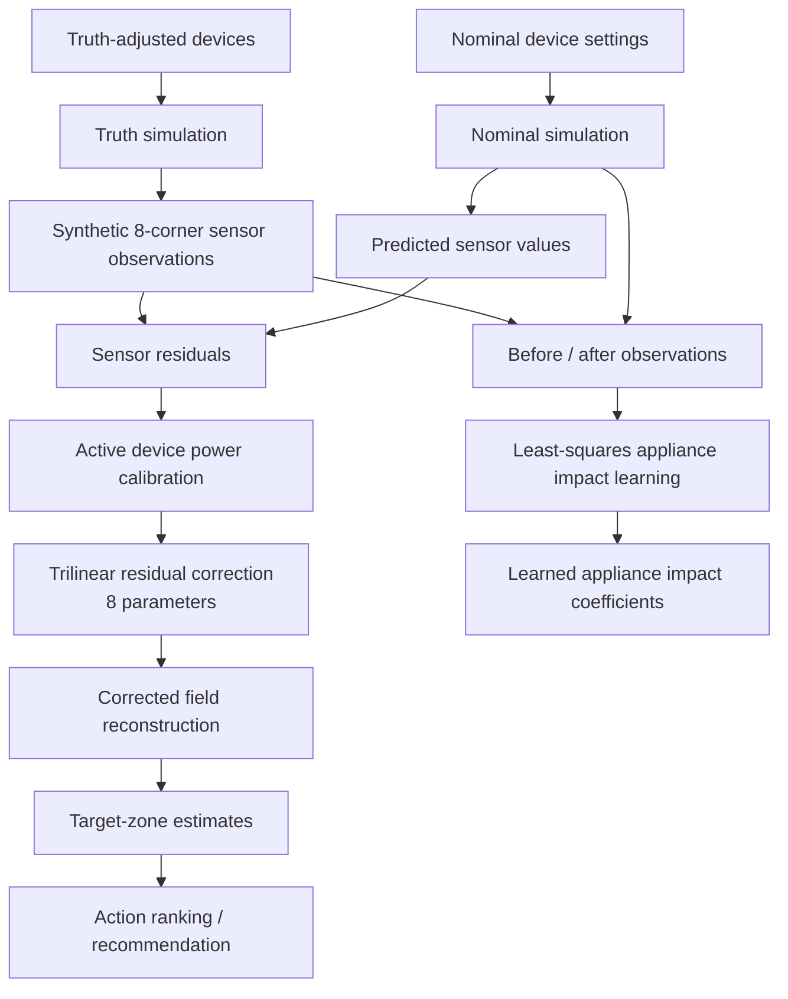

## 5. 模型學習推論與推薦資料流

```mermaid
%%{init: {'flowchart': {'nodeSpacing': 18, 'rankSpacing': 28, 'curve': 'basis'}} }%%
flowchart LR
    subgraph Train["A. Learning and training path"]
        direction TB
        T0["Raw records<br/>corner sensors / device events / outdoor / scenario"] --> T1["Time alignment<br/>unit and coordinate normalization"]
        T1 --> T2["Scenario state assembly<br/>baseline + outdoor + devices + furniture + time"]
        T2 --> T3["Nominal field estimate<br/>temperature / humidity / illuminance"]
        T3 --> T4["Sparse calibration<br/>power scale + trilinear residual"]
        T4 --> T5{"Training branch"}
        T5 --> T6["Impact learning<br/>before-after delta + device spatial basis"]
        T5 --> T7["Hybrid residual learning<br/>features + residual labels"]
        T6 --> A1[("Learned impact coefficients")]
        T7 --> A2[("Residual checkpoint")]
        T7 --> A3[("Validation summary JSON")]
    end

    subgraph Runtime["B. Runtime inference and recommendation path"]
        direction TB
        R0["Runtime input<br/>MCP / web demo / script / API"] --> R1["Scenario override and validation<br/>baseline + devices + furniture + time"]
        R1 --> R2["Nominal T/H/L estimate<br/>variable-specific physical models"]
        R2 --> R3["Sparse correction<br/>registered sensors or calibration state"]
        R3 --> R4["Optional hybrid residual<br/>add learned residual if checkpoint exists"]
        R4 --> R5["Point or zone prediction<br/>temperature + humidity + illuminance"]
        R5 --> R6["Recommendation precondition<br/>point sample or cluster sample + T/H/L target"]
        R6 --> R7{"Complete scope + target?"}
        R7 -- "No" --> R8["Return prediction<br/>or missing-target error"]
        R7 -- "Yes" --> R9["Counterfactual action simulation<br/>rerun inference for each candidate"]
        R9 --> R10["Rank by comfort penalty reduction<br/>recommended device operation"]
    end

    A1 -. "device impact coefficients" .-> R3
    A2 -. "optional residual model" .-> R4
    A3 -. "reproducible evidence" .-> R10
```

## 6. 可模組化裝置與家具架構

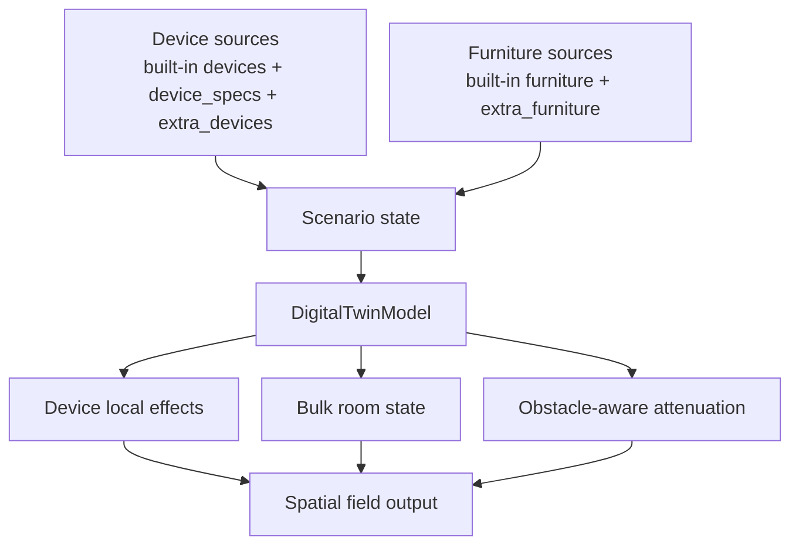

## 7. 房間感測器與目標區域配置

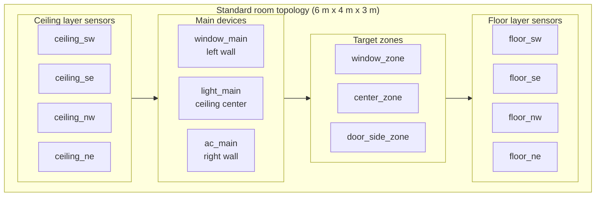

## 8. 驗證與實驗流程圖

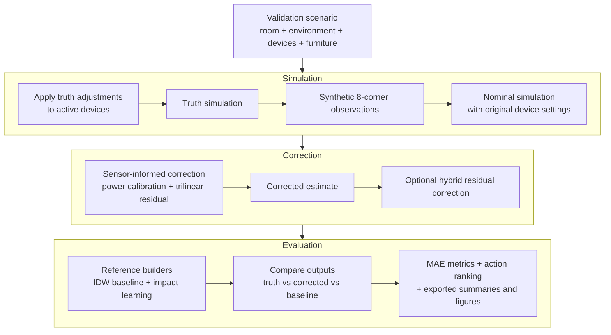

## 9. 程式碼結構圖

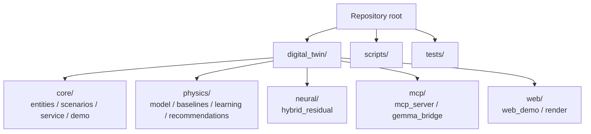

## 10. 文件與輸出結構圖

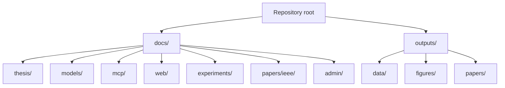

## 11. 圖表使用建議

- 若要放進 GitHub repo，直接保留 Mermaid 區塊即可。
- 若要先說清楚整篇論文的邏輯，優先使用第 1 張研究整體邏輯架構。
- 若要說明方法實作，再使用第 2 張系統分層、第 3 張執行資料流、第 4 張校正學習與第 5 張學習推論推薦資料流。
- 第 6 張適合放方法章或附錄，用來說明裝置與家具的可模組化設計。
- 第 9 張與第 10 張較適合 README、系統說明或口試備用頁，不建議放論文正文。
