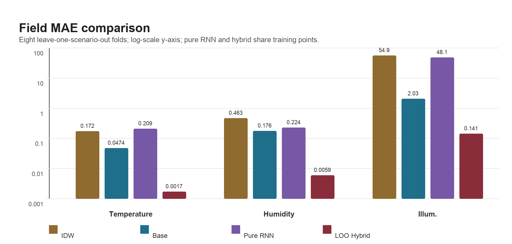

# 國立彰化師範大學

# 資訊工程學系碩士班

# 碩士論文完整版

# 單房間非連網家電環境影響學習之稀疏感測空間數位孿生原型

A Sparse-Sensing Spatial Digital Twin for Learning Environmental Impacts of Non-Networked Appliances in a Single Room

研究生：林昀佑

指導教授：易昶霈 教授、沈慧宇 副教授

版本：中文完整稿 v1.0

日期：2026 年 5 月 4 日


---


# 審定書

國立彰化師範大學資訊工程學系碩士班

碩士論文審定書

單房間非連網家電環境影響學習之稀疏感測空間數位孿生原型

研究生：林昀佑

本論文業經審查及口試合格，特此證明。

論文考試委員會召集人：

委員：

委員：

指導教授：易昶霈 博士

共同指導教授：沈慧宇 副教授

所長：

中華民國 115 年 月


---


# 誌謝

本研究能夠完成，首先感謝指導教授易昶霈教授與沈慧宇副教授在研究方向、方法與寫作上的指導與支持，以及各位口試委員的指正與建議。感謝求學過程中幫助我的各位師長所提供的學習環境，也感謝家人的支持與包容。

林昀佑 謹誌於

國立彰化師範大學資訊工程學系（所）

中華民國 115 年 5 月


---


# 摘要

智慧建築與智慧居家系統需要掌握室內環境狀態，才能支援舒適度評估、能源管理與設備控制。然而，一般房間中的冷氣、窗戶與照明常不具備連網遙測能力，室內也通常只能布建少量感測器，難以直接取得完整空間分布。本研究以單一矩形房間為場域，提出以 8 顆角落感測器支援之三因子空間數位孿生原型，針對 temperature、humidity 與 illuminance 建立變數專屬的 reduced-order nominal model：溫度以熱交換與熱源項描述，濕度以水氣交換與除濕項描述，照度以燈具光束幾何、窗戶日照 envelope、遮蔽與 single-bounce diffuse reflection 描述。系統再結合冷氣、窗戶與照明的參數化影響函數、active-device power calibration 與 trilinear residual correction，從稀疏觀測修正空間場估計；並以 hybrid residual neural network 學習主模型剩餘誤差，而不以純黑盒模型取代可解釋結構。

評估採分層證據設計，分別檢查受控完整場重建、公開資料相容子任務與真實稀疏校正。8 組標準情境中，base model 的平均 field MAE 為溫度 0.0474、濕度 0.1765、照度 2.0269，低於 IDW baseline 的 0.1723、0.4633、54.9052；不使用 physics estimate 的 pure RNN 為 0.2091、0.2241、48.1422，24 個 fold×因子均未取得最低 MAE；hybrid residual leave-one-scenario-out 平均進一步降至 0.0017、0.0059、0.1407。7 天 real-bedroom snapshot 中，pillow 參考點校正後 MAE 由 0.8967°C、4.1286% 與 309.0142 lux 降至 0.1676°C、0.3939% 與 16.6450 lux；以日期為 block 的 20,000 次 paired bootstrap 顯示三因子 MAE 降幅之 95% 區間下界皆大於 0。公開資料集 SML2010 與 CU-BEMS 僅作 task-aligned benchmark，不宣稱 full 3D dense-field 驗證。結果顯示，稀疏角落感測在搭配變數專屬物理結構、校正與殘差學習時，可支援可解釋且可訓練的室內環境場估計；推薦動作目前仍屬模型反事實排序，實際因果改善需後續 before/after 介入驗證。

關鍵字：空間數位孿生、稀疏感測、非連網家電、室內環境建模、溫度、濕度、照度、角落感測器。


---


# Abstract

Smart building and smart home systems require indoor environmental awareness for comfort assessment, energy management, and device control. In ordinary rooms, however, air conditioners, manual windows, and lights often expose no telemetry, while only a small number of sensors can be installed. This thesis proposes a sparse-sensing spatial digital twin for a single rectangular room using eight corner sensors. The model uses variable-specific reduced-order nominal structures: temperature is represented by thermal exchange and heat-source terms, humidity by moisture exchange and dehumidification terms, and illuminance by lamp beam geometry, window daylight envelopes, obstruction, and a lightweight single-bounce diffuse reflection approximation. Parameterized appliance influence functions, active-device power calibration, and trilinear residual correction are used to estimate the room field from sparse observations, and a hybrid residual neural network learns remaining systematic error without replacing the interpretable base model.

The evaluation separates controlled full-field reconstruction, public task-aligned benchmarks, and real sparse-calibration checks. Across eight canonical scenarios, the base model achieves average field MAE of 0.0474/0.1765/2.0269 for temperature, humidity, and illuminance, compared with 0.1723/0.4633/54.9052 for IDW. A standalone pure RNN without physics estimates obtains 0.2091/0.2241/48.1422 and is lowest in 0 of 24 fold-factor comparisons; leave-one-scenario-out hybrid residual correction further reduces MAE to 0.0017/0.0059/0.1407. In a seven-day real-bedroom snapshot, pillow-point calibration error is reduced from 0.8967°C, 4.1286%, and 309.0142 lux to 0.1676°C, 0.3939%, and 16.6450 lux; a 20,000-replicate paired date-block bootstrap keeps every 95% MAE-reduction interval above zero. SML2010 and CU-BEMS are used only as compatible task-aligned external benchmarks rather than dense 3-D spatial ground truth. These results support complementary roles for physical structure, calibration, and residual learning. Action recommendations remain model-based counterfactual rankings and require future before/after intervention validation for causal claims.

Keywords: spatial digital twin, sparse sensing, non-networked appliances, indoor environment modeling, temperature, humidity, illuminance, corner sensors.


---


# 目錄

摘要……I

Abstract……II

誌謝……III

目錄……IV

表目錄……V

圖目錄……VI

第一章 緒論…… 1

  1.1 研究背景…… 1

  1.2 研究動機…… 1

  1.3 研究問題…… 2

  1.4 研究範圍與限制…… 2

  1.5 預期貢獻…… 2

第二章 文獻探討…… 3

  2.1 室內環境建模…… 3

  2.2 空間插值與場估計…… 3

  2.3 數位孿生與智慧建築…… 3

  2.4 房間尺度室內因子實驗研究…… 4

  2.5 非連網裝置影響學習…… 4

  2.6 MCP 與 AI Agent Tool Interface…… 5

  2.7 與相似研究之差異定位…… 5

  2.8 公開資料與訓練資料適用性…… 6

  2.9 動態精準環境應用與 Kalman Filter 方向…… 6

第三章 系統架構與數學模型…… 7

  3.1 研究邏輯與系統架構…… 7

  3.2 房間、區域與感測器設定…… 7

  3.3 三因子場模型…… 8

    3.3.1 共用符號與 Indoor Baseline…… 8

    3.3.2 溫度場模型…… 8

    3.3.3 濕度場模型…… 8

    3.3.4 照度場模型…… 9

  3.4 設備影響函數…… 8

  3.5 感測器校正模型…… 9

    3.5.1 8 點場推估的可證明範圍…… 9

  3.6 非連網裝置影響學習…… 9

  3.7 訓練資料組裝流程…… 9

    3.7.1 學習與訓練資料流…… 10

    3.7.2 訓練完成後的推論與推薦資料流…… 10

  3.8 Hybrid Residual Neural Network 延伸…… 10

  3.9 控制動作排序…… 10

  3.10 方法選擇理由與限制…… 10

第四章 系統實作與服務介面…… 11

  4.1 Python 原型…… 11

  4.2 MCP Tools…… 11

  4.3 Gemma/Ollama Bridge…… 12

  4.4 Web Demo 與展示輔助介面…… 12

第五章 模擬案例與結果分析…… 13

  5.1 標準情境設定…… 13

  5.2 【實驗 E1】標準情境場重建誤差…… 13

  5.3 【實驗 E2】IDW Baseline 比較…… 14

  5.4 【實驗 E3】消融分析與可重現性補強…… 14

  5.5 【實驗 E4】非連網裝置影響學習…… 14

  5.6 【實驗 E5】窗戶時段、天氣、季節矩陣與直接輸入…… 14

  5.7 【實驗 E6】Pure RNN 與 Hybrid Residual Neural Network 結果…… 15

  5.8 【實驗 E7】真實臥室快照驗證與【驗證方案 E8】推薦動作驗證方法…… 16

  5.9 【實驗 E9】公開資料集執行流程與 Task-Aligned Benchmark 結果…… 17

  5.10 研究過程與實作挑戰…… 19

  5.11 展示 D1：可旋轉 3D 展示（非量化實驗）…… 19

第六章 結論與未來工作…… 19

  6.1 結論…… 19

  6.2 研究限制…… 19

  6.3 未來工作…… 19

參考文獻…… 20

附錄 A 原型執行方式…… 22

附錄 B Web Demo 操作與公開比較展示…… 22

附錄 C 名詞解釋…… 23


---


# 表目錄

表 2-1 相似研究差異比較…… 5

表 2-2 公開資料集概覽與適用性…… 6

表 2-3 Task-aligned benchmark 設計…… 6

表 3-1 房間與感測器設定…… 7

表 3-2 訓練資料表格說明…… 9

表 4-1 核心模組一覽…… 11

表 4-2 learn_impacts 事件記錄欄位…… 11

表 4-3 initialize_environment 可設定內容…… 11

表 4-4 Web demo 展示輔助區塊…… 12

表 5-1 標準情境結果摘要…… 13

表 5-2 IDW 與本研究 field MAE 比較…… 14

表 5-3 消融實驗平均 field MAE…… 14

表 5-4 窗戶矩陣情境節選…… 15

表 5-5 Hybrid residual robustness checks…… 15

表 5-6 真實臥室快照 MAE 與分時舒適度…… 16

表 5-7 推薦動作介入驗證指標…… 17

表 5-8 公開資料集比較執行流程與 claim boundary…… 17

表 5-9 公開資料集任務代號與比較目的…… 18

表 5-10 SML2010 任務族群優劣勢拆解…… 18

表 5-11 CU-BEMS 任務族群優劣勢拆解…… 18


---


# 圖目錄

圖 3-1 研究整體邏輯架構…… 7

圖 3-2 主要執行資料流…… 7

圖 3-3 房間感測器與目標區域配置…… 8

圖 3-4 感測器校正與影響學習流程…… 9

圖 3-5 模型學習、推論與推薦資料流…… 10

圖 5-1 驗證與實驗流程…… 13

圖 5-2 三裝置同時作用溫度場 3D 點雲（all_active）…… 13

圖 5-3 僅冷氣作用溫度場 3D 點雲（ac_only）…… 14

圖 5-4 僅燈具作用照度場 3D 點雲（light_only）…… 14

圖 5-5 IDW、Base 與 LOO Hybrid field MAE 比較…… 15

圖 5-6 SML2010 S1/S2/S3 任務族群拆解…… 18

圖 5-7 CU-BEMS C1/C2/C3 任務族群拆解…… 18

圖 5-8 三裝置全開溫度場 3D 點雲（5.11 節）…… 19

圖 5-9 僅開窗溫度場 3D 點雲（window_only）…… 19

圖 5-10 僅燈具照度場 3D 點雲（light_only，5.11 節）…… 19


---


# 第一章 緒論

## 1.1 研究背景

智慧家庭與智慧建築系統逐漸被用於室內環境監控、能源管理與舒適度控制。這類系統通常需要知道空間中溫度、濕度與照度的分布，才能判斷使用者所在區域是否過熱、過暗或過於潮濕。然而，實際房間內不可能在每一個位置都布建感測器，因此系統往往只能取得少量離散點位資料。若僅依賴單點或少數點位量測，容易忽略同一空間中不同區域的環境差異。

另一方面，許多既有家電並不是智慧裝置。傳統冷氣、一般開關照明或手動窗戶可能無法連網，也無法主動回報開關狀態、出力或作用範圍。這些裝置雖然無法被直接讀取，卻會持續改變室內環境。若數位孿生模型只依賴智慧裝置 API，將無法完整描述一般房間中的環境變化。因此，本研究關注的核心問題是：如何透過有限感測器觀測資料，學習非連網裝置對空間環境造成的影響，並將此學習結果用於更準確的三因子控制推薦。

## 1.2 研究動機

在原型開發初期，本研究曾嘗試將問題簡化為角落感測器插值或純局部影響場疊加，但很快發現兩個問題。第一，若只靠插值，模型雖能平滑填補空間，卻無法表達冷氣出風方向、窗邊日照或燈具位置等設備語意；第二，若只做局部場疊加，則容易出現設備附近變化明顯、全室平均狀態卻不合理的結果。這些實作經驗直接促成後續的變數專屬 nominal model、感測器校正流程，以及只把神經網路放在 residual correction 層的設計。

- 只知道角落感測器數值時，仍需要估計房間中央、靠窗區與門側區的三因子狀態。
- 裝置沒有連網時，仍希望從環境變化中推估它是否對空間造成影響。
- 新增或啟用冷氣、窗戶、照明後，系統應能估計其對不同區域造成的變化。
- 學習裝置影響後，模型應能在已指定 point/cluster sample 與三因子目標時，支援開冷氣、開窗或開燈等候選控制動作排序。
- 將模型封裝為標準化工具介面後，AI client 或 agent 可查詢與使用數位孿生能力。

## 1.3 研究問題

- RQ1：在只有 8 顆角落感測器的條件下，是否能建立單房間溫度、濕度與照度的空間估計模型？
- RQ2：在家電或環境裝置沒有連網狀態回報的情況下，是否能從環境感測資料學習其對空間不同區域的影響？
- RQ3：學習後的裝置影響模型，是否能在明確 point/cluster sample 與溫度、濕度、照度目標下，依三因子偏差輸出候選控制動作排序，例如選擇開冷氣、開窗或開燈，且推薦動作的實際可行性應如何透過介入式 before/after 實驗驗證？
- RQ4：將數位孿生模型封裝為標準化工具介面後，是否能讓 AI client 查詢、模擬與使用控制推薦能力？

## 1.4 研究範圍與限制

- 研究場域固定為單一矩形房間，不處理多房間或跨空間空氣交換。
- 感測器配置固定為天花板四角與地面四角，共 8 顆角落節點。
- 設備類型聚焦於冷氣、窗戶與照明。
- 目前室內受控或估測狀態的溫度建模與應用討論只涵蓋 20–30 °C；外部天氣邊界可超出此區間，但不因此擴張室內適用性主張，其他環境或製程亦不得直接外推。
- 模型為簡化動態模型，不追求 CFD 等級高精度流場。
- 濕度保留於模型中，但作為次核心變數處理。
- 人體舒適以目標值與容許範圍表示；低估測誤差本身不等於需要同等精度的實體舒適控制。
- 控制功能只做候選動作排序，不做自動閉環控制；推薦動作的真實因果效果需透過後續介入實驗驗證。
- MCP 部分定位為本地 stdio server 與 AI-agent-accessible interface，不宣稱提出新的 MCP protocol。

## 1.5 預期貢獻

- 提出一個以單房間、8 顆角落感測器為前提的三因子空間數位孿生原型，明確描述 temperature、humidity 與 illuminance 場。
- 建立包含變數專屬 nominal model、active device power calibration、trilinear correction 與裝置影響學習的可解釋估測流程。
- 建立訓練資料組裝與 hybrid residual correction 路線，使真實感測資料可用於參數校正、影響學習與殘差修正，而非直接取代主模型。
- 提出可對接 MCP、Web demo 與公開資料集 task-aligned benchmark 的研究原型與評估框架，並明確區分 synthetic full-field、real sparse calibration、public task-aligned benchmark 與 intervention validation 各自支援的主張範圍。


---


# 第二章 文獻探討

## 2.1 室內環境建模

室內環境建模的主要目的，在於描述空間中熱舒適、能源使用與設備控制之間的關係。高精度方法如 computational fluid dynamics（CFD）雖可細緻描述空氣流動、傳熱與邊界交換，但通常需要大量幾何細節、材料參數與邊界條件，計算成本亦相對較高。相較之下，reduced-order model、grey-box thermal model 與控制導向動態模型著重於以較少參數捕捉主要動態，並保留參數辨識與即時推估能力，因此更適合用於建築控制、預測與數位孿生原型 [1][2][3]。基於此，本研究不追求 CFD 等級的高解析流場，而採用偏向控制導向與可解釋性的簡化空間模型。

## 2.2 空間插值與場估計

在感測器數量有限的情況下，最直接的方法是使用空間插值估計未量測位置。本研究採用 inverse distance weighting（IDW）作為 baseline。IDW 的優點是實作簡單且不依賴設備先驗，但其估計完全由量測點距離決定，無法反映冷氣出風方向、窗戶位置、照明熱源或設備作用範圍等結構資訊。相較之下，zonal model、reduced-order model 與 hybrid spatial model 提供了介於 well-mixed room model 與 CFD 之間的折衷途徑，可在維持較低計算成本的同時保留主要空間差異 [4][5][6]。因此，本研究不是把同一個 bulk/local 物理假設套用到所有環境量，而是將主模型拆成變數專屬 nominal model：溫度採熱交換與熱源近似，濕度採水氣交換與除濕近似，照度採燈具光束幾何、窗戶日照 envelope、遮蔽與反射近似；三者再共用稀疏感測 residual correction 框架。

## 2.3 數位孿生與智慧建築

數位孿生通常被視為實體系統在數位空間中的動態對應模型，其核心價值在於將感測資料、系統狀態與分析模型整合為可更新、可查詢且可推估的數位映射。在智慧建築領域中，數位孿生常與 BIM、IoT 感測、設備監控與能源管理系統結合，用於營運最佳化與狀態預測。近年的建築數位孿生回顧指出，多數研究著重於平台架構、資料整合與建築尺度的決策支援，但對於少量感測器條件下之單房間空間場重建與設備影響推估，討論仍相對有限 [7]。因此，本研究的定位並非建構完整 BIM/BMS 平台，而是針對單房間、低成本感測器與非連網裝置場景提出一個可運作的簡化數位孿生原型。

## 2.4 房間尺度室內因子實驗研究

若將文獻範圍收斂到房間尺度的實驗研究，可以發現溫度、濕度與照度並不是彼此孤立的環境因子。Chinazzo 等人以 office-like test room 為實驗場域，控制不同室溫與日光照度條件，研究 visual perception 與 thermal perception 之間的交互作用，指出日照與室溫會共同影響受試者的感知結果 [18][19]。Lan 等人則在教室條件下同時調整熱環境與照明參數，分析其對學習表現與主觀感受的影響，顯示 thermal and visual environments 可在同一受控場域中被聯合操控與評估 [20]。這類研究雖不以數位孿生為主，但提供了重要前提：房間內三因子至少在實驗設計層級上具備共同量測與共同分析的必要性。

另一類與本研究更接近的工作，是冷氣、開窗或通風策略對房間環境的實驗或現地量測。Kuwahara 等人在大學實驗室中比較空調運轉與自然通風策略，量測溫度、相對濕度與 CO2 變化，用於評估室內環境與舒適 [21]。Zhou 等人則對綠建築辦公室進行長期 field study，追蹤 thermal environment、relative humidity、CO2 與 visual environment，並結合使用者滿意度調查 [22]。Wang 等人針對寒冷地區住宅建築的冬季室內環境品質進行實測，指出低能耗住宅中的室溫與相對濕度仍可能出現不理想分布 [23]。這些研究共同說明，房間尺度的 IEQ 實驗並不罕見，而且冷氣、通風與外氣條件確實會使房間內部環境產生可量測差異。

然而，現有房間尺度實驗研究多半聚焦於舒適評估、單一場域量測，或多因子對認知與滿意度的影響，較少進一步處理有限感測器下的空間場重建、非連網裝置影響學習，以及可被外部 AI 系統查詢的工具化服務。Geng 等人對綠建築辦公室進行大規模與長期 IEQ 比較，Lee 等人則分析研究機構中不同工作型態與 IEQ 的關係 [24][25]；這些研究證明房間內溫度、濕度、照度與舒適度之間具有實際研究基礎，但尚未形成單房間、三因子、8 顆角落感測器、設備影響學習與控制推薦整合於同一原型的做法。基於此，本研究並非宣稱房間室內因子實驗是全新問題，而是主張：本研究將既有 IEQ 實驗研究常見的環境因子量測，進一步推展為可估場、可校正、可學習與可服務化的單房間數位孿生方法。

## 2.5 非連網裝置影響學習

既有智慧家庭與智慧建築研究，常預設設備可由網路介面直接讀取或控制。然而在一般居住空間中，傳統冷氣、手動窗戶與一般照明往往不具備可直接讀取的連網能力。此時，若系統仍希望掌握設備對環境的作用，就必須從感測到的環境變化反推設備影響。近期研究顯示，有限感測器搭配 data assimilation、hybrid model 或感測配置分析，確實能對室內溫濕度場進行重建，並評估量測點配置對重建品質的影響 [5][8][9]。本研究延續此方向，將裝置啟用前後的感測器差異視為學習訊號，並利用裝置空間影響基底與最小平方法估計其對溫度、濕度與照度的影響係數，以支援後續的場估計與控制推薦。

## 2.6 MCP 與 AI Agent Tool Interface

Model Context Protocol（MCP）提供一種標準化工具介面，使外部模型或 AI client 能以一致方式呼叫系統能力。本研究將數位孿生原型封裝為本地 MCP server，但其角色不是執行論文驗證實驗，而是提供實際互動流程：先初始化 MCP session 的 runtime state，包含 base scenario、室內 baseline、外部邊界條件、註冊設備、家具/遮蔽物、預設時間與 estimator 選擇，再查詢指定座標於特定時間或準穩態下的三因子估計，並可建立 before/after 裝置影響學習紀錄、直接輸入窗戶外部資料，以及在指定座標 sample 與完整溫度、濕度、照度目標都存在時排序控制候選動作。需要強調的是，MCP 在本研究中的角色屬於系統整合與工具化封裝，用以驗證數位孿生模型可被外部 AI 系統操作，而非針對 MCP 通訊協定本身提出新方法。

## 2.7 與相似研究之差異定位

若從研究方法的相似性來看，本研究最接近的文獻不是一般性的 building digital twin 平台論文，而是有限感測器室內場重建、控制導向簡化熱模型，以及 hybrid thermal surrogate 這三類研究。Qian 等人以資料同化方法重建實際住宅房間中的溫濕度分布，重點在於以有限量測重建連續場並分析量測配置 [8]；Huljak 等人聚焦於空調房間中的 hybrid 溫度模型，強調以 physics-based 與 surrogate model 共同描述空調空間中的溫度分布 [5]；Megri 等人則以 DOMA 動態 zonal model 處理時間變化與熱舒適預測 [6]。這三類工作與本研究皆有明顯關聯，但關注點不同。

Oh、Sfarra 與 Kim 進一步把建築物理模擬與 operational data 整合為 next-day indoor air temperature hybrid predictor：物理模擬先提供 forecast day 的基線輸出，再由資料驅動模型學習歷史 simulation--measurement gap 並預測同一目標時刻的修正量 [26]。此研究直接支持「物理基線加上 learned residual」的建模邏輯，但其任務是次日溫度時序預測；本研究目前則以指定 elapsed time 的三因子空間場估測為主，兩者不能視為相同驗證任務。

本研究的具體定位是：在不做 CFD、不追求完整 BIM 平台，也不假設家電可回報狀態的前提下，建立一個可由 8 顆角落感測器校正、可學習非連網裝置影響、並可透過 MCP 與 Web 互動使用的單房間三因子數位孿生原型。換言之，本研究刻意把問題收斂在「單房間、有限角落感測器、溫濕度照度三因子、非連網家電影響學習、控制推薦、可工具化服務」這個組合上。從目前檢視到的相似研究來看，尚未看到與本研究完全同構的公開論文。

| 研究 | 相似處 | 主要差異 |
| --- | --- | --- |
| Qian et al. (2025) [8] | 有限觀測下重建室內溫濕度分布 | 未把照度、非連網家電影響學習與 MCP 工具化整合在同一系統 |
| Huljak et al. (2025) [5] | 使用 hybrid 溫度模型處理空調房間 | 主變數偏溫度，且依賴較強的建物邊界條件與物理模擬流程 |
| Oh et al. (2024) [26] | 以 forecast-day simulation 加上 learned simulation--measurement residual 預測次日室溫 | 屬 next-day 單變數時序預測，不直接驗證本研究三因子 3D spatial field |
| Megri et al. (2022) [6] | 強調動態 zonal / transient prediction | 目標偏熱舒適分析，不處理照度與非連網裝置學習 |
| Chen & Wen (2007) [9] | 討論感測器配置與 zonal model | 重點在感測器設計，不是建立可互動的單房間數位孿生原型 |
| Cespedes-Cubides & Jradi (2024) [7] | 界定 building digital twin 的整體脈絡 | 屬綜述，不提供本研究這種單房間三因子可執行原型 |

## 2.8 公開資料與訓練資料適用性

若從資料角度來看，公開資料集確實可作為本研究的輔助比對來源，但沒有任何一套資料能直接等價取代本研究的標準情境。原因在於，本研究同時要求單房間空間拓樸、8 顆角落感測器前提、三因子場估計、冷氣/窗戶/照明的裝置狀態，以及可移動家具阻擋。現有公開資料大多只滿足其中一部分。

| 資料集 | 可用欄位 | 適合用途 | 限制 |
| --- | --- | --- | --- |
| CU-BEMS [12] | 溫度、濕度、照度、AC/lighting power、zone-level series | 可用於驗證裝置狀態與環境量測的時間關聯 | 多區商辦資料，不是單房間 8 角落感測器拓樸 |
| Appliances Energy Prediction [13] | 多房間溫溼度、室外氣象、燈光用電 | 可用於室內外條件與用電關聯分析 | 缺空間幾何與單房間場分布標記 |
| SML2010 [14] | 兩處室內溫度/濕度/照度、日照與室外條件 | 可用於窗戶日照與室內響應的時序比對 | 量測點有限，且非完整單房間空間場 |
| Occupancy Detection [15] | 溫度、濕度、照度、CO2 | 可用於感測器前處理與環境變化偵測 | 不含裝置資訊與空間拓樸 |
| Denmark IEQ dataset [16] | 房間層級 operative temperature、RH、CO2、occupancy | 可用於真實住宅 IEQ 波動比對 | 缺照度與設備狀態 |
| ASHRAE Global Thermal Comfort Database II [17] | 大規模熱舒適與環境量測 | 可用於舒適目標與控制評分合理性參考 | 不是空間場重建資料，也不對應單房間幾何 |

因此，本研究目前採取的資料策略是：以可控制的模擬情境作為主要訓練與驗證來源，以公開資料集作為外部合理性檢查與未來真實資料接軌的準備。具體而言，若要替本研究的 hybrid residual neural network 增加真實資料，現階段最有價值的是 CU-BEMS、SML2010 與住宅 IEQ 類資料；若要補強舒適度控制目標的依據，則 ASHRAE Global Thermal Comfort Database II 比較適合作為外部參考。

具體而言，本研究可採兩層 benchmark 設計。第一層是 canonical synthetic benchmark，直接使用本研究的 8 組標準情境與 48 組窗戶矩陣，讓主模型、IDW baseline、移除設備先驗的純資料驅動模型，以及 hybrid residual correction 在完全相同的輸入、感測器配置與 ground truth 下比較 field MAE、zone MAE、sensor MAE 與推薦改善分數。第二層是 public task-aligned benchmark，亦即把公開資料集拆成與本研究相容的子任務：CU-BEMS 可用於比較 AC/lighting 事件前後的 zone-level temperature、humidity、illuminance 響應；SML2010 可用於比較窗戶/日照相關的溫濕度照度時序響應；Denmark IEQ 與 ASHRAE Global Thermal Comfort Database II 則適合比較舒適度目標函數、偏差分數或分類準確率。

除上述兩層 benchmark 外，推薦動作本身仍需要第三層介入式驗證。此層不再只比較模型估測誤差，而是要求研究者實際執行系統排序第一的動作，並量測介入前後目標位置或目標區域的 comfort penalty 是否下降。換言之，場估計驗證回答「模型是否看得準」，介入驗證則回答「模型建議的動作是否真的讓房間更接近舒適目標」。

| benchmark 層級 | 資料來源 | 比較任務 | 本研究模型模式 | 建議指標 |
| --- | --- | --- | --- | --- |
| canonical synthetic | 8 組標準情境 | 完整場重建、裝置影響學習、推薦排序 | full spatial mode | field MAE、zone MAE、sensor MAE、improvement score |
| canonical synthetic | 48 組窗戶矩陣 | 外部邊界條件敏感度分析 | full spatial window mode | field MAE、zone deviation、趨勢一致性 |
| public task-aligned | CU-BEMS | AC 與照明事件後的區域響應 | single-zone dataset-compatible mode | MAE、RMSE、delta MAE、correlation |
| public task-aligned | SML2010 | 兩點日照與外氣條件響應 | two-point dataset-compatible mode | MAE、RMSE、delta MAE |
| public task-aligned | Denmark IEQ / ASHRAE | 舒適度評分與控制目標合理性 | comfort-only mode | score error、accuracy、F1、AUROC |

## 2.9 動態精準環境應用與 Kalman Filter 方向

本研究原先以人體舒適作為推薦目標，但舒適決策通常以可接受範圍而非極窄單點判定。因此，模型 MAE 很低只能說明估測解析度提高，不能直接證明一般人居空間需要同等精度的致動控制。教授建議後，本研究保留人居舒適作為具有 tolerance 的 point/zone decision-support 情境，並另行尋找真正需要時間變化環境配方的應用。

現階段最符合「封閉環境、動態設定值、空間不均與稀疏感測」的候選，是小型植物生長室或植物工廠模組。Chiang、Bånkestad 與 Hoch 比較固定、正弦波與追蹤自然變化的溫度、濕度與光照設定，顯示環境波動方式會影響植物表現 [29]；Kim 等人也在人工光植物工廠中使用日夜溫差與光週期處理幼苗 [30]。不過，本研究目前只涵蓋 20–30 °C，文獻中任何超出此區間的處理都只能視為 out-of-domain 方法參考。另一方面，現有照度變數採 lux，不能代替植物 PPFD/PAR；系統也缺少 CO2、基質水分、氣流與生物量或品質等 endpoint。因此，封閉植物生長目前只是候選研究方向，不是已驗證部署或植物效益主張。

Kalman filter 可作為動態狀態估測的參考。原始 Kalman 架構要求明確的 state transition、observation model、process noise 與 measurement noise [28]。Speetjens 等人以 extended Kalman filter 進行溫室模型線上參數調整，支持其作為 time-varying model adaptation 的可能性 [32]；但 van Mourik 等人比較 moving average、EKF 與 UKF 時，沒有得到普遍改善，並指出基礎 climate model 的準確性會主導 filtering 成效 [31]。本研究因此先執行可稽核的 scalar random-walk controlled filtering：保留 normalized SML2010 溫濕度序列作 task reference，以固定 seed 注入三種受控 measurement noise，並讓未濾波、causal MA(3) 與 linear Kalman 使用相同 corrupted observations 與 test rows。此結果只定位 Kalman 作為 temporal filtering comparator；實體 sensing node、online parameter adaptation 與 EKF/UKF 仍需另行驗證。


---


# 第三章 系統架構與數學模型

## 3.1 研究邏輯與系統架構

本研究的整體論證不是從服務介面出發，而是從一般房間的兩項限制出發：室內只能布建少量感測器，冷氣、窗戶與照明又常缺乏可直接讀取的遙測。圖 3-1 因此把整篇論文整理成「研究缺口、研究問題、方法核心、對應證據、有界結論」五個連續階段。RQ1 對應變數專屬 nominal model、active-device power calibration、trilinear correction 與 optional hybrid residual，並由 E1--E3、E6 與 E7 分別提供受控完整場、baseline、robustness 與真實未見點證據；RQ2 對應 before/after delta 與裝置 spatial basis，並由 E4、E5 與 E9 的 event-aligned 子任務定位其可支持範圍；RQ3 對應 point/zone sample、完整三因子目標與反事實 comfort-penalty 排序，但推薦實際因果改善仍需 E8 介入驗證；RQ4 則是 scripts、Web、MCP 與 Gemma bridge 共用同一 estimator path 的次要服務化問題，不作為 headline novelty。


*圖 3-1 研究整體邏輯架構。此圖將研究缺口、RQ1--RQ4、方法核心、E1--E9 證據層與 claim boundary 串成同一條論證鏈；其中 RQ1--RQ3 為主要研究線，RQ4 為次要服務線，E8 維持 future intervention protocol。*

在上述研究邏輯之下，系統實作由房間與設備設定、三因子影響場模型、角落感測器校正、非連網裝置影響學習、控制動作排序與服務介面組成。輸入房間幾何、設備位置、外部環境與時間後，模型先建立變數專屬 nominal field，再用 8 顆角落感測器校準 active-device power scale 並建立 trilinear correction；必要時加上 hybrid residual，最後輸出任意座標或目標區域的三因子估計。只有在已有 point/cluster sample 與完整三因子目標時，才進一步輸出候選控制動作排序。圖 3-2 接著以一次 runtime request 說明這些模組的執行順序。


*圖 3-2 主要執行資料流。此圖對應一次 runtime request 如何從輸入設定、場估計、校正，到 dashboard 或 MCP 輸出。*

## 3.2 房間、區域與感測器設定

標準房間尺寸設定為寬 6.0 m、長 4.0 m、高 3.0 m。感測器固定於地面四角與天花板四角，共 8 顆節點。每個節點皆假設可量測 temperature、humidity 與 illuminance。區域劃分包含 window_zone、center_zone 與 door_side_zone，用於比較不同空間區域受到設備影響的差異。

| 項目 | 設定 |
| --- | --- |
| 房間尺寸 | 6.0 m × 4.0 m × 3.0 m |
| 感測器數量 | 8 顆角落節點 |
| 採樣網格 | 16 × 12 × 6 |
| 三個環境因素 | Temperature, Humidity, Illuminance |
| 主要區域 | window_zone, center_zone, door_side_zone |
| 設備類型 | ac_main, window_main, light_main |


*圖 3-3 房間感測器與目標區域配置。8 顆角落感測器、3 個主要區域與 3 個核心裝置共同構成單房間數位孿生的標準拓樸。*

## 3.3 三因子場模型

本研究將室內狀態定義為三個空間與時間函數：

$$T(\mathbf{p},t),\quad H(\mathbf{p},t),\quad L(\mathbf{p},t)$$

為避免把不同物理性質的環境量硬套到同一個公式，本研究將估測流程拆成兩層。第一層是依變數而異的 nominal model $N_v(\mathbf{p},t)$，負責描述該變數的主要物理趨勢；第二層是由 8 顆角落感測器提供的 residual correction $C_v(\mathbf{p},t)$，負責吸收低階空間偏差。因此任一環境因素 $v\in\{T,H,L\}$ 的最終估計值皆寫成：

$$\hat{F}_v(\mathbf{p},t)=N_v(\mathbf{p},t)+C_v(\mathbf{p},t)$$

| 符號 | 詳細意義 | 單位或備註 |
| --- | --- | --- |
| $\hat{F}_v(\mathbf{p},t)$ | 環境因素 $v$ 在位置 $\mathbf{p}$ 與時間 $t$ 的最終估計值。 | 溫度為 °C、濕度為 %RH、照度為 lux。 |
| $v$ | 被估計的環境因素索引。 | $v\in\{T,H,L\}$，分別代表 temperature、humidity、illuminance。 |
| $T(\mathbf{p},t)$ | 位置 $\mathbf{p}$、時間 $t$ 的溫度場。 | 單位為 °C。 |
| $H(\mathbf{p},t)$ | 位置 $\mathbf{p}$、時間 $t$ 的相對濕度場。 | 單位為 %RH，後續以 $\mathrm{clip}_{[0,100]}$ 限制在 0 到 100。 |
| $L(\mathbf{p},t)$ | 位置 $\mathbf{p}$、時間 $t$ 的照度場。 | 單位為 lux，後續以 $\max\{0,\cdot\}$ 避免負照度。 |
| $\mathbf{p}=(x,y,z)$ | 查詢點或採樣點的三維座標。 | 單位為 m，座標系統與房間設計檔一致。 |
| $x,y,z$ | 分別為房間寬度方向、長度方向與高度方向座標。 | 原點位於房間地面西南角。 |
| $t$ | 情境經過時間、設備啟動後時間或 demo 時間軸上的查詢時間。 | 單位依實作通常為 s 或 min；論文公式只表示相對時間。 |
| $N_v(\mathbf{p},t)$ | 變數專屬 nominal model 輸出，負責描述該變數主要物理趨勢。 | 溫度、濕度、照度各自使用不同公式。 |
| $C_v(\mathbf{p},t)$ | 由 8 顆角落感測器 residual 形成的校正場。 | 用於修正 nominal model 的低階空間偏差。 |

### 3.3.1 共用符號與 Indoor Baseline

其中 $T$ 代表 temperature，$H$ 代表 relative humidity，$L$ 代表 illuminance。$C_v$ 的三線性形式在 3.5 節定義；本節先定義三個不同的 nominal model。為了讓公式可讀，本研究先定義共用的幾何與裝置符號。令查詢點為 $\mathbf{p}=(x,y,z)$，房間高度為 $H_r$，則正規化垂直位置為：

$$\zeta=\frac{z}{H_r}-\frac{1}{2}$$

本節公式中的 baseline 指的是 indoor baseline，即房間在目標設備作用尚未加入、且尚未套用角落感測器 residual correction 前的室內基準狀態，不是第 5 章用來比較方法優劣的 IDW baseline，也不是公開資料集中的 persistence 或 linear regression baseline。具體而言，本研究將室內基準狀態寫成：

$$\mathbf{b}_0=(T_0,H_0,L_0)$$

$T_0$、$H_0$ 與 $L_0$ 分別代表該次情境的起始室內溫度、相對濕度與照度。若有真實部署資料，且可取得設備啟用前或查詢前的穩定參考時間 $t_{\mathrm{ref}}$，則可由 8 顆角落感測器的平均值初始化：

$$\begin{aligned}T_0&=\frac{1}{|\mathcal{S}|}\sum_{s\in\mathcal{S}}O_T(\mathbf{p}_s,t_{\mathrm{ref}}),\\H_0&=\frac{1}{|\mathcal{S}|}\sum_{s\in\mathcal{S}}O_H(\mathbf{p}_s,t_{\mathrm{ref}}),\\L_0&=\frac{1}{|\mathcal{S}|}\sum_{s\in\mathcal{S}}O_L(\mathbf{p}_s,t_{\mathrm{ref}})\end{aligned}$$

其中 $\mathcal{S}$ 為 8 顆角落感測器集合，$O_v$ 為實際觀測值。若沒有啟用前觀測資料，則 baseline 由房間設計檔或情境設定提供；本研究標準房間預設為 $T_0=29.0^\circ\mathrm{C}$、$H_0=67.0\%$、$L_0=90.0$ lux。Web demo 左側的 Indoor Baseline 欄位即是讓使用者直接指定這三個基準值。後續所有冷氣、窗戶與照明項，都是在此室內基準狀態上增加或減少的偏移量。

第 $j$ 個裝置的時間啟用量與空間影響 envelope 分別定義為：

$$A_j(t)=a_j\left(1-e^{-t/\tau_j}\right)$$

$$\begin{aligned}E_j(\mathbf{p},t)&=A_j(t)R_j(\mathbf{p})D_j(\mathbf{p},t)V_j(\mathbf{p}),\\R_j(\mathbf{p})&=\exp(-\|\mathbf{p}-\mathbf{p}_j\|/r_j)\end{aligned}$$

$A_j(t)$ 描述裝置由剛啟動到接近準穩態的時間響應；$R_j$ 是距離衰減；$D_j$ 是方向性項，例如冷氣出風方向或燈具照射方向；$V_j$ 是家具或牆面造成的可見性／遮蔽項；$r_j$ 是裝置影響半徑。這個 envelope 是三個變數共用的空間結構，但各變數如何使用它並不相同。

| 符號 | 詳細意義 | 單位或備註 |
| --- | --- | --- |
| $T_0,H_0,L_0$ | Indoor baseline，即設備作用與 residual correction 前的起始室內溫度、相對濕度與照度。 | 分別為 °C、%RH、lux。 |
| $\mathbf{b}_0$ | 三個 baseline 值組成的向量。 | $\mathbf{b}_0=(T_0,H_0,L_0)$。 |
| $\mathcal{S}$ | 角落感測器集合。 | 本研究固定為 8 顆。 |
| $s$ | 感測器索引。 | $s\in\mathcal{S}$。 |
| $\mathbf{p}_s$ | 第 $s$ 顆感測器的位置。 | 位於地面四角或天花板四角。 |
| $t_{\mathrm{ref}}$ | 用來初始化 baseline 的參考時間。 | 應選在設備作用尚未加入或狀態穩定時。 |
| $O_v(\mathbf{p}_s,t_{\mathrm{ref}})$ | 感測器在位置 $\mathbf{p}_s$、時間 $t_{\mathrm{ref}}$ 對變數 $v$ 的實際觀測值。 | 作為 baseline 或 residual 的資料來源。 |
| $z,H_r,\zeta$ | $z$ 為查詢點高度，$H_r$ 為房間高度，$\zeta=z/H_r-1/2$ 為中心化高度。 | $\zeta>0$ 表示偏上層，$\zeta<0$ 表示偏下層。 |
| $j$ | 裝置索引。 | 例如冷氣、窗戶或燈具。 |
| $A_j(t)$ | 第 $j$ 個裝置在時間 $t$ 的有效啟用量。 | 由 $a_j$ 與 $\tau_j$ 控制。 |
| $a_j$ | 裝置啟用強度或穩態比例。 | 常介於 0 到 1；也可視為經校正後的強度尺度。 |
| $\tau_j$ | 裝置接近穩態的時間常數。 | 愈大代表影響累積愈慢。 |
| $E_j(\mathbf{p},t)$ | 裝置在位置 $\mathbf{p}$、時間 $t$ 的空間影響 envelope。 | 結合時間響應、距離、方向與遮蔽。 |
| $R_j(\mathbf{p})$ | 距離衰減項。 | $\exp(-\|\mathbf{p}-\mathbf{p}_j\|/r_j)$。 |
| $D_j(\mathbf{p},t)$ | 方向性或朝向權重。 | 用於冷氣出風方向、窗戶日照方向或燈具照射方向。 |
| $V_j(\mathbf{p})$ | 可見性或遮蔽項。 | 0 表示完全遮蔽，1 表示未遮蔽，中間值表示部分遮蔽。 |
| $\mathbf{p}_j$ | 第 $j$ 個裝置的位置。 | 與房間座標同單位 m。 |
| $r_j$ | 第 $j$ 個裝置的作用半徑或衰減尺度。 | 單位為 m。 |
| $P_j$ | 第 $j$ 個裝置的 power scale。 | 可由感測器資料校正，用來修正預設設備強度。 |
| $k^{g},k^{s}$ | 全室平均響應與空間局部響應的簡化增益係數。 | $g$ 表示 global，$s$ 表示 spatial/local。 |
| $M(t)$ | 房間混合係數。 | 用於調整垂直分層項的強度。 |

### 3.3.2 溫度場模型

溫度場的 nominal model 採用熱交換與熱源近似，先分成 indoor baseline、全室平均響應、局部空間響應與垂直分層四個部分：

$$\begin{aligned}N_T(\mathbf{p},t)=T_0+B_T(t)+S_T(\mathbf{p},t)+\gamma_T M(t)\zeta\end{aligned}$$

$$\begin{aligned}B_T(t)=&\,B_{\mathrm{ac},T}(t)+B_{\mathrm{win},T}(t)+B_{\mathrm{light},T}(t),\\S_T(\mathbf{p},t)=&\,S_{\mathrm{ac},T}(\mathbf{p},t)+S_{\mathrm{win},T}(\mathbf{p},t)+S_{\mathrm{light},T}(\mathbf{p},t)\end{aligned}$$

其中 $B_T$ 表示全室平均熱響應，$S_T$ 表示設備附近的局部熱影響，$\gamma_T M(t)\zeta$ 表示垂直溫度分層。三個主要裝置的溫度項可展開為：

$$\begin{aligned}B_{\mathrm{ac},T}(t)&=s_m k_{\mathrm{ac},T}^{g}d_TP_{\mathrm{ac}}A_{\mathrm{ac}}(t),\\S_{\mathrm{ac},T}(\mathbf{p},t)&=s_m k_{\mathrm{ac},T}^{s}d_TP_{\mathrm{ac}}E_{\mathrm{ac}}(\mathbf{p},t)\end{aligned}$$

$$\begin{aligned}B_{\mathrm{win},T}(t)&=k_{\mathrm{win},T}^{g}(T_{\mathrm{out}}-T_0)P_{\mathrm{win}}A_{\mathrm{win}}(t),\\S_{\mathrm{win},T}(\mathbf{p},t)&=k_{\mathrm{win},T}^{s}(T_{\mathrm{out}}-T_0)P_{\mathrm{win}}E_{\mathrm{win}}(\mathbf{p},t)\end{aligned}$$

$$\begin{aligned}B_{\mathrm{light},T}(t)&=k_{\mathrm{light},T}^{g}P_{\mathrm{light}}A_{\mathrm{light}}(t),\\S_{\mathrm{light},T}(\mathbf{p},t)&=k_{\mathrm{light},T}^{s}P_{\mathrm{light}}E_{\mathrm{light}}(\mathbf{p},t)\end{aligned}$$

其中 $s_m$ 由冷氣模式決定，冷房或除濕時為負，加熱時為正，送風模式不產生全室熱量變化；$d_T$ 代表冷氣設定溫度與室內基準溫度形成的需求量。此式的重點是：溫度使用熱交換與熱源項，不使用照度的光學項。

| 溫度公式符號 | 詳細意義 | 物理角色 |
| --- | --- | --- |
| $N_T(\mathbf{p},t)$ | 溫度 nominal estimate。 | 在尚未加上角落 residual correction 前，模型對位置 $\mathbf{p}$ 的溫度估計。 |
| $B_T(t)$ | 全室平均溫度響應。 | 描述設備或窗戶造成的整體室溫偏移，不區分房間內不同位置。 |
| $S_T(\mathbf{p},t)$ | 局部溫度響應。 | 描述冷氣出風口、窗邊或燈具附近與其他位置不同的局部熱影響。 |
| $\gamma_T$ | 垂直溫度分層係數。 | 控制上層與下層溫度差的強度。 |
| $M(t)$ | 混合係數。 | 與 $\gamma_T\zeta$ 相乘，用來調整分層效果隨時間或混合狀態的變化。 |
| $\zeta$ | 中心化高度。 | 使垂直項在房間中層附近為 0，上層與下層分別呈現正負偏移。 |
| $B_{\mathrm{ac},T},S_{\mathrm{ac},T}$ | 冷氣造成的全室與局部溫度項。 | 通常為降溫；符號由 $s_m$ 與冷氣模式決定。 |
| $B_{\mathrm{win},T},S_{\mathrm{win},T}$ | 窗戶造成的全室與局部溫度項。 | 由室外與室內基準溫差 $T_{\mathrm{out}}-T_0$ 決定升溫或降溫。 |
| $B_{\mathrm{light},T},S_{\mathrm{light},T}$ | 照明造成的全室與局部熱項。 | 表示燈具發熱對溫度的低階近似。 |
| $s_m$ | 冷氣模式符號。 | 冷房或除濕為負、加熱為正、送風近似為 0。 |
| $d_T$ | 冷氣溫度需求量。 | 表示冷氣設定溫度與目前 indoor baseline 之間的差距強度。 |
| $k_{\mathrm{ac},T}^{g},k_{\mathrm{win},T}^{g},k_{\mathrm{light},T}^{g}$ | 溫度全室響應增益。 | 決定各裝置對 $B_T(t)$ 的影響大小。 |
| $k_{\mathrm{ac},T}^{s},k_{\mathrm{win},T}^{s},k_{\mathrm{light},T}^{s}$ | 溫度局部響應增益。 | 決定各裝置對 $S_T(\mathbf{p},t)$ 的影響大小。 |
| $P_{\mathrm{ac}},P_{\mathrm{win}},P_{\mathrm{light}}$ | 冷氣、窗戶與照明的 power scale。 | 由預設值或感測器 calibration 給定，用來修正裝置實際強度。 |
| $A_{\mathrm{ac}},A_{\mathrm{win}},A_{\mathrm{light}}$ | 冷氣、窗戶與照明的時間啟用量。 | 表示設備影響隨 elapsed time 逐漸累積。 |
| $E_{\mathrm{ac}},E_{\mathrm{win}},E_{\mathrm{light}}$ | 冷氣、窗戶與照明的空間 envelope。 | 表示位置、方向與遮蔽造成的局部影響差異。 |

### 3.3.3 濕度場模型

濕度場的 nominal model 不直接套用熱場公式，而是使用水氣交換與冷氣除濕近似。其結構同樣分成 indoor baseline、全室平均響應、局部空間響應與垂直濕度梯度：

$$\begin{aligned}N_H(\mathbf{p},t)=\mathrm{clip}_{[0,100]}\{H_0+B_H(t)+S_H(\mathbf{p},t)-\gamma_H M(t)\zeta\}\end{aligned}$$

$$\begin{aligned}B_H(t)=&-k_{\mathrm{ac},H}^{g}d_HP_{\mathrm{ac}}A_{\mathrm{ac}}(t)+k_{\mathrm{win},H}^{g}(H_{\mathrm{out}}-H_0)P_{\mathrm{win}}A_{\mathrm{win}}(t),\\S_H(\mathbf{p},t)=&-k_{\mathrm{ac},H}^{s}d_HP_{\mathrm{ac}}E_{\mathrm{ac}}(\mathbf{p},t)+k_{\mathrm{win},H}^{s}(H_{\mathrm{out}}-H_0)P_{\mathrm{win}}E_{\mathrm{win}}(\mathbf{p},t)\end{aligned}$$

其中 $H_0$ 為室內基準相對濕度，$H_{\mathrm{out}}$ 為室外相對濕度，$d_H$ 為除濕需求量。冷氣項為負值，表示除濕；窗戶項由 $(H_{\mathrm{out}}-H_0)$ 決定正負，表示外氣較濕時提高室內濕度，外氣較乾時降低室內濕度。此處並未主張完整求解水氣質量守恆或 psychrometric model，而是使用控制導向的低階近似，再交由角落感測器 residual 校正吸收模型偏差。

| 濕度公式符號 | 詳細意義 | 物理角色 |
| --- | --- | --- |
| $N_H(\mathbf{p},t)$ | 濕度 nominal estimate。 | 在尚未加上角落 residual correction 前，模型對位置 $\mathbf{p}$ 的相對濕度估計。 |
| $\mathrm{clip}_{[0,100]}$ | 上下界截斷函數。 | 確保相對濕度不低於 0% 且不高於 100%。 |
| $H_0$ | 室內基準相對濕度。 | 設備作用前或查詢前的室內濕度起點。 |
| $B_H(t)$ | 全室平均濕度響應。 | 描述冷氣除濕或窗戶換氣對全室濕度的平均影響。 |
| $S_H(\mathbf{p},t)$ | 局部濕度響應。 | 描述冷氣附近、窗邊等位置的濕度變化差異。 |
| $\gamma_H$ | 垂直濕度梯度係數。 | 控制高度造成的濕度分層強度。 |
| $-\gamma_H M(t)\zeta$ | 濕度垂直項。 | 使用負號表示目前模型假設上層與下層濕度梯度方向與溫度項不同。 |
| $k_{\mathrm{ac},H}^{g},k_{\mathrm{ac},H}^{s}$ | 冷氣除濕的全室與局部增益。 | 增益越大，冷氣對濕度下降的影響越強。 |
| $k_{\mathrm{win},H}^{g},k_{\mathrm{win},H}^{s}$ | 窗戶換氣的全室與局部濕度增益。 | 增益越大，室外濕度與室內基準濕度的差異越容易傳入室內。 |
| $d_H$ | 除濕需求量。 | 表示冷氣除濕作用的有效強度。 |
| $H_{\mathrm{out}}-H_0$ | 室外與室內基準濕度差。 | 大於 0 表示外氣較濕、開窗傾向增加濕度；小於 0 表示外氣較乾、開窗傾向降低濕度。 |
| $P_{\mathrm{ac}},P_{\mathrm{win}}$ | 冷氣與窗戶的 power scale。 | 校正冷氣除濕強度與窗戶換氣強度。 |
| $A_{\mathrm{ac}},A_{\mathrm{win}}$ | 冷氣與窗戶的時間啟用量。 | 描述除濕或換氣影響隨時間累積。 |
| $E_{\mathrm{ac}},E_{\mathrm{win}}$ | 冷氣與窗戶的空間 envelope。 | 描述不同位置受冷氣或窗戶濕度影響的程度。 |

### 3.3.4 照度場模型

照度場的 nominal model 採用燈具光束、日照、遮蔽與反射近似，不使用溫濕度的全室混合項：

$$N_L(\mathbf{p},t)=\max\{0,L_0+L_{\mathrm{win}}^{\mathrm{dir}}(\mathbf{p},t)+L_{\mathrm{light}}^{\mathrm{dir}}(\mathbf{p},t)+L_{\mathrm{win}}^{\mathrm{amb}}(\mathbf{p},t)+I^{\mathrm{refl}}(\mathbf{p},t)\}$$

$$\begin{aligned}L_{\mathrm{win}}^{\mathrm{dir}}(\mathbf{p},t)&=S_{\mathrm{out}}d_f k_{\mathrm{sol}}P_{\mathrm{win}}E_{\mathrm{win}}(\mathbf{p},t),\\L_{\mathrm{light}}^{\mathrm{dir}}(\mathbf{p},t)&=G_{\mathrm{light}}P_{\mathrm{light}}A_{\mathrm{light}}(t)\Phi_{\mathrm{light}}(\mathbf{p})Q_{\mathrm{light}}(\mathbf{p})V_{\mathrm{light}}(\mathbf{p}),\\L_{\mathrm{win}}^{\mathrm{amb}}(\mathbf{p},t)&=\beta_{\mathrm{amb}}L_0P_{\mathrm{win}}A_{\mathrm{win}}(t)\exp(-\|\mathbf{p}-\mathbf{p}_{\mathrm{win}}\|/(1.8r_{\mathrm{win}}))\end{aligned}$$

$$\Phi_{\mathrm{light}}(\mathbf{p})=\eta_{\mathrm{floor}}+(1-\eta_{\mathrm{floor}})\max(0,\mathbf{o}_{\mathrm{light}}\cdot\hat{\mathbf{r}}_{\mathrm{light}\to p})^{\alpha},\qquad Q_{\mathrm{light}}(\mathbf{p})=\frac{d_{\mathrm{ref}}^2}{\|\mathbf{p}-\mathbf{p}_{\mathrm{light}}\|^2+\epsilon d_{\mathrm{ref}}^2}$$

其中 $L_0$ 為室內基準照度，$S_{\mathrm{out}}$ 為外部日照照度，$d_f$ 為 daylight factor，$k_{\mathrm{sol}}$ 為窗戶日照增益，$G_{\mathrm{light}}$ 為燈具照度增益，$\Phi_{\mathrm{light}}$ 為由光束角推得的 cosine 方向權重，$Q_{\mathrm{light}}$ 為參考距離正規化後的距離衰減，$V_{\mathrm{light}}$ 為燈具到查詢點的遮蔽或可見性，$\beta_{\mathrm{amb}}$ 為窗邊散射背景光係數。$I^{\mathrm{refl}}$ 是 3.4 節定義的 single-bounce diffuse reflection。標準情境中的窗戶日照仍使用 envelope daylight 近似；本研究曾測試以窗戶面積與 aperture view factor 取代預設窗戶項，但在目前 8 組標準情境會增加 window family 的照度誤差，因此保留為可選模式而不作為本文預設結果。照度模型的重點在於光源位置、方向性、距離衰減、遮蔽與表面反射，因此它與溫度、濕度的熱交換或水氣交換公式不同。

| 照度公式符號 | 詳細意義 | 光學或模型角色 |
| --- | --- | --- |
| $N_L(\mathbf{p},t)$ | 照度 nominal estimate。 | 在尚未加上角落 residual correction 前，模型對位置 $\mathbf{p}$ 的照度估計。 |
| $\max\{0,\cdot\}$ | 非負截斷。 | 避免因校正或負項造成物理上不合理的負照度。 |
| $L_0$ | 室內基準照度。 | 沒有新增窗戶或燈具作用前的背景照度。 |
| $L_{\mathrm{win}}^{\mathrm{dir}}$ | 窗戶直射或主要入射光項。 | 表示外部日照經窗戶進入室內後對查詢點的直接貢獻。 |
| $L_{\mathrm{light}}^{\mathrm{dir}}$ | 燈具直射光項。 | 以燈具啟用量、光束方向、距離衰減與遮蔽估計查詢點的直接照度。 |
| $L_{\mathrm{win}}^{\mathrm{amb}}$ | 窗邊環境散射光項。 | 補足窗戶附近非直射但仍與開窗、外光相關的背景亮度。 |
| $I^{\mathrm{refl}}(\mathbf{p},t)$ | 單次漫反射項。 | 由牆面、地板、天花板與家具表面作為次級反射面，補足 indirect fill light。 |
| $S_{\mathrm{out}}$ | 外部日照照度。 | 室外光源強度；天氣、時段或外部資料會改變此值。 |
| $d_f$ | daylight factor。 | 表示外部日照進入室內後的比例或衰減。 |
| $k_{\mathrm{sol}}$ | 窗戶日照增益。 | 調整窗戶直射光項的強度。 |
| $G_{\mathrm{light}}$ | 燈具照度增益。 | 調整燈具直射光項的強度。 |
| $\Phi_{\mathrm{light}}$ | 燈具方向權重。 | 由燈具朝向與查詢點方向的 cosine 投影計算，光束角決定衰減指數。 |
| $Q_{\mathrm{light}}$ | 燈具距離衰減。 | 以參考距離正規化的 inverse-square 近似，避免遠端或近端量級失控。 |
| $V_{\mathrm{light}}$ | 燈具可見性或遮蔽項。 | 家具遮擋燈具到查詢點的路徑時降低直接照度。 |
| $\eta_{\mathrm{floor}}$ | 方向權重下限。 | 避免光束邊緣被硬切為 0，保留少量散射近似。 |
| $\alpha$ | 光束角對應的 cosine 指數。 | 光束越窄，方向衰減越快；光束越寬，照度分布越平滑。 |
| $d_{\mathrm{ref}}$ | 燈具 photometric reference distance。 | 作為距離衰減的正規化尺度。 |
| $\beta_{\mathrm{amb}}$ | 窗邊散射背景光係數。 | 控制窗邊 ambient light 對室內照度的補償程度。 |
| $\mathbf{p}_{\mathrm{win}}$ | 窗戶位置。 | 用於計算查詢點離窗戶的距離。 |
| $r_{\mathrm{win}}$ | 窗戶影響半徑。 | 控制 $L_{\mathrm{win}}^{\mathrm{amb}}$ 隨距離衰減的速度。 |
| $1.8r_{\mathrm{win}}$ | 窗邊散射光的衰減尺度。 | 比直接窗戶 envelope 稍長，用來表示散射光比直射項更平滑。 |

因此，本研究的主張不是「溫度、濕度、照度都遵守同一套 bulk + local 物理定律」，而是「三種變數各自先由符合其物理特性的低階 nominal model 產生估計，再共用 8 點 sparse-sensor residual correction」。這樣可同時保留可解釋性、低運算成本，以及由真實感測資料校正的能力。

## 3.4 設備影響函數

- 冷氣：主要造成局部降溫，並帶有弱除濕效果；3D 視覺化中以牆面橫條表示。
- 窗戶：受外部溫度、外部濕度與日照條件影響，同時改變三個環境因素；3D 視覺化中以牆面矩形表示。
- 照明：主要提升照度，並產生少量熱效應；3D 視覺化中以點狀標記表示。

對照度而言，若只使用窗戶與照明的直接項，再乘上遮蔽衰減，常會低估牆面、地板與家具附近的間接回填亮度。若改用完整 radiosity 或 ray tracing，則需要更細的表面材質、反射模型與幾何資訊，且計算成本明顯提高，與本研究稀疏感測、低成本原型的定位不符。因此本研究僅在 illuminance 路徑加入一個 lightweight single-bounce diffuse reflection 近似：

$$I^{\text{refl}}(\mathbf{p},t) = \sum_{s} \rho_s \bar{I}_s A_s^{\text{rel}} e^{-\|\mathbf{p}-\mathbf{c}_s\|/\ell_s} \max(0,\,\mathbf{n}_s \cdot \hat{\mathbf{r}}_{s\to p})\, V_s(\mathbf{p})$$

其中 $s$ 代表 floor、ceiling、四面牆與啟用中的家具表面；$\rho_s$ 為表面反射率；$\bar{I}_s$ 為該表面中心由 direct light 接收到的照度；$A_s^{\text{rel}}$ 為正規化後的面積因子；$\ell_s$ 為衰減長度；$V_s(\mathbf{p})$ 則延用既有遮蔽邏輯。這個公式的目的不是做高保真光學渲染，而是在不引入完整光傳輸模擬的前提下，補足 direct light 對 indirect fill light 的低估。

| 反射公式符號 | 詳細意義 | 模型角色 |
| --- | --- | --- |
| $I^{\text{refl}}(\mathbf{p},t)$ | 查詢點收到的單次漫反射照度。 | 加到照度 nominal model 中，補足 indirect fill light。 |
| $\sum_s$ | 對所有候選反射表面加總。 | 包含 floor、ceiling、四面牆，以及啟用中的家具表面。 |
| $s$ | 反射表面索引。 | 每個 $s$ 對應一個具有位置、法向量與面積的表面。 |
| $\rho_s$ | 表面 $s$ 的反射率。 | 0 表示完全不反射，1 表示理想全反射；本研究使用簡化參數。 |
| $\bar{I}_s$ | 表面 $s$ 中心接收到的 direct illuminance。 | 表示該表面被窗戶或燈具照亮後可作為次級光源的強度。 |
| $A_s^{\text{rel}}$ | 相對面積因子。 | 面積越大的表面可提供較多反射貢獻；經正規化避免量級失控。 |
| $\mathbf{c}_s$ | 表面 $s$ 的中心點。 | 用來計算表面中心到查詢點的距離。 |
| $\ell_s$ | 表面 $s$ 的反射衰減長度。 | 值越大表示反射光衰減越慢。 |
| $e^{-\|\mathbf{p}-\mathbf{c}_s\|/\ell_s}$ | 距離衰減項。 | 查詢點離反射表面越遠，該表面的回填照度越弱。 |
| $\mathbf{n}_s$ | 表面 $s$ 的外法向量或有效反射方向。 | 用於判斷查詢點是否位於該表面可反射的方向。 |
| $\hat{\mathbf{r}}_{s\to p}$ | 由表面中心指向查詢點的單位向量。 | 與 $\mathbf{n}_s$ 做內積以計算方向投影。 |
| $\max(0,\mathbf{n}_s\cdot\hat{\mathbf{r}}_{s\to p})$ | Lambertian 方向投影近似。 | 若查詢點在表面背向側，貢獻被截為 0。 |
| $V_s(\mathbf{p})$ | 反射面到查詢點之間的可見性或遮蔽項。 | 家具或牆面遮擋時降低反射貢獻。 |

換言之，本研究對 illuminance 的設計取捨是：保留 direct source、directionality 與 obstruction 的可解釋結構，再另外加上一個單次漫反射近似，使牆、地板、天花板與家具能作為次級發光面回填照度。這樣既能維持與現有影響場模型一致的參數化形式，也比 full radiosity 更適合目前的單房間數位孿生原型。

## 3.5 感測器校正模型

模型先預測 8 顆角落感測器位置的三因子值，再與觀測值比較得到殘差。為提高環境估計精度，系統先以最小平方法估計 active device 的 power scale，使設備影響函數更接近觀測資料；接著對每一個環境因素，以 8 參數 trilinear correction 擬合角落殘差：

$$C(\mathbf{p}) = c_0 + c_1 X + c_2 Y + c_3 Z + c_4 XY + c_5 XZ + c_6 YZ + c_7 XYZ$$

其中 X、Y、Z 為正規化後的房間座標。相較於一階 affine surface，trilinear correction 可使用 8 個角點支撐 8 個校正係數，除了整體偏移與一階梯度外，也能表示角落之間的交互變化。不過此方法仍無法重建任意高頻局部變化，因此其定位仍是低成本、可解釋的場校正方法。

| 校正公式符號 | 詳細意義 | 模型角色 |
| --- | --- | --- |
| $C(\mathbf{p})$ | 某一環境因素在查詢點的三線性 residual correction。 | 加回 nominal model 以修正低階空間偏差。 |
| $X,Y,Z$ | 正規化房間座標，分別由 $x/W$、$y/L$、$z/H$ 得到。 | 皆介於 0 到 1，表示查詢點在房間內的相對位置。 |
| $c_0$ | 常數項。 | 修正整體偏移，也就是所有角點共同偏高或偏低的部分。 |
| $c_1X,c_2Y,c_3Z$ | 三個一階空間梯度項。 | 修正沿寬度、長度與高度方向的線性偏差。 |
| $c_4XY,c_5XZ,c_6YZ$ | 兩兩交互項。 | 修正兩個方向同時變化時的低階彎曲或角落差異。 |
| $c_7XYZ$ | 三方向交互項。 | 修正需要同時考慮 x、y、z 三方向的角落差異。 |
| $c_0,\ldots,c_7$ | 8 個三線性校正係數。 | 由 8 顆角落感測器 residual 決定或等價地由 8 個 Lagrange basis 權重表示。 |

### 3.5.1 8 點場推估的可證明範圍

本研究必須先區分「取得資料」與「推估資料」：8 顆角落感測器以外的位置並沒有被直接量測，系統輸出的其他採樣點數值是由物理先驗模型加上角落 residual correction 推估而得。因此，本研究不宣稱只靠 8 點可以無條件還原任意真實室內場；可嚴謹證明的是，在明確模型假設下，8 個角點可唯一決定一個三線性 residual correction，且該 correction 對三線性 residual 完全正確，對平滑 residual 則具有可寫出的誤差界。

首先說明不可證明的部分。若不對真實場加入任何平滑性、物理模型或函數族假設，僅由 8 個角落值無法唯一決定房間內任一非角落點的值。理由是：對任一非感測點 $\mathbf{p}^{*}$，可構造一個連續 bump function $g(\mathbf{p})$，使其在 8 個角落皆為 0，但在 $\mathbf{p}^{*}$ 為 1。則任意一個場 $f(\mathbf{p})$ 與另一個場 $f(\mathbf{p})+\alpha g(\mathbf{p})$ 在 8 顆感測器上完全相同，卻在 $\mathbf{p}^{*}$ 相差 $\alpha$。因此，若沒有額外假設，任何演算法都無法由同一組 8 點觀測唯一判斷 $\mathbf{p}^{*}$ 的真值。這也說明本研究必須把主張寫成條件式推估，而不是任意場重建定理。

在本研究的條件式模型中，令房間為 $\Omega=[0,W]\times[0,L]\times[0,H]$，正規化座標為 $X=x/W$、$Y=y/L$、$Z=z/H$。對任一環境因素 $v$，主模型先給出 nominal estimate $N_v(\mathbf{p},t)$，8 個角落感測器在角點 $\mathbf{p}_{abc}$（$a,b,c\in\{0,1\}$）提供觀測 $O_v(\mathbf{p}_{abc},t)$，角落殘差定義為：

$$r_{abc}^{v}(t)=O_v(\mathbf{p}_{abc},t)-N_v(\mathbf{p}_{abc},t)$$

三線性校正場使用 8 個角點殘差作為權重基底。令 $\ell_0(s)=1-s$、$\ell_1(s)=s$，則任一室內點的 residual correction 為：

$$C_v(X,Y,Z,t)=\sum_{a,b,c\in\{0,1\}} r_{abc}^{v}(t)\,\ell_a(X)\ell_b(Y)\ell_c(Z)$$

最後任一採樣點或查詢點的推估值為：

$$\hat{F}_v(\mathbf{p},t)=N_v(\mathbf{p},t)+C_v(X,Y,Z,t)$$

| 8 點推估符號 | 詳細意義 | 推估或證明中的角色 |
| --- | --- | --- |
| $\Omega=[0,W]\times[0,L]\times[0,H]$ | 房間的三維定義域。 | $W,L,H$ 分別為房間寬度、長度與高度。 |
| $X=x/W,Y=y/L,Z=z/H$ | 將實際座標轉成 0 到 1 的正規化座標。 | 讓八個角點可寫成 0 或 1 的組合。 |
| $a,b,c\in\{0,1\}$ | 角點索引。 | a 對應 x 方向，b 對應 y 方向，c 對應 z 方向。 |
| $\mathbf{p}_{abc}$ | 由索引 $a,b,c$ 指定的房間角點。 | 例如 $\mathbf{p}_{000}$ 是原點角，$\mathbf{p}_{111}$ 是對角天花板角。 |
| $O_v(\mathbf{p}_{abc},t)$ | 角點感測器對第 v 個環境因素的觀測。 | 8 點推估的實測輸入。 |
| $N_v(\mathbf{p}_{abc},t)$ | 主模型在同一角點的 nominal estimate。 | 用來和觀測值相減得到 residual。 |
| $r_{abc}^{v}(t)$ | 角點 residual。 | 等於觀測值減去 nominal estimate，是三線性校正的資料來源。 |
| $\ell_0(s)=1-s,\ell_1(s)=s$ | 一維線性 Lagrange basis。 | 在座標為 0 或 1 的角點上會選出對應角點權重。 |
| $\ell_a(X)\ell_b(Y)\ell_c(Z)$ | 三維角點權重。 | 所有 8 個權重在房間內非負且總和為 1。 |
| $C_v(X,Y,Z,t)$ | 由 8 個角點 residual 加權得到的三線性校正值。 | 使模型在角點與觀測一致，並在室內做低階補間。 |
| $\hat{F}_v$ | 校正後的最終估計。 | 等於 nominal estimate 加上 trilinear residual correction。 |

此公式也可解讀為對 8 個角落 residual 做 convex combination：當 $0\le X,Y,Z\le1$ 時，所有權重 $\ell_a(X)\ell_b(Y)\ell_c(Z)$ 皆非負，且權重和為 1。因此校正值不會由任一單點無限制外插，而是在 8 個角落 residual 的包絡內進行低階空間補間。

命題一（角點一致性）。對任一角點 $\mathbf{p}_{abc}$，三線性校正滿足 $C_v(\mathbf{p}_{abc},t)=r_{abc}^{v}(t)$，因此 $\hat{F}_v(\mathbf{p}_{abc},t)=O_v(\mathbf{p}_{abc},t)$。證明如下：在角點上，$X$、$Y$、$Z$ 皆為 0 或 1；對應的 $\ell_a$ 為 1，其餘同軸基底為 0，因此上式求和只剩下對應角點的 residual。故校正後模型在 8 顆感測器位置與觀測一致。實作中為數值穩定在 normal equation 加入極小 regularization，因此角點一致性在浮點誤差範圍內成立。

命題二（三線性 residual 的唯一與完全重建）。若真實 residual $R_v(\mathbf{p},t)=F_v^{\text{true}}(\mathbf{p},t)-N_v(\mathbf{p},t)$ 屬於三線性函數空間

$$\mathcal{V}=\mathrm{span}\{1,X,Y,Z,XY,XZ,YZ,XYZ\}$$

則 8 個角點 residual 可唯一決定 $R_v$，且 $C_v(\mathbf{p},t)=R_v(\mathbf{p},t)$ 對所有 $\mathbf{p}\in\Omega$ 成立。證明重點是：$\mathcal{V}$ 的維度為 8，而 8 個角點的取值形成一組 unisolvent interpolation conditions。若存在兩個三線性函數在所有角點取值相同，兩者相減得到一個在 8 個角點全為 0 的三線性函數；依前述 Lagrange basis 表示法，其 8 個基底係數皆為 0，因此差函數恆為 0，唯一性成立。由於 $C_v$ 與 $R_v$ 在 8 個角點取值相同且同屬 $\mathcal{V}$，故兩者在整個房間內相同。

命題三（平滑 residual 的誤差界）。若真實 residual $R_v$ 不一定是三線性，但在房間內具有連續二階偏導，且

$$M_{xx}=\sup_{\Omega}|\partial^2 R_v/\partial x^2|,\quad M_{yy}=\sup_{\Omega}|\partial^2 R_v/\partial y^2|,\quad M_{zz}=\sup_{\Omega}|\partial^2 R_v/\partial z^2|$$

則三線性補間誤差可由下式界定：

$$|R_v(\mathbf{p},t)-C_v(\mathbf{p},t)|\le \frac{W^2}{8}M_{xx}+\frac{L^2}{8}M_{yy}+\frac{H^2}{8}M_{zz}$$

| 誤差界符號 | 詳細意義 | 為什麼重要 |
| --- | --- | --- |
| $R_v(\mathbf{p},t)$ | 真實 residual，也就是真實場與 nominal estimate 的差。 | 若它很平滑，8 點三線性校正較容易接近真實 residual。 |
| $\mathcal{V}$ | 三線性函數空間。 | 包含常數、一階項與交互項，共 8 個基底。 |
| $M_{xx},M_{yy},M_{zz}$ | 真實 residual 在 x、y、z 方向二階偏導的最大絕對值。 | 代表 residual 的曲率或彎曲程度；值越大，8 點補間可能誤差越大。 |
| $\partial^2R_v/\partial x^2$ | residual 沿 x 方向的二階變化率。 | 衡量 residual 是否有無法由線性 x 項捕捉的彎曲。 |
| $\sup_{\Omega}$ | 在整個房間定義域內取最大上界。 | 確保誤差界對房間內任一點都成立。 |
| $W^2/8,L^2/8,H^2/8$ | 房間尺寸造成的補間誤差尺度。 | 房間越大、且 residual 曲率越高，角點補間的最壞情況誤差越大。 |
| $|R_v-C_v|$ | 真實 residual 與三線性校正 residual 的絕對誤差。 | 這是 8 點推估能否接近真實場的關鍵誤差項。 |

此誤差界可由一維線性補間誤差推得。對任一方向的一維線性補間，誤差上界為 $h^2\sup|f''|/8$；三線性補間是 x、y、z 三個方向線性補間算子的張量積，且線性補間算子在 sup norm 下不放大函數最大值。因此三維誤差可分解為三個方向的一維補間誤差加總。此結果說明：8 點推估的準確度取決於主模型剩餘 residual 的平滑程度與曲率大小；若主模型已吸收主要設備影響，使 residual 只剩低頻偏移或緩慢梯度，8 點三線性校正可以提供有界且可解釋的估計；若 residual 含有強烈局部尖峰、遮蔽邊界或高頻變化，單靠 8 點無法保證準確，需額外空間探針、移動式量測或 hybrid residual 訓練資料補強。


*圖 3-4 感測器校正與影響學習流程。此圖說明真值模擬、角落觀測、設備 power calibration、trilinear residual correction，以及 least-squares impact learning 之間的關係。*

## 3.6 非連網裝置影響學習

對非連網裝置，系統不依賴裝置 API，而是由啟用前後的感測器變化估計影響係數。流程如下：

```text
before sensor observations
→ after sensor observations
→ sensor delta
→ device spatial basis
→ least-squares impact coefficient learning
```

## 3.7 訓練資料組裝流程

為了讓模型不只停留在手動指定參數，本研究將資料流程拆成原始紀錄層、對齊整併層、樣本建構層與模型訓練層。原始資料至少包含四類：角落感測器時序、裝置事件紀錄、室外環境時序，以及情境描述或額外空間量測。角落感測器時序紀錄 8 顆節點在各時間點的 temperature、humidity 與 illuminance；裝置事件紀錄保存冷氣、窗戶與燈的啟用狀態、模式、設定溫度、風量、左右/上下出風角度、固定或擺動設定與開窗比例；室外環境時序提供 outdoor temperature、outdoor humidity 與 sunlight；情境描述則記錄房間尺寸、目標區域、家具配置與採樣設定。

| 資料表 | 主要欄位 | 角色 |
| --- | --- | --- |
| corner_sensor_timeseries | timestamp, sensor_name, x, y, z, temperature, humidity, illuminance | 提供 8 顆角落感測器觀測值，用於校正、裝置影響學習與真實資料 fine-tune |
| device_event_log | timestamp, device_name, device_kind, activation, mode, target_temperature, fan_speed, fan_strength, horizontal_mode, horizontal_angle_deg, vertical_mode, vertical_angle_deg, opening_ratio | 還原各時間點裝置狀態，並作為特徵與影響學習依據 |
| outdoor_environment | timestamp, outdoor_temperature, outdoor_humidity, sunlight_illuminance, daylight_factor | 提供窗戶影響函數與時間條件所需的外部邊界 |
| scenario_metadata / spatial_probe_ground_truth | 房間尺寸、家具配置、目標區域、額外空間量測 | 定義情境與提供較密集的監督標籤 |

在資料對齊階段，系統會先以時間戳記為主鍵，將感測器時序、裝置事件與外部環境資料同步到同一時間軸。接著根據房間幾何與裝置配置，將每個時間點的狀態送入主模型，得到 $F_v(\mathbf{p},t)$ 的 physics estimate。若為影響係數學習，則以裝置啟用前後的感測器差值建立 sensor delta；若為 hybrid residual neural network，則進一步在空間採樣點上建立 feature-target 配對。

對於 hybrid residual 訓練，本研究在每個採樣點 $\mathbf{p}_i=(x_i, y_i, z_i)$ 與時間點 $t_i$ 上組合特徵向量：

$$\begin{aligned}\boldsymbol{\varphi}_i = [&x_i,\, y_i,\, z_i,\, t_i,\, \text{indoor baseline},\, \text{outdoor conditions},\\&F_{\text{temp}},\, F_{\text{hum}},\, F_{\text{illum}},\, \text{device activations},\\&\text{device powers},\, \text{influence envelopes}]\end{aligned}$$

| 訓練特徵符號 | 詳細意義 | 輸入資訊來源 |
| --- | --- | --- |
| $i$ | 訓練樣本索引。 | 每個樣本對應一個採樣點與一個時間。 |
| $\boldsymbol{\varphi}_i$ | 第 $i$ 筆樣本的特徵向量。 | 作為 hybrid residual neural network 的輸入。 |
| $x_i,y_i,z_i$ | 第 $i$ 筆樣本的三維座標。 | 來自採樣網格、角落感測器或額外 probe 點。 |
| $t_i$ | 第 $i$ 筆樣本的 elapsed time。 | 來自情境時間軸或真實資料時間戳對齊後的相對時間。 |
| indoor baseline | $T_0,H_0,L_0$ 等室內起始狀態。 | 由情境設定或設備啟用前感測器平均值取得。 |
| outdoor conditions | $T_{\mathrm{out}},H_{\mathrm{out}},S_{\mathrm{out}}$ 等外部邊界條件。 | 由情境、天氣 preset 或外部資料取得。 |
| $F_{\text{temp}},F_{\text{hum}},F_{\text{illum}}$ | 主模型對三個環境因素的估計值。 | 由 nominal model 加校正流程產生。 |
| device activations / control state | 冷氣、窗戶、照明等裝置的啟用狀態或控制比例；冷氣另包含模式、設定溫度、風量與出風方向。 | 來自 device event log 或 scenario state。 |
| device powers | 各裝置的 power scale 或校正後作用強度。 | 由預設參數或 active-device calibration 取得。 |
| influence envelopes | 各裝置在採樣點的 $E_j(\mathbf{p}_i,t_i)$。 | 由距離、方向與遮蔽模型計算。 |

若採用目前的模擬訓練設定，標籤來自 truth field 與主模型估計值之差：

$$y_i^v = F_v^{\text{truth}}(\mathbf{p}_i, t_i) - F_v(\mathbf{p}_i, t_i)$$

| 標籤公式符號 | 詳細意義 | 訓練角色 |
| --- | --- | --- |
| $y_i^v$ | 第 $i$ 筆樣本、第 $v$ 個環境因素的 residual label。 | 神經網路要學習的目標值。 |
| $F_v^{\text{truth}}(\mathbf{p}_i,t_i)$ | 在模擬設定下可取得的 truth field。 | 作為監督標籤來源；真實部署若無 dense ground truth 則不能直接取得。 |
| $F_v(\mathbf{p}_i,t_i)$ | 主模型在同一點同一時間的估計值。 | 與 truth field 相減後得到剩餘誤差。 |
| $v$ | 環境因素索引。 | temperature、humidity 與 illuminance 會分別建立 label。 |

其中 v 分別代表 temperature、humidity 與 illuminance。換言之，神經網路不是直接學整個場，而是學主模型剩餘誤差。若未來接入真實資料，則可分成兩種層次：第一種只使用 8 顆角落感測器，將其作為參數校正、裝置影響學習與角落 residual fine-tune 的監督訊號；第二種則在有移動式量測或額外空間探針時，再擴充為更完整的空間 residual 訓練。這樣可避免只憑 8 個角落點就對全室高解析度場做過度宣稱。

在目前的實作中，hybrid residual 訓練可選擇再加入 Fourier low-pass denoising。具體作法是：先針對同一採樣點沿 elapsed time 建立一段短 residual trace，再將該 trace 做 discrete Fourier transform、套用低通遮罩，最後以 inverse transform 還原較平滑的 residual target。根據目前實驗，此做法對 temperature 幾乎不改變結果，對 humidity 有小幅改善，但若直接套用到 illuminance 則會抹去有用的快速變化，因此目前只對 temperature 與 humidity 啟用。這個設計來自三個環境因子的物理特性差異：temperature 與 humidity 主要受熱容量、空氣混合、水氣交換與除濕作用影響，時間變化通常較平滑，高頻成分較可能是感測雜訊或短時擾動；illuminance 則直接受燈具開關、窗戶日照、遮蔽邊界、家具陰影與反射路徑影響，場值可能在短時間內出現物理上有意義的跳變。因此，照度 residual 的高頻部分不應被一律視為雜訊，否則會削弱模型對光源與遮蔽快速變化的學習能力。

相較於以固定時間窗做積分或區間平均的平滑方式，Fourier low-pass denoising 更適合目前題目。兩者都能降低短時振盪，但時間窗積分本質上屬於時間域中的固定 box filter，若視窗太小則去噪不足，若視窗太大則容易同時模糊瞬態響應與局部轉折，甚至造成較明顯的 lag。相對地，Fourier 低通是直接在頻域中抑制高頻成分，再還原回時間域，因此可以在保留低頻主趨勢的同時，仍然取得對應目前時間點的 denoised residual endpoint。換言之，它不是把時間資訊丟掉，而是在保留時間位置的前提下降低高頻擾動。

整體而言，本研究的訓練資料流程可概括為：原始感測與事件資料先經時間對齊與情境整併，再由主模型產生 physics estimate，最後依任務不同分流為 least-squares impact learning、nominal model parameter calibration 或 hybrid residual neural training。此設計的優點在於，即使資料來源從模擬擴大到真實房間快照或長期 ESP32 量測，資料進入訓練流程的接口仍可保持一致。


*圖 3-5 模型學習、推論與推薦資料流。訓練端將原始感測、裝置事件、外部環境與情境資料轉為 scenario state，再分流為 impact learning 與 hybrid residual learning；推論端則使用同一個 scenario state 執行三因子估測，並以反事實模擬排序推薦動作。*

### 3.7.1 學習與訓練資料流

為避免把「資料如何進入模型」說成單一黑箱步驟，本研究將學習流程拆成資料輸入、時間與空間對齊、情境狀態組裝、主模型估計、任務分流與模型輸出六個階段，如圖 3-5 左側所示。此處的學習包含兩種不同任務：第一種是非連網裝置 impact learning，目標是從 before/after sensor delta 學出裝置影響係數；第二種是 hybrid residual learning，目標是讓神經網路學習主模型剩餘誤差。

```text
raw sensor / event / outdoor / scenario data
→ time alignment and unit/coordinate normalization
→ scenario state assembly
→ reduced-order nominal estimate and sparse calibration
→ task branch: impact learning or hybrid residual learning
→ learned coefficients, checkpoint, and validation summary
```

| 階段 | 資料如何進入 | 處理流程 | 輸出 |
| --- | --- | --- | --- |
| 1. Raw input | 角落感測器時序、裝置事件、外部環境、房間/情境描述；若是 synthetic benchmark，另有 dense truth field 或 spatial probe labels。 | 保留原始 timestamp、座標、裝置狀態、室外溫濕度與日照條件。 | 可追溯的原始紀錄。 |
| 2. 對齊與正規化 | 將不同來源資料依 timestamp 對齊，並統一座標、單位與欄位名稱。 | 檢查點位是否在房間內；濕度限制在 0--100%；照度與 daylight factor 不允許為負；裝置 activation 限制在 0--1。 | 同一時間軸上的 normalized records。 |
| 3. 情境狀態組裝 | baseline、outdoor conditions、device states、furniture blockers、elapsed time 與 room geometry 進入 scenario state。 | 建立可被 service layer、web demo 與 MCP 共用的 runtime state。 | 一個完整 scenario object 或 MCP registered state。 |
| 4. 主模型估計與校正 | scenario state 進入溫度、濕度、照度各自的 nominal model。 | 計算設備 dynamic activation、influence envelope、照度 reflection；若有角落觀測，先校正 active-device power scale，再建立 trilinear residual correction。 | 校正後 base estimate $F_v(\mathbf{p},t)$。 |
| 5A. Impact learning 分支 | 同一裝置啟用前後的 8 顆角落感測器觀測值。 | 計算 sensor delta，建立 device spatial basis，使用 least-squares 解出各環境因素的 impact coefficients。 | learned device impact coefficients 與 learning record。 |
| 5B. Hybrid residual 分支 | 採樣點座標、時間、baseline、外部環境、設備狀態、device powers、influence envelopes 與主模型估計值。 | 建立特徵向量 $\boldsymbol{\varphi}_i$；以 $F_v^{\text{truth}}-F_v$ 作為 residual label；temperature/humidity 可先做 Fourier low-pass denoising，illuminance 保留原始 residual。 | 三個環境因素各自的 residual network parameters $\boldsymbol{\theta}_v$。 |
| 6. 訓練完成與驗證 | 訓練結果與 held-out / LOO split。 | 輸出 field MAE、sample count、no-Fourier 對照、LOO 平均與 checkpoint。 | summary JSON、hybrid residual checkpoint、論文驗證報告可重現的數字來源。 |

因此，訓練完成後實際保留下來的不是一個取代全部物理模型的黑盒，而是三類可被後續推論使用的結果：校正後的主模型參數與 power scale、由 before/after 資料得到的裝置影響係數，以及 optional hybrid residual checkpoint。主模型仍負責主要物理趨勢；learned impact 與 hybrid residual 只補上非連網裝置作用與系統性殘差。

### 3.7.2 訓練完成後的推論與推薦資料流

模型訓練完成後，使用者或 MCP client 的輸入不會直接丟進神經網路得到答案，而是先被轉成與訓練階段一致的 scenario state，如圖 3-5 右側所示。接著系統先跑可解釋主模型，再視設定套用 sparse correction 與 hybrid residual，最後才輸出指定點或區域的三因子預測。推薦動作不是在只有房間狀態時自動產生；系統必須先取得一個決策採樣範圍，也就是單一指定座標的 point sample，或由多個採樣點、目標區域形成的 cluster sample。接著使用者必須給出 temperature、humidity 與 illuminance 三因子的要求與容許範圍。只有 sample scope 與完整三因子目標都存在時，系統才會對候選動作建立反事實情境並排序；若缺少任一項，流程應停在 point / zone prediction，或由工具回報缺少 sample / target，不產生推薦動作。

```text
runtime input: baseline + outdoor conditions + devices + furniture + time
→ scenario override and validation
→ nominal temperature/humidity/illuminance estimate
→ sparse correction and optional hybrid residual
→ point or zone prediction
→ sample scope: point sample or cluster/zone sample
→ three-factor requirement: target + tolerances for T/H/L
→ if scope and target are complete: counterfactual actions
→ comfort penalty reduction ranking
```

| 階段 | 輸入 | 處理流程 | 輸出 |
| --- | --- | --- | --- |
| 1. Runtime input | MCP initialize、web demo、script 或 API 傳入 baseline、外部環境、設備狀態、家具與 elapsed/steady-state。 | 使用 `_scenario_with_overrides` 或 MCP registered state 建立目前房間狀態。 | 可推論的 scenario state。 |
| 2. 主模型推論 | scenario state 與查詢點 $\mathbf{p}$。 | 分別計算 $N_T$、$N_H$、$N_L$；溫度處理熱交換，濕度處理水氣交換與除濕，照度處理直射、遮蔽與 single-bounce reflection。 | 未套用 residual neural correction 的 base prediction。 |
| 3. 稀疏校正 | 8 顆角落感測器觀測值或已註冊 baseline / calibration state。 | 使用角落 residual 進行 active-device power calibration 與 trilinear residual correction，使模型在感測器位置貼近觀測。 | 校正後的 $F_T,F_H,F_L$。 |
| 4. Optional hybrid residual | 若 `use_hybrid_residual=true` 且 checkpoint 存在，使用與訓練相同的特徵欄位。 | 對查詢點建立 $\boldsymbol{\varphi}$，由 $R_v(\mathbf{p},t;\boldsymbol{\theta}_v)$ 預測 residual，並加回主模型。 | $F_v^{\text{hybrid}}=F_v+R_v$。 |
| 5. Point / cluster sample | 指定座標、單點 sample，或由多點/目標區域形成的 cluster sample。 | 若是 `sample_point`，直接回傳該點 temperature、humidity、illuminance；若是 zone / cluster summary，對範圍內採樣點做平均或統計。 | 目前採樣範圍的 $\mathbf{q}_{\mathrm{base}}=(q_T,q_H,q_L)$ 與 estimator 狀態。 |
| 6. Recommendation precondition | sample scope、三因子目標 $g_T,g_H,g_L$、容許範圍 $\delta_T,\delta_H,\delta_L$ 與權重 $w_T,w_H,w_L$。 | 檢查 sample scope 是否存在，且 temperature、humidity、illuminance 三個目標是否完整；缺少時只回傳估測，不輸出推薦。 | `READY_TO_RANK` 或明確缺項錯誤；缺項時沒有 recommendations 輸出。 |
| 7. Candidate action simulation | 目前註冊設備與候選動作，例如冷氣冷房/除濕/暖房/送風、設定溫度、風量、左右/上下風向、固定或擺動、開窗或開燈。 | 只在 `READY_TO_RANK` 時，對每個候選動作建立反事實 scenario，把裝置 activation 或 metadata 改成候選狀態，重新執行同一條推論流程。 | 每個候選動作後的 $\mathbf{q}_a=(q_T,q_H,q_L)$。 |
| 8. Recommendation ranking | 目前狀態 $\mathbf{q}_{\mathrm{base}}$、動作後狀態 $\mathbf{q}_a$、舒適目標 $g_m$、容許範圍 $\delta_m$ 與權重 $w_m$。 | 先算目前 penalty，再算每個候選動作後的 penalty；排序分數為 $P(\mathbf{q}_{\mathrm{base}})-P(\mathbf{q}_a)$。 | 依預測改善量排序的推薦動作清單、預測改善值與注意事項。 |

這條推論流程也說明本研究的推薦動作不是規則表，也不是 LLM 直接猜測，而是由同一套數位孿生模型對候選動作做反事實模擬。若排名第一的動作是開冷氣，代表模型預測在目前 baseline、外部環境、家具遮蔽、設備狀態、指定 sample scope 與三因子目標下，開冷氣後該目標點或目標區域的 comfort penalty 下降最多；但它仍需 5.8 節的 before/after 介入實驗才能證明真實因果改善。

## 3.8 Hybrid Residual Neural Network 延伸

雖然主模型已具有可解釋的變數專屬 nominal model 結構，但在設備交互作用、局部照度分布或窗邊複合邊界條件下，仍可能存在系統性殘差。為此，本研究不以純黑盒神經網路取代主模型，而是加入 hybrid residual neural network 作為第二層修正器：

$$F_v^{\text{hybrid}}(\mathbf{p},t) = F_v(\mathbf{p},t) + R_v(\mathbf{p},t;\,\boldsymbol{\theta}_v)$$

其中 $F_v$ 為第三章前述的 reduced-order 主模型，$R_v$ 則由小型多層感知器近似其殘差。這是本研究目前使用的 current-state spatial estimate：$t$ 表示同一情境的 elapsed time，主模型與 residual model 都估計位置 $\mathbf{p}$ 在同一時刻 $t$ 的場值。

若將此架構推廣為從預測起點 $t$ 出發的 $h$-step forecast，較完整的時間對齊寫法如下。Oh 等人的 next-day temperature study 即屬這類概念：forecast-day 的物理模擬結果提供目標日基線，再以歷史 simulation--measurement gap 學習同一目標時刻的修正量 [26]。

$$\widehat{F}_v^{\text{hybrid}}(\mathbf{p},t+h\mid\mathcal{I}_t)=\widehat{F}_v^{\text{phys}}(\mathbf{p},t+h\mid\mathcal{I}_t)+\widehat{R}_v(\mathbf{p},t+h\mid\mathcal{I}_t)$$

式中的 $h$ 是 forecast lead，不是物理模型額外增加的係數。物理項之所以也寫成 $t+h$，是因為加法兩側必須估計同一個 target time：物理模型由 $t$ 時刻可得的狀態、邊界條件預報與既定控制輸入向前推進，得到 $t+h$ 的 baseline；residual model 則預測同一 $t+h$ 尚未被物理模型吸收的誤差。$\mathcal{I}_t$ 明確表示預測起點可用資訊，不能包含 $t+h$ 的實測真值或 truth residual，否則會造成 future-observation leakage。本研究目前未執行新的 $h>0$ 預測實驗，因此現有公式應視為 $h=0$ 的空間估測特例。

在目前 $h=0$ 的實作中，訓練目標定義為：

$$R_v^*(\mathbf{p},t) = F_v^{\text{truth}}(\mathbf{p},t) - F_v(\mathbf{p},t)$$

其損失函數可表示為：

$$\mathcal{L}(\boldsymbol{\theta}_v) = \frac{1}{N}\sum_{i=1}^{N}\bigl\|R_v^*(\mathbf{p}_i,t_i) - R_v(\mathbf{p}_i,t_i;\boldsymbol{\theta}_v)\bigr\|^2 + \lambda\|\boldsymbol{\theta}_v\|^2$$

| Hybrid residual 符號 | 詳細意義 | 訓練或推論角色 |
| --- | --- | --- |
| $F_v^{\text{hybrid}}$ | 套用 neural residual 後的最終 hybrid estimate。 | 等於主模型輸出加上神經網路預測的剩餘誤差。 |
| $F_v$ | 第三章前述 reduced-order 主模型輸出。 | 提供可解釋的 baseline estimate。 |
| $R_v(\mathbf{p},t;\boldsymbol{\theta}_v)$ | 第 $v$ 個環境因素的神經殘差模型。 | 由 MLP 預測主模型尚未吸收的 residual。 |
| $\boldsymbol{\theta}_v$ | 第 $v$ 個殘差網路的可訓練參數。 | 不同環境因素各自訓練一組參數。 |
| $R_v^*$ | 理想 residual target。 | 由 truth field 減去主模型估計值形成。 |
| $N$ | 訓練樣本數。 | 例如 default split 中的訓練或測試樣本數會分開統計。 |
| $i$ | 樣本索引。 | 從 1 到 $N$。 |
| $\|\cdot\|^2$ | 平方誤差。 | 懲罰預測 residual 與目標 residual 的差距。 |
| $\lambda$ | L2 regularization 權重。 | 控制模型參數大小，降低過擬合風險。 |
| $\lambda\|\boldsymbol{\theta}_v\|^2$ | 參數懲罰項。 | 鼓勵殘差網路保持較平滑、較小幅度的修正。 |
| $h$ | 由預測起點 $t$ 到目標時刻 $t+h$ 的 forecast lead。 | 只在 forecast 推廣式中使用；目前實驗為 $h=0$。 |
| $\mathcal{I}_t$ | 預測起點 $t$ 時合法可得的資訊集合。 | 不得包含 $t+h$ 的實測真值或 truth residual。 |

本研究將座標、時間、室內外環境條件、主模型估計值、設備 activation、設備 power 與 influence envelope 作為輸入特徵，分別為溫度、濕度與照度訓練三個小型殘差網路。若啟用頻域去噪，temperature 與 humidity 會先將 $R_v^*$ 沿短時間軌跡做 Fourier low-pass denoising，再送入 MLP 訓練；illuminance 則保留原始 residual target。此設計的目的在於保留主模型可解釋性，同時尊重三因子的物理差異：溫度與濕度 residual 較適合被平滑為低頻趨勢，照度 residual 則需保留由光源、日照、遮蔽與反射造成的短時結構。

## 3.9 控制動作排序

本研究不做閉環控制，而是對候選控制動作進行排序。此排序不是無條件推薦，而是在明確的決策採樣範圍與三因子要求下才被定義。採樣範圍可是一個指定座標 point sample，也可是一組由目標區域或使用者選定點組成的 cluster sample；三因子要求則必須同時包含溫度、濕度與照度的目標值與容許範圍。若缺少採樣範圍或缺少任一環境因子的目標，系統只能回傳估測結果，不應輸出候選動作推薦。

具體而言，系統先以目前感測資料校正模型，取得採樣範圍目前三因子估計值並計算 baseline comfort penalty。若採樣範圍是單點，$K=1$；若是 cluster 或 target zone，則以 $K$ 個空間採樣點的平均代表該範圍。接著，對每一個候選動作建立反事實情境：例如將冷氣 activation 調至 0.85，同時設定冷房/除濕/暖房/送風模式、目標溫度、fan speed / fan strength、左右與上下出風角度及 fixed/swing 狀態；或將窗戶開啟至 0.7、主要照明調至 0.8，再重新模擬該採樣範圍的溫度、濕度與照度。候選動作分數定義為 baseline penalty 減去動作後預測 penalty，因此分數愈高代表模型預期改善愈大。

令決策採樣範圍為：

$$S=\{\mathbf{p}_k\}_{k=1}^{K}$$

在第 $m$ 個環境因素上，採樣範圍的估計值定義為：

$$q_m(S)=\frac{1}{K}\sum_{k=1}^{K}F_m(\mathbf{p}_k,t)$$

其中 point sample 是 $K=1$ 的特殊情況；cluster sample 或 target zone 則是 $K>1$ 的空間聚合。三因子目標向量與容許範圍分別寫成：

$$\mathbf{g}=(g_T,g_H,g_L),\qquad \boldsymbol{\delta}=(\delta_T,\delta_H,\delta_L)$$

comfort penalty 對每個因子使用目標值與容許範圍計算，可寫成：

$$P(\mathbf{q}(S))=\sum_{m\in\{T,H,L\}} w_m \max\left(0,\frac{|q_m(S)-g_m|-\delta_m}{\delta_m}\right)$$

候選動作 $a$ 的排序分數定義為：

$$\mathrm{score}(a)=P(\mathbf{q}_{\mathrm{base}}(S))-P(\mathbf{q}_{a}(S))$$

| 控制排序符號 | 詳細意義 | 排序中的角色 |
| --- | --- | --- |
| $m$ | comfort penalty 中的環境因素索引。 | $m\in\{T,H,L\}$，分別對應溫度、濕度與照度。 |
| $S$ | 推薦排序使用的決策採樣範圍。 | 可為單一 point sample，也可為 cluster sample 或 target zone。 |
| $K$ | 採樣範圍中的點數。 | $K=1$ 代表單點；$K>1$ 代表區域或群集平均。 |
| $\mathbf{p}_k$ | 採樣範圍中的第 $k$ 個座標點。 | 每個點都在同一個房間座標系中。 |
| $\mathbf{q}(S)$ | 由採樣範圍 $S$ 聚合出的三因子估計向量。 | 可寫成 $(q_T(S),q_H(S),q_L(S))$。 |
| $q_m(S)$ | 採樣範圍中第 $m$ 個環境因素的估計值。 | 由目前模型或反事實動作模擬後對 $S$ 聚合得到。 |
| $g_m$ | 第 $m$ 個環境因素的舒適目標值。 | 例如目標溫度、目標濕度或目標照度。 |
| $\delta_m$ | 第 $m$ 個環境因素的可接受容許範圍。 | 偏差小於此範圍時不產生 penalty。 |
| $w_m$ | 第 $m$ 個環境因素的權重。 | 用來表示溫度、濕度與照度在決策中的重要程度。 |
| $P(\mathbf{q}(S))$ | 採樣範圍 $S$ 的 comfort penalty。 | 值越小表示該點或群集越接近舒適目標。 |
| $\mathbf{q}_{\mathrm{base}}(S)$ | 尚未套用候選動作時，採樣範圍 $S$ 的目前狀態估計。 | 用來計算 baseline penalty。 |
| $\mathbf{q}_a(S)$ | 套用候選動作 $a$ 後，採樣範圍 $S$ 的反事實估計。 | 由模型重新模擬得到，不是實際控制後的量測值。 |
| $\mathrm{score}(a)$ | 候選動作 $a$ 的改善分數。 | 分數越高，表示模型預期該動作越能降低 comfort penalty。 |

若預測值落在容許範圍內，該因子 penalty 為 0；若超出容許範圍，則以超出量除以容許範圍後乘上對應權重。此設計避免微小偏差被過度懲罰，也使不同量綱的溫度、濕度與照度可被加總。需要注意的是，這裡的推薦排序屬於 model-based counterfactual simulation，並不等同於已完成實際控制驗證；而且在數學上只有當 $S$、$\mathbf{g}$ 與 $\boldsymbol{\delta}$ 都完整時才有定義。

## 3.10 方法選擇理由與限制

為避免方法堆疊流於任意組合，本研究將每一個方法都對應到明確的研究需求。整體選擇邏輯是：先用可解釋的變數專屬 nominal model 描述室內溫度、濕度與照度的主要趨勢，再用稀疏感測器的 residual correction 修正房間現況，最後才以資料驅動模型處理主模型無法完整描述的剩餘誤差。表 3-5 整理各方法的使用原因、解決問題與限制。

| 方法 | 使用原因 | 解決的問題 | 限制或注意事項 |
| --- | --- | --- | --- |
| Indoor Baseline | 需要一個設備作用與感測器修正之前的室內起始狀態。 | 將 T0、H0、L0 作為溫度、濕度與照度場的共同參考點，避免模型每次都從任意絕對值重新估計。 | 若 baseline 來自預設值或使用者輸入而非實測前置資料，後續估計會帶有基準偏差；因此它不是比較方法中的 IDW 或 persistence baseline。 |
| 變數專屬 nominal model | 溫度、濕度與照度的物理特性不同，不能用同一組 bulk/local 公式硬套三個變數。 | 讓溫度處理熱交換與垂直梯度，濕度處理除濕與外氣交換，照度處理直射、環境光與反射。 | 此模型是 reduced-order approximation，不等同於 CFD、完整濕空氣熱力模型或光線追跡。 |
| Dynamic activation | 冷氣、開窗與照明的影響不會在動作發生瞬間完全達到穩態。 | 用 Aj(t)=aj(1-exp(-t/tauj)) 表示設備影響隨時間漸進，使 before/after 與短時間模擬更合理。 | 需要指定或校正時間常數 tauj；若設備實際響應高度非線性，單一時間常數只能近似主要趨勢。 |
| Influence envelope | 設備效果會隨距離、方向與遮蔽而衰減，需要比全室均勻假設更細的空間描述。 | 以距離衰減、方向投影與遮蔽係數描述局部作用範圍，讓冷氣出風口、窗邊與燈具附近可呈現不同影響強度。 | 無法解析亂流、微尺度陰影與複雜反射；其目的在於提供可計算且可校正的低階空間先驗。 |
| Active-device power calibration | 設備預設功率與實際房間反應可能不同，需要由感測器 residual 回推修正。 | 用已知啟動設備的觀測誤差調整效果強度，降低模型參數與實際場之間的落差。 | 若多個設備同時啟動且影響高度共線，校正可能病態；因此需要配合事件紀錄與感測器位置檢查。 |
| Trilinear residual correction | 只有 8 個採集點時，不能聲稱完整知道全場，但可以在低階平滑假設下推估角點包圍盒內的 residual。 | 用 8 點角點 residual 建立三線性修正場，使模型在感測器位置貼合觀測值，並可給出低階場的誤差界線。 | 它不能證明高頻局部尖峰被重建；因此本文僅主張接近主要空間趨勢，而非完全等同真實連續場。 |
| Least-squares impact learning | 非連網裝置沒有 API 回報狀態，只能從事件前後的感測變化學習其影響。 | 以 before/after delta 建立線性觀測方程，估計未知裝置對溫度、濕度與照度的方向與大小。 | 需要事件可分離且雜訊受控；若多個未知動作重疊，學到的是混合效果而非單一裝置效果。 |
| One-bounce diffuse reflection | 照度若只看直射光，會低估牆面與家具反射造成的間接照明。 | 用一次漫反射近似補上間接光，使窗戶與燈具之外的區域不會被估得過暗。 | 此方法不是完整 radiosity 或 ray tracing；反射率與遮蔽幾何仍需以簡化參數表示。 |
| Hybrid residual neural network | 可解釋主模型仍可能留下系統性殘差，需要資料驅動方式補償。 | 讓小型 MLP 學習 truth field 與主模型估計值之差，在保留主模型結構的同時改善殘差。 | 需要獨立驗證資料避免過擬合；它是第二層修正器，不是用黑盒模型取代物理先驗。 |
| Fourier low-pass denoising | 溫度與濕度受熱容量、空氣混合與水氣交換影響，時間響應相對平滑，residual 中的高頻成分較常是短時雜訊或擾動。 | 在頻域抑制高頻成分並保留低頻趨勢，讓 temperature/humidity residual target 更接近可重現的環境變化。 | 本文不將它套用於照度 residual，因為照度受燈具開關、日照、遮蔽、陰影與反射影響，快速變化本身可能是有物理意義的訊號。 |
| IDW baseline | 需要一個簡單、無設備物理先驗的比較對象，才能量化本研究模型的附加價值。 | 用距離加權插值作為傳統稀疏感測場估計基準，對照 device-aware model 的改善幅度。 | IDW 不理解設備狀態、方向、時間響應或遮蔽；它是比較 baseline，不是本文主模型。 |
| 公開資料集 task-aligned benchmark | 本研究資料規模有限，需要用公開資料補強方法在外部資料上的可比較性。 | 將公開資料切成與本研究相近的預測或重建任務，檢查模型相對於 baseline 的表現。 | 公開資料通常缺少本研究的 3D 座標、8 點拓樸與裝置事件，因此只能支持任務層級比較，不能直接證明完整三維場重建。 |
| Web demo 與 MCP 介面 | 研究成果需要可展示、可查詢，也需要讓教授或使用者能看到模型輸入與輸出如何連動。 | 提供 3D 場視覺化、名詞解釋、公開資料比較與 tool-based 查詢，協助驗證展示與口試說明。 | 它是服務與展示層，不是主要科學貢獻；論文主張仍需回到模型、實驗與誤差分析。 |

因此，若被問到「為什麼不用單純插值」或「為什麼不用同一公式描述三個因子」，本研究的回答是：單純插值缺少設備與時間響應資訊，而單一公式會忽略溫度、濕度與照度的物理差異。本研究採用分層方法，是為了在可解釋性、稀疏感測可行性、展示互動性與資料驅動修正之間取得平衡。


---


# 第四章 系統實作與服務介面

## 4.1 Python 原型

本研究原型以 Python 實作，核心模組包含 entities、model、scenarios、learning、hybrid_residual、baselines、recommendations、service、mcp_server 與 web_demo。系統採零外部依賴設計，方便在本地環境快速執行與展示。

| 模組 | 功能 |
| --- | --- |
| entities.py | 定義房間、設備、感測器、區域與動作資料結構 |
| model.py | 建立三因子場、設備影響函數與感測器校正 |
| scenarios.py | 定義標準情境與窗戶矩陣情境 |
| learning.py | 由前後感測資料學習非連網裝置影響係數 |
| hybrid_residual.py | 訓練與套用 hybrid residual neural network |
| baselines.py | 建立 IDW baseline |
| service.py | 提供 MCP、Gemma bridge 與 web demo 共用服務介面 |
| web_demo.py | 提供本地可旋轉 3D web demo、Term Glossary 與公開資料集比較展示 |

## 4.2 MCP Tools

本地 MCP server 目前保留五個互動流程 tools：

- initialize_environment：初始化 MCP session 的 runtime state，包含 base scenario、室內 baseline、外部環境、註冊設備、家具阻擋物、預設時間與 estimator 選擇。
- sample_point：估計指定座標在特定 elapsed minutes 或 steady state 下的 temperature、humidity 與 illuminance，用於補足非感測點狀態。
- learn_impacts：針對某個非連網設備建立 before/after observation record；只有同時具備開啟前與開啟後的真實感測讀值時，才計算 learned impact coefficients。
- run_window_direct：直接輸入外部溫度、濕度、日照與開窗比例，執行窗戶影響模擬，並可更新目前 MCP session 的外部環境。
- rank_actions：輸入指定座標 sample 與完整目標三因子值，根據目前註冊設備產生候選操作並依 comfort penalty 改善量排序；缺少 sample 或任一三因子目標時不產生推薦。

其中 learn_impacts 的資料化流程可分為 start、record 與 finish 三步。start 階段輸入的動作不是單純的 action name，而是要套用到裝置上的 `device_state`；例如冷氣可包含 activation、模式、設定溫度、風速或風量、水平/垂直出風角度與 fixed/swing 擺動設定。系統會把 `device_state` 合併到目前註冊設備，形成新的 `device_specs`，並以 `learning_record_id` 建立一筆 `RECORDING` 狀態的事件紀錄。record 內容保存當時的 device_name、device_state、device_specs、室內 baseline、外部邊界、家具遮蔽、elapsed time、sampling mode、before_observations 與 optional note。finish 階段再輸入同一批感測器的 after_observations，系統以 after minus before 取得各感測器的 $\Delta T,\Delta H,\Delta L$，並以設備 influence envelope 作為設計矩陣估計 learned_device_impacts。若缺少 before 或 after readings，工具只保留事件紀錄，不輸出係數。

表 4-2 learn_impacts 事件記錄欄位

| 欄位 | 資料內容 | 用途 |
| --- | --- | --- |
| learning_record_id | 每次 start 產生的唯一編號 | finish 時把 after observations 接回同一筆事件 |
| device_name | 被操作的設備名稱，例如 ac_main | 指定要學習哪個非連網裝置 |
| device_state | activation、kind、power 與 AC mode/setpoint/fan/airflow 等操作狀態 | 描述這次實際套用的裝置動作 |
| device_specs | 合併 device_state 後的完整設備清單 | 後續 sample 與 impact learning 使用的 runtime device state |
| baseline / environment | 室內溫濕照度基準與室外溫濕度、日照 | 保留事件發生時的環境條件 |
| furniture / furniture_overrides | 家具與遮蔽物狀態 | 保留當時的空間遮蔽條件 |
| elapsed_minutes / sampling_mode | 裝置作用時間或 steady-state 設定 | 決定 dynamic activation 與 influence envelope |
| before_observations / after_observations | 同一批感測器前後的 temperature、humidity、illuminance | 計算 $\Delta y = y_{\mathrm{after}}-y_{\mathrm{before}}$ |
| result | metric_coefficients、sensor_mae、sensor_observation_delta | 儲存學到的裝置影響係數與誤差摘要 |

其中 initialize_environment 是 MCP runtime 的起點，不是單純把場景名稱設為 idle。它會建立後續工具共用的 session state，因此必須清楚區分哪些項目是在初始化時註冊，哪些是後續查詢才輸入。表 4-3 列出目前初始化可設定的內容。

表 4-3 initialize_environment 可設定內容

| 欄位 | 可設定內容 | 後續影響 |
| --- | --- | --- |
| scenario_name | 選擇基礎情境，例如 idle 或其他內建情境。 | 決定標準房間模板、內建設備、內建家具與基礎拓樸。 |
| baseline.indoor_temperature | 起始室內溫度，預設 29.0°C。 | 作為溫度場 $T_0$，後續冷氣與窗戶影響都在此基準上疊加。 |
| baseline.indoor_humidity | 起始室內相對濕度，預設 67.0%。 | 作為濕度場 $H_0$，決定除濕與外氣交換方向。 |
| baseline.base_illuminance | 起始室內背景照度，預設 90.0 lux。 | 作為照度場 $L_0$，窗戶日照、燈具與反射項會疊加其上。 |
| environment.outdoor_temperature | 室外溫度，預設 33.0°C。 | 影響窗戶造成的熱交換。 |
| environment.outdoor_humidity | 室外相對濕度，預設 74.0%。 | 影響開窗後室內濕度上升或下降。 |
| environment.sunlight_illuminance | 室外日照照度，預設 32000 lux。 | 影響窗戶直射光與 single-bounce reflection 的光源強度。 |
| environment.daylight_factor | 日光進入室內的比例係數，預設 0.95。 | 調整外部日照轉成室內照度的強度。 |
| devices | 註冊或覆寫 ac_main、window_main、light_main，也可新增 custom ac/window/light。常用欄位包含 name、kind、activation、position、orientation、influence_radius、response_time_minutes、power、metadata；冷氣可加 ac_mode、target_temperature、fan_speed、fan_strength、horizontal_mode、horizontal_angle_deg、vertical_mode、vertical_angle_deg 與 swing 週期/角度序列。 | 後續 sample_point、learn_impacts 與 rank_actions 會依目前註冊設備計算。 |
| replace_existing_devices | 若為 true，未列入 devices 的內建設備會被標記移除。 | 可建立只包含指定設備的 runtime 環境。 |
| furniture | 註冊或覆寫 cabinet_window、sofa_main、table_center，也可用 min_corner/max_corner 新增自訂家具或遮蔽物。 | 影響照度遮蔽、單次反射、冷氣/窗戶可見性與混合懲罰。 |
| elapsed_minutes | 後續工具未指定時間時使用的預設 elapsed time，預設 18 分鐘。 | 影響 dynamic activation 與指定時間點的 point sample。 |
| steady_state_minutes | 後續使用 steady_state: true 時的代表時間，預設 120 分鐘。 | 用於查詢接近準穩態後的三因子估計。 |
| use_hybrid_residual | 是否預設使用 hybrid residual corrected field。 | 影響後續 sample_point 與 rank_actions 的估計器選擇；若無 checkpoint 則回到主模型。 |

因此，若教授問「initialize 到底初始化什麼」，可回答：它是在 MCP session 中註冊一個可被後續工具共用的房間 runtime state，包含室內初始基準、外部邊界條件、目前設備狀態、家具遮蔽狀態、查詢時間預設值與估計器選擇。它尚未代表完成實驗驗證，也不是重新建立任意 BIM 幾何；目前仍以本研究標準單房間拓樸為基礎。

早期用於驗證或展示的 list_scenarios、run_scenario、compare_baseline 與 run_window_matrix 仍可由實驗腳本或 web demo 使用，但不再作為 MCP 對外工具。此重構使 MCP 的定位更接近實際 runtime：先註冊環境，再查點位、記錄學習資料、輸入窗戶資料與排序控制動作。

## 4.3 Gemma/Ollama Bridge

本研究以本機 Ollama 上之 Gemma 模型作為語言介面，並以 Python bridge 串接數位孿生服務。實測顯示，本機 Gemma 可透過 Ollama 進行 tool calling；但 MCP 支援本質上來自主機端或 client/runtime 層，而非模型權重本身。因此本研究採用的設計是：由 Gemma 將自然語言請求轉為工具選擇，Python bridge 執行數位孿生服務或 MCP server 所提供的工具，再把工具輸出回送給 Gemma 生成最終回答。這樣的設計比直接宣稱模型原生支援 MCP 更準確，也更符合目前本地 AI agent 的實作方式。

## 4.4 Web Demo 與展示輔助介面

Web demo 以 idle 房間背景為基礎，透過 ac_main、window_main 與 light_main checkbox 組合設備狀態，不使用下拉式情境選單。3D 預覽可拖曳旋轉與縮放，並以牆面橫條標示冷氣、牆面矩形標示窗戶、點狀標記表示照明。Metric 亦以勾選式控制切換 temperature、humidity 與 illuminance。左側固定欄位提供 Indoor Baseline 設定，使室內基準溫度、濕度與照度可直接調整；窗戶區則保留季節、天氣與時段 preset，並允許使用者手動覆寫外部溫度與開窗比例。互動式 3D 預覽上方另提供時間軸與播放控制，可觀察系統從啟動到接近準穩態的過程。最新版本的 Web UI 另外提供 estimator toggle，可在主模型與 hybrid residual corrected field 之間切換，並同步更新 target zone、recommendation ranking、baseline comparison、impact panel、3D volume、point sample 與 timeline。

為了讓口試或展示時能直接解釋技術名詞，Web demo 新增 Term Glossary。此區塊列出 sparse sensing、spatial digital twin、IDW、MAE、RMSE、LOO、hybrid residual correction、task-aligned benchmark、structured prior 與 linear readout head 等詞彙，頁面文字中的關鍵術語也會自動加上 hover/tap tooltip。此設計的目的不是改變模型本身，而是降低展示時對聽眾背景知識的依賴，使模型、資料與指標能在同一頁面中被說明。

Web demo 也新增 Public Dataset Comparison 區塊。此區塊讀取 outputs/data/public_benchmarks/sml2010_hybrid_twin_comparison.json 與 outputs/data/public_benchmarks/cu_bems_hybrid_twin_comparison.json，不重新計算論文數字；後端路由為 /api/public_benchmarks。頁面會依資料集列出 benchmark mode、資料量、unsupported claims、執行流程說明，以及每個 task/horizon/target 的 MAE 對比與最佳方法。展示時應強調：公開資料集比較只支援 shared observable tasks，不能被解讀為 full 3D dense-field validation。

表 4-4 列出 Web demo 最新展示輔助區塊。

| 區塊 | 呈現內容 | 展示用途 |
| --- | --- | --- |
| Term Glossary | 常見研究名詞與 inline tooltip | 讓聽眾即時理解模型、指標與資料比較術語 |
| Public Dataset Comparison | SML2010、CU-BEMS 的任務流程、限制與 MAE 對比 | 說明公開資料比較如何執行，以及哪些主張不可由公開資料支持 |
| /api/public_benchmarks | 輸出 demo 使用的公開 benchmark JSON 摘要 | 使 demo、論文表格與既有實驗輸出維持一致資料來源 |


---


# 第五章 模擬案例與結果分析

## 5.1 標準情境設定

本研究建立 8 組標準情境，包含無設備作用、僅冷氣、僅開窗、僅照明、冷氣與窗戶、窗戶與照明、冷氣與照明，以及三者同時作用。每組情境均輸出場重建誤差、區域平均值、感測器校正效果、IDW baseline、pure RNN 與 LOO hybrid 同任務比較、非連網裝置影響學習與推薦排序。

表 5-1 的最佳推薦表示在目前 comfort target 與模型估測下，哪一個候選動作具有最高預測改善量。此表用來檢查推薦模組是否能依情境輸出合理排序，但仍屬模擬與反事實評估；若要宣稱推薦動作在真實房間中有效，需依 5.8 節所述介入式驗證方法量測實際改善量。

為避免將不同資料來源支持的主張混在一起，本章採用分層驗證邏輯。8 組標準情境、pure RNN 同任務 baseline、消融實驗與 leave-one-scenario-out hybrid residual 測試用於驗證受控條件下的完整 3D 場重建與模型元件貢獻；48 組窗戶矩陣用於檢查外部邊界條件敏感度；bedroom_01 真實快照用於檢查稀疏感測校正是否能改善未參與校正的 pillow 參考點；SML2010 與 CU-BEMS 僅作 public task-aligned benchmark，用於外部資料的相容子任務比較。換言之，synthetic benchmark 回答「完整場是否能在受控真值下重建」，真實快照回答「校正管線是否能吸收真實觀測並改善保留點」，公開資料集回答「模型在相容任務上的外部定位」，推薦介入實驗才回答「建議動作是否真的造成舒適度改善」。

實驗標記總覽。本章後續以 E1--E9 標記實驗或驗證項目。E1--E6 為 controlled simulation 或 model robustness experiment，E7 為真實臥室 sparse-calibration check，E8 是尚未完成實測的推薦介入驗證方案，E9 為 public task-aligned benchmark。Web demo、MCP 與可旋轉 3D 展示屬於服務介面與展示輔助，不列為獨立量化實驗。

| 標記 | 名稱 | 資料來源 | 主要比較或輸出 | 可支持主張 | 限制 |
| --- | --- | --- | --- | --- | --- |
| 實驗 E1 | 標準情境 full-field 重建 | 8 組 controlled synthetic scenarios | IDW、base、pure RNN、LOO hybrid field MAE，以及 zone / sensor MAE | 受控條件下可重建完整 3D 場，並以同任務 baseline 比較 | 非真實 dense ground truth |
| 實驗 E2 | IDW baseline 比較 | E1 同一組情境與 8 顆角落感測器 | Base model 與 IDW field MAE | 設備先驗、校準與場模型比純空間插值更適合有設備作用情境 | IDW 只是無設備語意 baseline，不代表所有空間插值上限 |
| 實驗 E3 | 消融與可重現性 | E1 同一 synthetic setup | raw、no reflection、no calibration、no trilinear、full base | 說明反射、校準與 trilinear correction 的個別貢獻與限制 | trilinear 目標是感測點一致性，不保證 dense MAE 單調下降 |
| 實驗 E4 | 非連網裝置影響學習 | controlled before/after synthetic observations | learned impact coefficients、推薦排序 | 可由環境變化學出裝置影響方向與相對強度 | 不是實測因果控制 |
| 實驗 E5 | 窗戶矩陣與 direct input | 48 組 season/weather/time/window cases | window-zone 與 center-zone estimates | 外部溫濕度、日照與開窗比例會改變估測場 | 不是實際天氣部署或長期監測 |
| 實驗 E6 | Pure RNN / hybrid robustness | 同一 8 組情境與 8 顆角落觀測；8-fold leave-one-scenario-out | 四模型 field MAE、資料 parity、train/test samples | 檢查純黑盒 RNN 與物理結構加 residual learning 的差異 | RNN token 次序不是物理時間；結果不代表任意房間泛化 |
| 實驗 E7 | 真實臥室快照 sparse calibration | bedroom_01，7 天 28 snapshots | raw vs corrected pillow MAE | 真實稀疏觀測可改善未參與校正的 pillow 參考點 | 只有單一 pillow reference，沒有 dense 3D ground truth |
| 驗證方案 E8 | 推薦動作 before/after 介入 | 尚待實測 | actual improvement、success rate、top-1 regret | 定義未來如何驗證推薦是否真的造成改善 | 目前只完成 protocol，不列為已完成結果 |
| 實驗 E9 | Public task-aligned benchmark | SML2010、CU-BEMS | persistence、linear regression、本研究 mapped readout | 提供外部資料相容子任務上的定位與比較 | 不能宣稱 full 3D field、8-corner calibration 或完整非連網裝置學習 |

因此，本文後續提到「實驗」時，E1--E7 與 E9 代表已產生數值輸出的實驗或 benchmark；E8 僅代表推薦控制的實測 protocol；Web demo 與 MCP 則屬展示與服務介面，不直接作為量化實驗證據。


*圖 5-1 驗證與實驗流程。此圖說明標準情境如何經由 truth adjustment、合成觀測、校正估測、baseline 比較與輸出摘要，形成第五章的實驗結果。*

表 5-1 標準情境結果摘要

| 情境 | 中央溫度 | 中央濕度 | 中央照度 | 最佳推薦 |
| --- | --- | --- | --- | --- |
| idle | 28.84 | 67.60 | 90.00 | ac_and_light |
| ac_only | 25.56 | 65.75 | 90.00 | turn_on_light |
| window_only | 29.51 | 68.42 | 214.60 | ac_and_light |
| light_only | 29.11 | 67.60 | 452.99 | turn_on_ac |
| all_active | 26.39 | 66.34 | 478.82 | turn_on_ac |

## 5.2 【實驗 E1】標準情境場重建誤差

本研究採用平均絕對誤差（Mean Absolute Error, MAE）作為主要精度指標，定義如下，其中 ŷᵢ 為模型在第 i 個網格點的預測值，yᵢ 為對應的模擬基準值，n 為評估點總數。MAE 直接反映預測值與基準值之間的平均偏差幅度，數值愈低代表場重建愈準確，且因不進行平方放大，對少數離群點較不敏感，適合作為室內場重建的評估基準。

$$\text{MAE} = \frac{1}{n}\sum_{i=1}^{n}\left|\hat{y}_i - y_i\right|$$

8 組標準情境中，平均溫度 MAE 為 0.0474，平均濕度 MAE 為 0.1765，平均照度 MAE 為 2.0269；各因子的最大 MAE 分別為 0.0481、0.1770 與 2.2990。照度 MAE 仍高於溫度與濕度，主要原因是照度場受燈具位置、窗戶日照、遮蔽與方向性影響較大，且數值尺度遠高於溫度與濕度。

這表示新增的反射公式補足了牆面、地板、天花板與家具造成的間接回填亮度，使非直射區域不再被系統性低估。另一方面，溫度與濕度指標維持在小幅誤差範圍內，也說明照度反射項主要作用在預期的 illuminance 路徑，而沒有不必要地擾動其他兩個環境因素。


*圖 5-2 三裝置同時作用（all\_active）之溫度場 3D 點雲視圖。每點為一個 16×12×6 網格樣本，顏色由藍綠（低溫）至橙紅（高溫）映射溫度分布。冷氣區域明顯偏藍，靠窗與靠燈區域則居溫度中高端。*


*圖 5-3 僅冷氣作用（ac\_only）之溫度場 3D 點雲視圖。冷氣氣流影響區域（後牆靠左側）溫度明顯下降，距冷氣較遠的靠窗區域溫度相對較高，展示溫度 nominal model 對全室熱響應與局部梯度的同時建模能力。*


*圖 5-4 僅燈具作用（light\_only）之照度場 3D 點雲視圖。燈具正下方的測點照度最高（黃橙色），底層四角與遠端則由間接反射賦予少量回填亮度，顏色實現正確的照度衰減樣態。*

## 5.3 【實驗 E2】IDW Baseline 比較

IDW（Inverse Distance Weighting，反距離加權插值）是最基本的空間插值法：給定 8 顆角落感測器的量測值，對任一查詢點以距離的倒數為權重加權平均。此方法不需要任何關於設備位置或物理模型的知識，僅依賴量測點的空間分布進行推算。本節以 IDW 作為零成本 baseline，驗證本研究模型加入設備影響函數、power scale 校準與 trilinear residual correction 後的實質改善幅度。

表 5-2 列出 8 組情境下，IDW 與本研究模型（base model）的 field MAE 及改善比例。

| 情境 | 因子 | 本研究 MAE | IDW MAE | 改善 (%) |
| --- | --- | --- | --- | --- |
| idle | 溫度 | 0.0470 | 0.1242 | 62.2% |
| idle | 濕度 | 0.1762 | 0.4656 | 62.2% |
| idle | 照度 | 1.7625 | 1.3210 | −33.4% ▲ |
| ac\_only | 溫度 | 0.0481 | 0.2536 | 81.0% |
| ac\_only | 照度 | 1.7625 | 1.3210 | −33.4% ▲ |
| window\_only | 照度 | 2.1121 | 59.2620 | 96.4% |
| light\_only | 溫度 | 0.0470 | 0.1232 | 61.9% |
| light\_only | 照度 | 2.2990 | 69.7248 | 96.7% |
| window\_light | 照度 | 2.0877 | 110.5221 | 98.1% |
| ac\_light | 照度 | 2.2537 | 65.3733 | 96.6% |
| all\_active | 溫度 | 0.0479 | 0.1896 | 74.7% |
| all\_active | 照度 | 2.0525 | 93.5832 | 97.8% |

結果說明如下。在溫度與濕度方面，所有情境的改善率均達 61–81%，原因是本研究模型加入冷氣對全室與局部溫濕度的設備影響函數，使有設備的情境（ac\_only、ac\_window、ac\_light、all\_active）能正確描述冷氣區域的降溫效果，而純 IDW 因僅依靠角落感測值做全場推算，對冷氣作用區域估計不準。

在照度方面，有光源（窗戶或燈具）的情境改善幅度極大（96–99%），原因是照度具有強烈的點源衰減特性：燈具正下方的照度極高，角落卻很低，IDW 用角落感測值插值中央會嚴重低估；而本研究模型使用直接照度公式加 single-bounce diffuse reflection，能正確重建燈具中心的高照度峰值。對照地，idle 與 ac\_only（無窗無燈）的照度改善為負，這是預期現象：在無主動光源情境下，照度全場平坦，IDW 插值本身即有合理表現，本研究模型的設備驅動照度項此時不起作用，反而略高於 IDW 的平坦估計。此結果反映本研究照度建模設計的目標：在有光源時大幅提升精度，而非在無光源情境下多此一舉。

值得注意的是，本研究目前的照度估計完全依賴物理模型推算（設備位置、功率、反射係數），並未使用任何實測照度感測器回饋。若系統部署時，角落感測器本身即具備照度量測能力（例如採用光照感測元件的多合一環境感測器），則可將實測角落照度值引入 trilinear residual correction，使模型的照度殘差直接對齊真實量測，從根本上消除物理假設帶來的系統性偏差。換言之，本研究現有的照度誤差並非方法的根本限制，而是感測器配置選擇的結果，一旦取得真實光照量測資料，即可透過既有的 residual correction 管線加以修正，實現更高精度的照度場重建。

## 5.4 【實驗 E3】消融分析與可重現性補強

為回應 IEEE conference 審稿時可能關注的 overfitting 與 synthetic leakage 問題，本研究新增 submission readiness 實驗。所有消融實驗均使用相同的 6.0 m × 4.0 m × 3.0 m 房間、8 顆角落感測器、16×12×6 網格、8 組標準情境、18 分鐘 settling interval，以及固定的 deterministic truth adjustment。合成觀測只由 truth sensor prediction 加上固定 index-based perturbation 產生：temperature 加上 0.08((i mod 4) − 1.5)，humidity 加上 0.3((i mod 4) − 1.5)，illuminance 加上 3.0((i mod 4) − 1.5)。此設計使每次實驗可完全重現，也避免把 nominal estimator 的輸出直接當作訓練標籤。

表 5-3 顯示各消融版本在 8 組標準情境上的平均 field MAE。raw nominal 表示不使用角落感測回饋；no reflection 移除照度 single-bounce diffuse reflection；no calibration 移除 active-device power calibration；no trilinear 保留 power calibration 但不套用 trilinear residual correction；full base 則為目前主模型。結果顯示，移除設備感測回饋或反射近似會明顯增加照度誤差；no trilinear 在本組 synthetic dense-field MAE 上反而較低，表示 trilinear correction 更應被解讀為角落感測一致性修正，而非保證所有 synthetic dense field 指標皆單調下降的步驟。

| Variant | Temperature | Humidity | Illuminance |
| --- | --- | --- | --- |
| IDW baseline | 0.1723 | 0.4633 | 54.9052 |
| raw nominal | 0.1312 | 0.0842 | 3.5183 |
| no reflection | 0.0472 | 0.1762 | 2.4296 |
| no calibration | 0.0493 | 0.1772 | 3.3631 |
| no trilinear | 0.0446 | 0.0274 | 0.9849 |
| full base | 0.0474 | 0.1765 | 2.0269 |
| pure RNN LOO | 0.2091 | 0.2241 | 48.1422 |
| hybrid residual LOO | 0.0017 | 0.0059 | 0.1407 |

因此，本研究在後續 hybrid residual 評估中不只報告單一 6/2 held-out split，也加入 leave-one-scenario-out cross-validation、train/test sample count 與 no-Fourier 對照，以降低僅憑單一切分得到過度漂亮結果的風險。可重現腳本包含 scripts/run_demo.py、scripts/run_hybrid_residual_experiment.py 與 scripts/run_submission_readiness_experiments.py。

## 5.5 【實驗 E4】非連網裝置影響學習

在 ac_only 情境中，模型學得冷氣對 temperature 的係數為負，對 humidity 的係數亦為負，對 illuminance 則接近零，符合冷氣降溫與弱除濕的模型假設。在 light_only 情境中，照明主要提升 illuminance，並帶來少量正向熱效應。這些結果顯示，即使裝置本身不回報狀態，仍可由環境感測變化估計其影響方向與相對強度。

## 5.6 【實驗 E5】窗戶時段、天氣、季節矩陣與直接輸入

本研究新增 48 組窗戶矩陣情境，組合 4 個時段、3 種天氣與 4 個季節。此矩陣可作為外部環境變數敏感度分析，用於說明窗戶在不同外部條件下對靠窗區與中心區的溫度、濕度與照度影響。依目前室內溫度適用範圍 20–30 °C 稽核，34 組 target-zone 室內溫度位於範圍內；其餘 14 組保留為範圍外壓力測試，不支援目前應用適用性主張。

除列舉矩陣外，系統亦支援窗戶 direct input 模式。使用者可直接提供外部溫度、外部濕度、外部日照照度、開窗比例，以及可選的室內基準溫濕度。此模式適合接入即時天氣資料、手動量測資料或使用者指定條件，不必先將外部條件離散化為季節、天氣與時段分類。

表 5-4 列出窗戶矩陣中的三個代表情境。

| 情境 | 外部溫度 | 外部濕度 | 外部日照 | 窗戶區照度 |
| --- | --- | --- | --- | --- |
| window_summer_sunny_noon | 37.0 | 71.0 | 36000.0 | 247.3004 |
| window_winter_rainy_night | 11.0 | 78.0 | 15.2 | 73.0820 |
| window_spring_cloudy_morning | 21.5 | 70.0 | 5005.0 | 96.7992 |

## 5.7 【實驗 E6】Pure RNN 與 Hybrid Residual Neural Network 結果

為補足 standalone black-box baseline，本研究另執行 pure Elman RNN 的完整 3-D 場比較。RNN 不接收 physics estimate、IDW prediction、residual target 或 held-out truth，而是依固定順序讀取同一 snapshot 的 8 顆角落感測器 token；每個 token 包含感測器座標與三因子觀測，並附上查詢點座標及當下 room、environment、device context。八個 leave-one-scenario-out folds 中，每 fold 以其餘 7 個情境、每情境 96 個固定點訓練，並在 held-out 情境完整 1,152 點計算 field MAE；資料 parity 8/8 通過。

Pure RNN 的平均 field MAE 為 temperature 0.2091、humidity 0.2241、illuminance 48.1422。相對 IDW，humidity 與 illuminance 分別降低 51.62% 與 12.32%，但 temperature 增加 21.36%；相對 base model 與 LOO hybrid 三項皆較差，24 個 fold×因子均未取得最低 MAE。此負向結果保留而不在觀察後調整 architecture，並只代表固定 sensor-token Elman RNN 與八情境 controlled synthetic truth，不能推論所有 recurrent designs。

在目前預設的 held-out 測試設定下，hybrid residual neural network 以 6 個情境作為訓練資料，並以 light\_only 與 all\_active 作為測試情境（與 5.2 節的 8 組全集平均為不同子集）。此切分包含 576 個訓練樣本與 192 個測試樣本。若對 temperature 與 humidity residual trace 啟用 Fourier low-pass denoising，並保留 illuminance 原始 residual，則 hybrid residual correction 套用於主模型輸出後，field MAE 可由 temperature 0.0474、humidity 0.1765、illuminance 2.1757，分別降至 0.0020、0.0051 與 0.1370。對應改善比例約為溫度 95.78%、濕度 97.11% 與照度 93.70%。

為檢查 Fourier denoising 是否造成主要降幅，本研究另外關閉 Fourier low-pass denoising 重跑相同切分；結果為 temperature 0.0021、humidity 0.0057、illuminance 0.1370。此結果顯示，頻域低通主要對 humidity 有小幅穩定效果，而照度改善主要來自 residual model 對結構性偏差的學習，不是由頻域處理造成。進一步的 leave-one-scenario-out 設定中，每一 fold 以 7 個情境訓練、1 個情境測試，平均每 fold 為 672 個訓練樣本與 96 個測試樣本；8-fold 平均 hybrid field MAE 為 temperature 0.0017、humidity 0.0059、illuminance 0.1407，對應改善比例約為 96.41%、96.66% 與 93.06%。

表 5-5 彙整預設切分、no-Fourier 對照與 LOO cross-validation。圖 5-5 則將 IDW、base model、pure RNN 與 LOO hybrid 的平均 field MAE 以 log-scale 顯示，避免照度量級過大而掩蓋溫度與濕度差異。

| 設定 | Train/Test samples | Base MAE (T/H/L) | Hybrid MAE (T/H/L) |
| --- | --- | --- | --- |
| default 6/2 held-out | 576 / 192 | 0.0474 / 0.1765 / 2.1757 | 0.0020 / 0.0051 / 0.1370 |
| no-Fourier held-out | 576 / 192 | 0.0474 / 0.1765 / 2.1757 | 0.0021 / 0.0057 / 0.1370 |
| leave-one-scenario-out avg. | 672 / 96 per fold | 0.0474 / 0.1765 / 2.0269 | 0.0017 / 0.0059 / 0.1407 |


*圖 5-5 IDW、base model、pure RNN 與 LOO hybrid residual correction 的平均 field MAE 比較。圖中使用 log-scale y-axis；pure RNN 與 hybrid 均採 8-fold LOO。*

## 5.8 【實驗 E7】真實臥室快照驗證

除 canonical synthetic benchmark 與 public task-aligned benchmark 外，本研究也將使用者提供的 bedroom_01 真實房間快照資料納入初步驗證。該房間尺寸為 4.0 m × 4.6 m × 3.2 m，包含壁掛式冷氣、東南向窗戶、主燈、桌燈、床、書桌與收納櫃。資料涵蓋 2026-04-14 至 2026-04-20 共 7 天，每天包含 09:00、15:00、22:00 與 02:00 四個快照，共 28 筆時間點。每筆快照提供 8 顆角落感測器的 temperature、humidity、illuminance 觀測、裝置 activation、外部邊界條件，以及 pillow 位置的參考觀測值。

本節比較 raw reduced-order model 與套用 active-device power calibration + trilinear residual correction 後的估計結果。8 顆角落感測器觀測值用於校正，因此校正後 corner sensor MAE 為 0 是預期結果，代表模型與稀疏感測點一致，不能單獨解讀為 dense field validation。相對地，pillow 位置未參與校正，可作為獨立局部檢查點。結果顯示，pillow 位置的 MAE 由 raw model 的 temperature 0.8967°C、humidity 4.1286%、illuminance 309.0142 lux，下降至校正後的 0.1676°C、0.3939% 與 16.6450 lux，顯示同一套 sparse-sensor calibration 管線可實際吸收真實房間觀測並改善非感測點估計。

為檢查上述平均改善是否只由少數時間點造成，本研究進一步進行 paired day-block bootstrap。由於同一天的 morning、afternoon、night 與 sleep 四筆快照共享日期層級的天氣與使用脈絡，重抽樣時以日期為 block，將同一天的四筆資料一起抽取；固定 seed 20260726 執行 20,000 次，並以 2.5 與 97.5 percentile 建立 95% interval。Temperature 的平均 MAE 降幅為 0.7291°C，95% CI [0.4582, 1.0232]；humidity 為 3.7346 %RH，95% CI [3.2005, 4.2524]；illuminance 為 292.3692 lux，95% CI [288.3083, 297.0237]。三個區間下界均大於 0，且逐快照改善數分別為 26/28、28/28、28/28，表示此七天資料中的改善並非只由單一日期驅動。

為更直接檢查單一日期的影響，本研究另執行 7-fold leave-one-date-out sensitivity analysis：每次移除一天的 4 筆快照，使用其餘 24 筆重算 raw 與 calibrated MAE。七個 folds 中，temperature、humidity、illuminance 的最小 MAE 降幅分別仍為 0.6123°C、3.5551 %RH 與 290.5716 lux，三者皆大於 0。因此，在目前觀察到的七個日期內，改善不依賴保留某一個特定日期；但七個 folds 高度重疊，這仍是單一房間、單一 pillow point 的內部敏感度分析，而非新的獨立重複實驗。

上述 bootstrap 是針對既有七個日期 block 的描述性不確定性分析，不會增加新的獨立資料，也不能把逐快照改善比例解讀為控制介入成功率。其結論仍限定在 bedroom_01、單一 pillow hold-out 位置與觀察到的七天期間。

另外，本研究在真實臥室資料中加入分時 comfort target。一般時段沿用 pillow 位置原始 comfort target；sleep_02_00 快照則將照度目標設為 0 lux，容許範圍為 5 lux，以避免將睡眠時合理的黑暗狀態誤判為不舒適。分時後 sleep segment 的平均 comfort penalty 為 0.0000，而最差 penalty 轉移至 morning segment，表示舒適度評分已能反映不同使用情境。

| 比較項目 | Temp. MAE | Hum. MAE | Illum. MAE | Comfort penalty |
| --- | --- | --- | --- | --- |
| Raw pillow all | 0.8967 | 4.1286 | 309.0142 | -- |
| Corrected pillow all | 0.1676 | 0.3939 | 16.6450 | 0.0911 |
| Corrected morning | 0.2372 | 0.3695 | 8.6247 | 0.2371 |
| Corrected afternoon | 0.1358 | 0.4890 | 11.2235 | 0.0812 |
| Corrected night | 0.0913 | 0.2193 | 46.6993 | 0.0459 |
| Corrected sleep | 0.2060 | 0.4979 | 0.0326 | 0.0000 |

此資料仍屬小型初步驗證：它提供真實 sparse observations 與單一 pillow reference point，但沒有完整 dense spatial ground truth。因此，本研究仍以 synthetic benchmark 報告 full-field MAE，以真實臥室快照驗證 calibration pipeline 的實用性，兩者分別回答不同層級的問題。此限制也意味著 hybrid residual 在標準情境 family 內的漂亮降幅，應被解讀為結構性殘差可學習性的證據，而不是對任意房間、任意家具配置或任意天氣序列的無條件泛化保證。

### 5.8.1 【驗證方案 E8】推薦動作實際介入驗證方法

上述 bedroom_01 一週資料能驗證的是模型是否可利用真實稀疏感測資料改善非感測點估計；它尚未直接驗證推薦動作是否具有因果改善效果。為此，本研究將推薦動作驗證定義為介入式 before/after 實驗：先量測介入前 8 顆角落感測器與目標參考點，使用校正後模型輸出候選動作排序，實際執行排名第一的動作，等待固定 settling interval（建議先採 18 至 30 分鐘），再量測介入後狀態。若介入後實測 comfort penalty 下降，且改善方向與模型預測一致，才可視為該次推薦有效。

此驗證方法建議至少記錄四類數值：第一，介入前實測 penalty；第二，系統對每個候選動作預測的 penalty 與 predicted improvement；第三，介入後實測 penalty；第四，predicted improvement 與 actual improvement 的差距。若同一初始條件可測試多個候選動作，則可進一步比較預測排名與實測排名的一致性。

為避免實驗完成後才改變欄位或指標，本研究已將 E8 protocol 實作成預註冊 execution kit：e8_intervention_trial_schema.json 固定 study、trial、target、before/after observations、predicted ranking、executed action、settling interval、control condition 與 protocol deviations；e8_intervention_trials_template.json 提供 bedroom_01 pillow point 的空白收集格式；analyze_e8_intervention_trials.py 則重新計算 comfort penalty、actual improvement、prediction error、direction accuracy，並僅在同一 block 具有可比較 action arms 時輸出 top-1 regret 與 Spearman rank correlation。

目前執行套件已可重現地產生 e8_intervention_summary.json，但 E8 目前完成真實介入試驗數為 0，證據狀態仍是 `NOT_EVALUATED`，所有效益估計維持 null。這表示資料契約與分析路徑已準備完成，不表示推薦具有實測效果；單元測試使用的 synthetic fixtures 只驗證公式與錯誤處理，不能進入論文證據。

| 指標 | 定義 | 用途 |
| --- | --- | --- |
| actual improvement | penalty_before - measured_penalty_after | 判斷實際是否變舒適 |
| success rate | actual improvement > 0 的比例 | 衡量推薦成功率 |
| prediction error | abs(predicted improvement - actual improvement) | 衡量預測改善量準確度 |
| direction accuracy | 三因子改善方向是否一致 | 檢查建議方向是否合理 |
| top-1 regret | 實測最佳動作與推薦第一名的改善差距 | 衡量排序代價 |

因此，本研究目前可主張的範圍是：校正後模型能在真實臥室快照中改善 pillow 參考點估計，並能根據 comfort penalty 對候選動作輸出反事實排序；推薦動作的實際有效性則應由上述介入實驗補足。此寫法可避免將估測準確度與控制因果效果混為一談。

## 5.9 【實驗 E9】公開資料集執行流程與 Task-Aligned Benchmark 結果

為驗證模型在非合成資料上的外部可比性，本研究以 SML2010 與 CU-BEMS 兩個公開資料集執行 task-aligned benchmark，並以 MAE、RMSE 與 Pearson Correlation 三項指標進行評估。MAE 衡量平均絕對誤差，RMSE 對尖峰偏差更敏感，Correlation 則反映模型是否能正確追蹤時序趨勢，三者共同提供較完整的評估視角。預測目標為下一個 15 分鐘或 60 分鐘時步的感測值，比較對象為 persistence（以上一時步值作預測）與 linear regression 兩個 baseline。

公開資料集比較的重點，是把其他論文或公開資料的可觀測欄位轉換成與本研究相容的子任務，而不是假設它們直接具備本研究所需的完整房間幾何、8 顆角落感測器、設備三維位置與 dense field ground truth。實作上，本研究先用 normalize_public_benchmark_data.py 將 raw public data 轉為 repo 內部 normalized public templates，再用 run_public_dataset_benchmark.py 在相同 task、horizon 與 target 上建立 persistence 與 linear regression baseline。接著，run_public_dataset_model_comparison.py 將 DigitalTwinModel 與 hybrid residual checkpoint 映射為 public task 可用的 structured prior，並在與 baseline 完全相同的 chronological 70/30 split 上訓練一個小型 linear readout head，輸出 hybrid_digital_twin_readout。

因此，本節的「本研究」數字不是 physics model zero-shot 直接輸出，也不是另行切分資料後得到的不可比結果，而是同一 train/test split、同一 target、同一 horizon 下的正式 head-to-head comparison。Web demo 的 Public Dataset Comparison 區塊則讀取同一批 JSON 輸出，將這些流程、限制與 MAE 結果整理成展示表格。

表 5-8 列出公開資料集比較的執行流程與可宣稱範圍。

| 步驟 | 執行方式 | 輸出或限制 |
| --- | --- | --- |
| 資料正規化 | normalize_public_benchmark_data.py 將 raw SML2010/CU-BEMS 轉為 normalized public templates | 保留公開資料可觀測欄位，不補造完整 3D dense field |
| Baseline 建立 | run_public_dataset_benchmark.py 在相同 task、horizon、target 上計算 persistence 與 linear regression | 採 chronological 70/30 split，避免時序洩漏 |
| 模型映射 | run_public_dataset_model_comparison.py 將 DigitalTwinModel + hybrid residual checkpoint 映射為 structured prior | 使用 pseudo room、pseudo device 與 boundary/device-response 特徵 |
| Readout 訓練 | 在 baseline 相同的訓練切分上 fit small linear readout head | 輸出 hybrid_digital_twin_readout，與 baseline 逐 target 比較 |
| 展示與重現 | Web demo 透過 /api/public_benchmarks 讀取既有 JSON 輸出 | demo 不重新計算數字，避免展示數字與論文不一致 |
| Claim boundary | 公開資料只作 shared observable task benchmark | 不能宣稱 full 3D field MAE、8-corner calibration 或完整非連網裝置係數學習 |

SML2010 在本研究中被映射為 two-point boundary-response benchmark。資料包含 dining room 與 room 兩個室內點位、室外溫濕度、日照與天氣相關欄位，適合評估窗邊或 facade 條件變化後的兩點時序響應；但它不包含完整單房間幾何、明確窗戶開關狀態、完整 3D 場真值，也不能支援非連網裝置影響係數的直接學習。CU-BEMS 則被映射為 single-zone device-response benchmark；每個 floor-zone 被視為一個 pseudo zone，AC power 與 lighting power 被轉換為 bounded device activations，用於評估 zone-level 溫度、濕度與照度響應。它的優點是資料量大且含裝置用電欄位，限制則是多區商辦資料不等於本研究的單房間 8 角落感測拓樸。

### 5.9.1 任務代號與圖表閱讀方式

為避免把所有 benchmark row 混在同一張表中而難以判讀，本研究將公開資料集任務改以 task family 呈現。每個 task family 都獨立報告三個比例：本研究是否取得最低 MAE、是否勝過 linear regression、是否勝過 persistence。這三個比例分別回答不同問題：最低 MAE 代表該任務上三者中誤差最小；勝過 linear regression 表示 structured prior 是否比一般線性讀出更有幫助；勝過 persistence 則是最嚴格的短視窗時序檢查，因為 persistence 直接沿用上一時步值，常在高時間慣性的資料中非常強。

| 任務 | 資料集 | 比較目的 | 主要限制 |
| --- | --- | --- | --- |
| S1 | SML2010 | 純日照/照度邊界響應；檢查 daylight mapping 是否能處理兩點照度預測 | 短視窗照度慣性強，且公開資料缺實際窗戶幾何與遮蔽資訊 |
| S2 | SML2010 | 溫度與濕度邊界響應；檢查外氣與室內兩點的熱濕響應 | 濕度量測尺度與本研究簡化濕度模型不完全對齊 |
| S3 | SML2010 | facade event delta response；檢查邊界或日照事件後的變化方向與長視窗響應 | 仍只是兩點時序任務，不是完整 3D 場驗證 |
| C1 | CU-BEMS | AC power 相關的 zone-level 溫濕度響應 | 商辦 zone-level 資料時間慣性強，persistence 很難勝過 |
| C2 | CU-BEMS | lighting power 相關的 zone-level 照度響應 | 大型商辦照度受排程、遮陽、自然光與多燈具共同影響 |
| C3 | CU-BEMS | compound event delta response；檢查裝置用電與環境變化的共同響應 | 仍缺本研究所需的單房間幾何、8 點拓樸與 dense field truth |

### 5.9.2 SML2010：S1/S2/S3 任務族群拆解


*圖 5-6 SML2010 S1/S2/S3 任務族群拆解。每個任務族群分別顯示本研究映射模型取得最低 MAE、勝過 linear regression 與勝過 persistence 的比例，並列出優勢或劣勢原因。*

| 任務族群 | 結果摘要 | 為什麼表現較好或較差 | 論文可宣稱範圍 |
| --- | --- | --- | --- |
| S1 純照度 | 4 個 target-horizon 任務中，最低 MAE 0/4，勝過 linear regression 2/4，勝過 persistence 0/4。代表案例為 15min dining_illuminance：本研究 MAE 5.346，高於 persistence 3.418。 | S1 是純日照/照度任務，15 分鐘內照度通常高度延續上一時步；公開資料又缺少實際窗戶、遮蔽與燈具幾何，因此模型 daylight mapping 會引入額外誤差。 | S1 是本研究在 public benchmark 的明確劣勢；不能宣稱本模型優於短視窗照度 persistence。 |
| S2 溫濕度 | 8 個任務中，最低 MAE 2/8，勝過 linear regression 2/8，勝過 persistence 4/8。優勢集中在長視窗溫度，例如 60min dining_temperature 本研究 MAE 0.156，低於 linear regression 0.192。 | 溫度在 60 分鐘視窗受外氣與熱邊界條件影響，structured prior 較能提供方向；但濕度在 SML2010 中有量測尺度與基準偏移問題，簡化濕度模型容易高估。 | 可主張長視窗溫度任務有優勢；不能把 S2 解讀成溫度、濕度都全面勝出。 |
| S3 複合事件 | 12 個任務中，最低 MAE 10/12，勝過 linear regression 11/12，勝過 persistence 10/12。60 分鐘 horizon 下 6 個 target 全部同時勝過兩個 baseline。 | S3 是 facade event delta response，任務重點是事件後的變化方向。persistence 只延續上一時步，對 delta 任務缺少方向資訊；本研究的邊界條件、日照與響應特徵提供較有效的事件先驗。 | S3 是本研究在公開資料上的主要優勢，可用來支持 structured prior 對事件/邊界變化與長視窗響應有幫助。 |

整體統計上，SML2010 共包含 24 個 target-horizon 任務，本研究映射模型在 12 項取得最低 MAE，15 項勝過 linear regression，14 項勝過 persistence。此結果不能簡化成「公開資料集全面勝出」；更精確的說法是：S3 這類事件/邊界變化任務是主要優勢，S2 的長視窗溫度有部分優勢，而 S1 短視窗純照度是明確劣勢。

從物理意義來看，這個結果與本研究模型設計一致。模型不是為了最佳化一般自回歸時序預測，而是把外部邊界、設備作用、空間位置與變數專屬響應拆開處理；因此當任務需要知道事件造成的方向與長視窗環境響應時較有利，當任務只需要複製上一時步照度時則不佔優勢。

### 5.9.3 Oh et al. (2024) 方法移植比較

為回答新增文獻中的方法能否直接拿來比較，本研究另建立一個 focused transfer benchmark。其核心保留 Oh、Sfarra 與 Kim [26] 的加法邏輯：先用本研究 mapped physics model 產生目標時刻的 temperature baseline，再用 origin-time 的室內量測、外部邊界與操作特徵，學習 measured - physics residual，最後以 physics + predicted residual 得到輸出。為避免偽稱重現，residual learner 固定為 ridge-linear head（ridge = 0.001），不是原文的 CNN--LSTM；資料也改用 SML2010 S2 兩點溫度，而不是原文機密的商辦 return-air BEMS data。所有方法使用相同 chronological 70/30 split，並比較 persistence、direct linear regression、raw physics prior、本研究 hybrid digital-twin readout 與 Oh2024-inspired additive residual。

| Horizon | Persistence MAE
(dining/room) | Direct LR MAE | Raw physics MAE | 本研究 readout MAE | Oh2024-inspired MAE |
| --- | --- | --- | --- | --- | --- |
| 15 min | 0.1182 / 0.1153 | 0.0426 / 0.0519 | 0.4332 / 0.1572 | 0.0728 / 0.0951 | 0.0422 / 0.0517 |
| 60 min | 0.4698 / 0.4580 | 0.1925 / 0.2297 | 0.4209 / 0.4204 | 0.1562 / 0.2167 | 0.1925 / 0.2305 |
| 1440 min | 1.5175 / 1.4996 | 1.7532 / 1.7686 | 1.5869 / 1.5092 | 1.7894 / 1.8010 | 1.7538 / 1.7723 |

預註冊判準為 Oh2024-inspired residual 在 6 個 temperature target--horizon cases 中至少 4 個優於 raw physics；實際結果為 4/6，因此支持「additive residual 能在部分 task 修正 physics bias」的有限主張。不過，最低 MAE 的分布更重要：Oh2024-inspired 方法只在兩個 15 分鐘 case 最佳，本研究 readout 在兩個 60 分鐘 case 最佳，而 24 小時的兩個 case 都由 persistence 最佳。尤其 1440 分鐘下，Oh2024-inspired MAE 反而比 raw physics 高 0.1668°C 與 0.2630°C，表示原文在 next-day commercial return-air task 的優勢沒有在 SML2010 兩點溫度 transfer 中重現。

#### 5.9.3.1 次日預測改善實驗

為檢查是否能增加次日預測優勢，本研究另以 h=1440 min 建立 leakage-controlled follow-up。Primary protocol 固定採 chronological 60/10/30 train/validation/test；候選方法包含 bias-corrected persistence、damped daily trend、persistence--physics blend 與 seasonal residual ridge，所有 candidate 與 hyperparameter 只由 validation MAE 決定，選定後以最前 70% refit，再評估與前節相同的末段 30% test。輸入只允許 forecast origin 已知的室內狀態、歷史 lag、外部邊界、forecast_temperature_c、週期特徵與 origin-derived physics；不得使用 target-time 實測值。

| 次日方法 | Dining MAE | Room MAE | 相對 persistence |
| --- | --- | --- | --- |
| Seasonal persistence | 1.5175 | 1.4996 | baseline |
| Validation-selected fixed model：damped trend，alpha=0.25 | 1.6289 | 1.6250 | -7.34% / -8.36% |
| Registered bias-corrected persistence（未被 validation 選中） | 1.5018 | 1.4884 | +1.04% / +0.75% |
| Post-primary exploratory adaptive median 14d | 1.6515 | 1.6456 | -8.83% / -9.73% |

Primary validation 在兩個 target 都選到 alpha=0.25 的 damped daily trend，但 final test 反而比 persistence 差；paired date-block bootstrap 的 MAE reduction 95% interval 分別為 [-0.2623, 0.0295]°C 與 [-0.2788, 0.0197]°C，兩者均跨越 0，因此 H-ND-01、robustness hypothesis 與次日優勢 claim 均不支持。固定 bias correction 雖在 test 顯示約 1% 的小幅改善，但它沒有通過 validation selection，不能事後改稱主要方法。

在 primary 結果已知後，本研究另預先列出 rolling mean、median 與 EWMA same-slot daily-delta correction，作為明確標記的 post-primary exploratory online analysis。Validation 選到 14-day median，但 test 仍惡化約 9%，故沒有探索性改善訊號。此結果顯示目前限制不是 residual 公式本身，而是 validation/test 間的非平穩漂移、資料檔案時間缺口，以及缺少可靠的 target-day weather 與 HVAC schedule forecast。要建立可主張的次日優勢，後續需要新增獨立日期或建築作 untouched holdout，並在 forecast origin 提供可信的次日外氣與操作排程，再用 rolling-origin evaluation 驗證；不能只在同一 test 上繼續調參。

因此，這篇方法適合納入本研究作為「published-method-inspired baseline」，但不適合把原文的 December/January/February CVRMSE 與本研究 MAE 直接排在同一排名表。原文資料明示為 confidential，且建築、target、physical model、CNN--LSTM 架構與訓練月份均不同；本節只能支持方法概念移植與同資料公平比較，不能宣稱重現 Oh et al.、優於其 published model，或完成 full 3-D field validation。

#### 5.9.3.2 Vanilla RNN 同資料公平比較

依教授建議，本研究另在 SML2010 S2 的 dining/room 溫度與濕度上加入固定 vanilla Elman RNN [27]，比較 15、60 與 1,440 分鐘 horizon。四種方法先共用同一 eligible-endpoint index：每個案例具有相同四筆 origin-history、chronological 70/30 split、target 與 test rows；sequence linear regression 與 RNN 取得相同 raw history，physics-structured readout 只能從相同 origin records 衍生特徵，且主要比較不載入額外 synthetic learned checkpoint。每個 horizon 另保存各方法相同的 endpoint 與 input-content hash。

RNN 同資料比較為 COMPLETE，12/12 個案例通過資料一致性，共完成 12 個 target--horizon 案例。最低 MAE 次數為 sequence linear regression 為 7 項、persistence 為 5 項、physics-structured readout 為 0 項、RNN 為 0 項。RNN 在兩個 60 分鐘溫度案例勝過 persistence，也在兩個 15 分鐘濕度案例勝過 physics readout，但 12 個案例均未勝過 sequence linear regression。

| 方法 | 最低 MAE 案例數 | 結果解讀 |
| --- | --- | --- |
| Sequence linear regression | 7 / 12 | 四步歷史的線性關係已能描述多數短中期案例 |
| Persistence | 5 / 12 | 60 分鐘 dining humidity 與四個 24 小時案例仍由時間慣性佔優 |
| Physics-structured readout | 0 / 12 | 此 focused S2 absolute-value 任務沒有取得最低 MAE |
| Vanilla RNN | 0 / 12 | 固定小型 recurrent model 未建立優勢 |

這是需要保留的負向結果。它支持的主張是 RNN 已在相同資料條件下完成比較，而不是 RNN 或本研究方法較佳。若後續增加 history length、LSTM/GRU 或調整 architecture，必須另立 protocol，且所有其他模型仍須取得相同資料與 test rows。

##### GRU 與 LSTM 簡易同資料比較

為進一步回答 gated recurrence 是否能改善上述 vanilla RNN，本研究固定一個簡易、單一 seed 的後續比較。資料仍使用相同 SML2010 S2、四筆 origin history、15/60/1,440 分鐘 horizon、四個溫濕度 target 與 chronological 70/30 split。Vanilla RNN、GRU 與 LSTM 分別使用 6、3、2 個 hidden units，參數量為 148、169、140；三者均固定訓練 30 epochs、batch size 32、Adam learning rate 0.01、gradient clipping 1.0 與 seed 42，不使用 test set 選架構或停止時點。

12/12 案例與三個 horizon 的 endpoint/input hash 全部一致，訓練 loss 與預測亦均為有限值。六方法最低 MAE 次數仍由 sequence linear regression 取得 7/12、persistence 取得 5/12；physics readout、vanilla RNN、GRU 與 LSTM 均為 0/12。GRU 只在兩個 60 分鐘濕度案例優於 vanilla RNN，為 2/12，其中位每案例相對 MAE 改善為 -12.880146%；LSTM 為 0/12，中位相對改善為 -11.368865%。

| 模型 | 參數量 | 最低 MAE | 勝過 vanilla RNN | 中位相對 MAE 改善 |
| --- | --- | --- | --- | --- |
| Vanilla RNN | 148 | 0 / 12 | - | - |
| GRU | 169 | 0 / 12 | 2 / 12 | -12.880146% |
| LSTM | 140 | 0 / 12 | 0 / 12 | -11.368865% |

預註冊門檻要求至少一個 gated model 在 8/12 案例勝過 vanilla RNN，且中位相對改善為正；兩者均未達成，因此 H-RNNGATE-01 不支持，沒有模型送入完整 3-D 後續比較。此結果只限單一 seed、四筆歷史的 SML2010 時序任務。它不能否定所有 GRU/LSTM 設計，也不能因結果不佳事後增加 hidden units、history 或 seeds 並覆蓋本次負結果。

#### 5.9.3.3 Kalman Filter 受控同資料比較

為把 Kalman 從文獻方向推進為可執行比較，本研究以 normalized SML2010 的 dining/room 溫度與濕度作 current-time task reference，固定 seed 後分別注入 low、nominal 與 high 三種 Gaussian measurement-noise stress profile。溫度標準差為 0.5、1.0、2.0 °C，濕度為 1.5、3.0、5.0 %RH。未濾波、causal MA(3) 與 scalar linear Kalman random-walk model 共用同一 corrupted series、chronological 70/30 split、test timestamps、current-time targets 與 metrics；Kalman 固定採 F=1、H=1，R 為登記的 injected-noise variance，Q 由 training reference 相鄰差分變異估計。

Kalman 受控同資料比較為 COMPLETE，12/12 Kalman 案例通過資料一致性，共完成 12 個受控 filtering 案例。最低 MAE 次數為未濾波為 0 項、MA(3) 為 6 項、Linear Kalman 為 6 項；Kalman 在 12 項都優於未濾波。結果依變數呈現明確分化：六個溫度案例全部由 MA(3) 取得最低 MAE，六個濕度案例全部由 linear Kalman 取得最低 MAE。

| 目標族群 | 案例數 | 未濾波最低 | MA(3) 最低 | Linear Kalman 最低 | 判讀 |
| --- | --- | --- | --- | --- | --- |
| 溫度 | 6 | 0 | 6 | 0 | 簡單三點平滑較符合目前溫度序列與固定 random-walk covariance |
| 濕度 | 6 | 0 | 0 | 6 | Kalman 在三種受控雜訊下均低於 raw 與 MA(3) |
| 合計 | 12 | 0 | 6 | 6 | Kalman 非普遍最佳，方法效果依變數動態而異 |

這項結果的 evidence class 是 CONTROLLED_INJECTED_NOISE。原始 SML2010 量測只作 task reference，並非 latent physical ground truth；受控雜訊也不是 DHT11、DHT22、SHT31 或其他實體感測器的 noise characterization。因此，本節不能支持真實感測器去噪、未來值預測、完整 3D 場、控制效益或跨場域主張。

#### 5.9.3.4 機箱 BMC 公開資料轉移比較

為把機箱／設備櫃方向由規劃推進為可否證的第一階段實驗，本研究使用 Zhang et al. [34] 對應的公開 BMC dataset [35]，執行 E11A next-observation outlet-air temporal comparison。資料欄位包含 inlet/outlet temperature、PSU power 與 fan RPM；比較方法為 persistence、一般 linear readout，以及以 inlet-outlet temperature difference、power 與 fan-modulated difference 為特徵的 thermal-balance readout。所有方法共用 chronological 60/20/20 split、ridge=0.001、相同 endpoints 與 20–30 °C air-state 範圍。此設計參考 contained data-center lumped thermal model 與 data-driven model 的分工 [33]，但不宣稱重現原文模型。

完整資料 commit 含 124 個 source CSV，展開為 317 個 file-device cases；其中 312 個因 20–30 °C 內合格 pair 少於 30 而標為 insufficient_in_scope_samples，只有 5 個案例可評估。五案皆為 11 秒 median cadence，結果如下。

| Case | Eligible pairs | Persistence MAE | Linear MAE | Thermal-balance MAE | 最低 MAE |
| --- | --- | --- | --- | --- | --- |
| 202512112333:bmc | 45 | 0.111111 | 0.611499 | 0.644822 | Persistence |
| 202512120002:bmc | 75 | 0.200000 | 0.236494 | 0.464760 | Persistence |
| 202512120114:bmc | 249 | 0.019608 | 0.075570 | 0.165912 | Persistence |
| 202512132226:bmc | 86 | 0.000000 | 0.086525 | 0.083910 | Persistence |
| 202512132302:bmc | 99 | 0.000000 | 0.027354 | 0.033091 | Persistence |

Persistence 在 5/5 案例取得最低 test MAE，thermal-balance 對 persistence 為 0/5，因此 H-ENC-01 不支持。兩個 test partition 的 outlet reading 維持常數，使 persistence MAE 為 0；其餘三案也仍由 persistence 最佳。這項負向結果表示，在目前短 cadence、量化且高慣性的 outlet-air task 中，加入簡化 thermal terms 沒有形成可驗證增益。它只回答公開 BMC temporal task，不能宣稱 3-D 機箱熱場、CPU/GPU hotspot、PID 效益或一般設備櫃適用性；後續空間轉移仍需具座標的 airflow、temperature、power 與 reference field 資料另立 E11B protocol。

#### 5.9.3.5 AAU 伺服器機房空間轉移比較

E11B 依預註冊協定使用 AAU Server Room v4 資料集 [36] 的 12 個固定 4 MiB 位元組區段，並以設備與量測研究 [37] 交叉確認量測背景。42 個高信心 PT100 位置經一分鐘中位數彙整後形成 1,641 個可評估快照；六個位置語意不明的冷卻單元通道於分析前排除。

| 基線 | MAE（°C） | RMSE（°C） | P95 絕對誤差（°C） | 感測器勝出 |
| --- | --- | --- | --- | --- |
| 全域平均 | 2.293 | 2.624 | 4.554 | 6/42 |
| 最近鄰 | 1.175 | 1.411 | 2.579 | 30/42 |
| 3D IDW（p=2） | 1.687 | 1.921 | 3.319 | 6/42 |

IDW 雖優於全域平均，卻未勝過最近鄰，且僅在 6/42 個感測器取得最低 MAE，未達預註冊的 60% 門檻，因此 H-ENC-02 判定為不支持。機櫃局部拓撲、氣流方向或熱分層是合理但尚未驗證的解釋；為避免事後選擇，本輪不調整 IDW 指數或座標。證據限制包括僅取樣 706 MB 原始物件的固定區段、排除六個不明通道，且結果不構成 CFD、因果或控制效能證據。

#### 5.9.3.6 E11C 局部鄰域獨立確認

由於 E11B 已揭露全域 IDW 的弱點，E11C 不重用 discovery rows，而在相鄰 E11B ranges 的 11 個空隙各固定一個 4 MiB range。方法在下載前固定為最近鄰、三最近點 local IDW（k=3, p=2）與全域 IDW；局部 IDW 的使用依據為 local-neighborhood interpolation 文獻 [38], [39]，資料中心 IDW 與 rack cooling 文獻 [40], [41] 只作方法與邊界參考，不視為同任務重現。11 個 ranges 形成 89,587 筆合格列、1,505 個一分鐘快照與 11 個 calendar-day bootstrap blocks。

| 方法 | MAE（°C） | RMSE（°C） | P95 絕對誤差（°C） |
| --- | --- | --- | --- |
| 最近鄰 | 1.301 | 2.218 | 5.745 |
| Local IDW（k=3, p=2） | 1.223 | 1.886 | 4.026 |
| Global IDW（p=2） | 1.844 | 2.285 | 4.507 |

Local IDW 的 paired MAE 改善為 0.0783 °C，20,000 次 day-block bootstrap 95% 區間為 [0.0546, 0.1063] °C；但 per-sensor 結果為 local IDW 21/42、最近鄰 21/42，未達預註冊至少 26/42 的廣度門檻。因此四項條件只通過三項，H-ENC-03 判定為不支持。探索性分群顯示 local IDW 在 gradient、rack back、rack front 分別勝出 0/5、17/28、4/9；這只能形成 sensor-role heterogeneity 假說，不能證明機櫃拓撲、氣流方向或熱分層原因。

### 5.9.4 CU-BEMS：C1/C2/C3 任務族群拆解


*圖 5-7 CU-BEMS C1/C2/C3 任務族群拆解。CU-BEMS 呈現出與 SML2010 不同的型態：本研究常能勝過 linear regression，但在高時間慣性的商辦 zone-level 任務中未勝過 persistence。*

| 任務族群 | 結果摘要 | 為什麼表現較好或較差 | 論文可宣稱範圍 |
| --- | --- | --- | --- |
| C1 AC 溫濕度 | 4 個 target-horizon 任務中，最低 MAE 0/4，勝過 linear regression 3/4，勝過 persistence 0/4。代表案例為 15min temperature：本研究 MAE 0.282，略低於 linear regression 0.288，但高於 persistence 0.262。 | AC power 與 plug load 可提供裝置狀態線索，因此 structured prior 能補強線性讀出；但 zone-level 溫濕度短時間自相關很強，上一時步觀測已是極強 baseline。 | 可主張對 linear regression 有補強效果；不能宣稱優於 persistence。 |
| C2 照度 | 2 個任務中，最低 MAE 0/2，勝過 linear regression 0/2，勝過 persistence 0/2。15min illuminance 本研究 MAE 7.700，高於 linear regression 1.794 與 persistence 1.363。 | 商辦照度受排程、遮陽、自然光、多燈具與區域平均方式共同影響，與本研究單房間照度幾何假設不一致；照度短視窗又容易被 persistence 捕捉。 | C2 是明確劣勢，提醒照度模型不能未經校正就外推到大型商辦區域。 |
| C3 複合事件 | 6 個任務中，最低 MAE 0/6，勝過 linear regression 6/6，勝過 persistence 0/6。代表案例為 60min illuminance：本研究 MAE 5.728，低於 linear regression 7.093，但高於 persistence 4.509。 | 事件 delta 任務讓 device power 與環境響應特徵變得有用，因此能穩定勝過 linear regression；但 CU-BEMS zone-level 資料時間慣性非常強，persistence 仍在 MAE 上最佳。 | 可宣稱本研究特徵對 compound event readout 有幫助；不能把 CU-BEMS 解讀為完整 3D spatial twin 驗證。 |

CU-BEMS 呈現與 SML2010 不同的結果。12 個 target-horizon 任務中，本研究映射模型有 9 項 MAE 勝過 linear regression，但沒有任何一項勝過 persistence。這表示在大規模 zone-level building operation forecasting 中，資料本身的時間慣性非常強，上一時步觀測值往往已是極強 baseline；本研究模型的優勢較適合解讀為 structured prior 對 linear readout 的補強，而不是全面取代 persistence。

### 5.9.5 綜合判讀與 Claim Boundary

綜合兩個資料集，本研究在公開資料上的主要優勢不是「所有任務都比 baseline 好」，而是「當任務包含事件、邊界變化或長視窗響應時，變數專屬 structured prior 能提供比一般 linear regression 更有用的特徵」。最強證據是 SML2010 S3：15 分鐘 horizon 下 6 個 target 中有 5 項勝過 linear regression、4 項勝過 persistence；60 分鐘 horizon 下 6 個 target 全部同時勝過兩個 baseline。

公開資料上的主要劣勢也必須直接寫清楚。第一，短視窗純照度任務常由 persistence 佔優，因為照度在相鄰時間點高度相似，直接沿用上一時步即可得到低 MAE；若模型額外估計日照或燈具幾何，反而可能增加誤差。第二，CU-BEMS 這類商辦 zone-level forecasting 有很強的時間慣性，因此即使本研究能勝過 linear regression，也不代表能勝過 persistence。第三，SML2010 濕度任務存在量測尺度與本研究濕度模型基準對齊問題，因此不能把溫度上的優勢直接外推到濕度。

需要特別說明的是，task-aligned benchmark 採用的是「下一時步預測」框架（15min 或 60min 視窗），而本研究的核心使用情境並非短視窗自回歸預測，而是在設備達到準穩態後的空間場估計。實際應用中，使用者先啟動冷氣或開窗，系統再估計若干分鐘後整個房間的三因子空間分布，並據此輸出控制動作推薦。此類穩態導向估計不依賴前一時步值作為主要訊號，而是依賴設備配置、外部環境條件與物理影響函數。因此，persistence 在短視窗下的優勢屬於不同任務假設的產物，並不代表本研究模型在其實際設計目標上的劣勢。本研究進行 task-aligned benchmark 的目的，是為了在共同可比的框架下提供外部資料集的相對定位，而非宣稱本研究的主要評估對象是次步預測誤差。

## 5.10 研究過程與實作挑戰

本研究在實作過程中有三個直接影響最終模型設計的問題。第一，初期若僅使用局部影響場疊加設備作用，會出現冷氣附近快速降溫、房間遠端卻幾乎維持原溫的不合理結果，因此後續必須在溫度與濕度 nominal model 中加入全室平均響應與垂直分層近似；照度則改以燈具光束幾何、窗戶日照 envelope、遮蔽與反射近似處理，而不套用同一個全室混合模型。第二，若只以 8 顆角落感測器直接監督整個 3D 場，則黑盒神經網路雖可能把角落點擬合得很好，但對室內中央、窗邊與家具後方的場仍缺乏足夠監督，因此本研究把神經網路限制在 residual correction 層，而不是直接取代主模型。第三，公開資料集與本研究情境在幾何、裝置標記與感測器拓樸上通常不一致，因此必須採用 task-aligned benchmark，不能直接把所有實驗都搬到同一公開資料集上比較。

這些困難也說明本研究的設計取捨不是任意拼接，而是由實作過程逐步收斂而來：變數專屬 nominal model 負責處理溫度、濕度與照度各自的主要物理趨勢，single-bounce diffuse reflection 負責補足 direct lighting 對間接回填亮度的低估，trilinear correction 負責利用有限角落感測器修正低階偏差，least-squares impact learning 負責從設備前後差異學習非連網裝置影響，hybrid residual neural network 則只處理主模型尚未吸收的系統性誤差。

## 5.11 展示 D1：可旋轉 3D 展示（非量化實驗）

Web demo 提供可旋轉 3D 預覽，使使用者可直接觀察三因子點雲、房間框線與設備幾何位置。冷氣以牆面橫條表示，窗戶以牆面矩形表示，照明以點狀標記表示。圖 5-8 至 5-10 為靜態輸出之三因子場 3D 點雲，展示三種代表情境：三裝置全開、單獨窗戶、單獨燈具。此展示有助於口試或公開展示時說明模型如何從設備位置與環境場估計區域影響。


*圖 5-8 三裝置同時作用（all\_active）溫度場 3D 點雲。顏色由藍綠至橙紅對映 26.02–27.16 °C 範圍；設備位置用帶邊框的標記表示。*


*圖 5-9 僅開窗（window\_only）溫度場 3D 點雲。靠窗區域溫度最高，造成區域溫度梯度。可與 all\_active 情境對比，觀察冷氣介入後對窗邊高溫的抑制效果。*


*圖 5-10 僅燈具作用（light\_only）照度場 3D 點雲。燈具正下方照度最高，遠端補有少量的 single-bounce diffuse 回填；此情境也是 5.7 節 held-out 測試集之一。*


---


# 第六章 結論與未來工作

## 6.1 結論

本研究建立一個面向非連網家電環境影響學習的單房間三因子空間數位孿生原型，針對 temperature、humidity 與 illuminance 的空間變化進行建模、校正與學習。透過 8 顆角落感測器、設備影響函數、active device power scale 校準、single-bounce diffuse reflection 與 trilinear 校正場，系統能估計房間內任意位置與指定區域的三因子狀態。模擬結果顯示，加入設備影響模型與照度反射近似後，在冷氣、窗戶與照明等情境下能提供較 IDW baseline 與 pure RNN 更精細的場估計；pure RNN 在同八情境 LOO 比較為 0/24 lowest MAE，說明固定小型黑盒 recurrence 未取代結構先驗。進一步加入只作用於 temperature / humidity residual trace 的 Fourier low-pass denoising 與 hybrid residual neural correction 後，預設 held-out 與 leave-one-scenario-out 情境的場重建誤差皆可再顯著下降。

此外，本研究將模型封裝為 MCP server，並提供 Gemma/Ollama bridge 與 web demo，使數位孿生不只是離線模擬程式，而是可被 AI client 或使用者互動查詢的工具化系統。整體成果符合研究目標：在有限感測器與非連網裝置條件下，學習裝置對空間環境的影響，並在 sample scope 與三因子目標明確時用於更可解釋的控制動作推薦排序。

在公開資料集 task-aligned benchmark 方面，本研究以 MAE、RMSE 與 Pearson Correlation 三項指標，對比 persistence 與 linear regression 兩個 baseline。SML2010 共 24 個 target-horizon 任務中，本研究映射模型有 12 項取得最低 MAE，並在 S3 facade event delta 的 60 分鐘 horizon 中對 6 個 target 全部優於兩個 baseline；這說明物理結構與 boundary/event response 先驗在長視窗變化任務中具明確價值。CU-BEMS 則提供相反提醒：在 12 個 target-horizon 任務中，本研究映射模型有 9 項勝過 linear regression，但沒有任何一項勝過 persistence，表示高時間慣性的大規模 zone-level building forecasting 不一定能由本研究模型取代簡單時間延續策略。劣勢主要集中於短視窗純照度任務與外部資料濕度尺度不匹配。此分析說明本研究的優勢來自模型結構對裝置、邊界與空間響應的顯式建模，而非針對一般純時序預測最佳化。

以 Oh et al. (2024) 為概念來源的 focused transfer benchmark 進一步顯示，同一 additive residual 方法在 15 分鐘兩點溫度任務可取得最低 MAE，但在 60 分鐘由本研究 readout 較佳，24 小時則由 persistence 最佳，且 transferred residual 在兩個 24 小時 case 都劣於 raw physics。這個結果支持把 published hybrid method 當作可執行比較基線，同時否定「只要加入 learned residual 就能跨資料集維持 next-day 優勢」的過度推論。

針對 24 小時 horizon 的 leakage-controlled follow-up 也未建立新的優勢：validation-selected damped daily trend 在 dining 與 room 的 test MAE 分別為 1.6289°C 與 1.6250°C，均高於 persistence 的 1.5175°C 與 1.4996°C；post-primary adaptive correction 亦未改善。這個負結果表示目前不能把約 1% 的未選中 bias-correction 小訊號包裝成次日優勢，後續必須以新增獨立時段、可信 target-day weather/HVAC schedule forecast 與 rolling-origin validation 重新驗證。

教授指定的 vanilla RNN 也已在完全相同的 SML2010 S2 四步歷史、split 與 test rows 下完成比較。12 個 target--horizon 案例中，sequence linear regression 在 7 項取得最低 MAE，persistence 在 5 項取得最低 MAE，而 RNN 與 physics-structured readout 都是 0 項。此結果說明目前資料下的 recurrent complexity 沒有轉化為可驗證優勢，也再次支持保留簡單基準與負向結果。

Kalman controlled filtering 亦顯示相同的比較原則：12 個案例皆以相同 corrupted observations 評估，linear Kalman 與 causal MA(3) 各取得 6 項最低 MAE。Kalman 在六個濕度案例較佳，但六個溫度案例均由 MA(3) 較佳；這支持把 Kalman 視為需依 state/noise model 評估的 comparator，而不是因方法名稱較複雜就假設普遍改善。

機箱 E11A 公開 BMC transfer 也形成需要保留的負向結果：317 個 file-device cases 只有 5 個符合 20–30 °C 與最低樣本門檻，且 persistence 在 5/5 最低，thermal-balance 為 0/5。這否定目前簡化 thermal readout 在該短 cadence outlet-air task 的優勢，但不等同否定具 3-D 幾何、airflow 或不同 horizon 的後續機箱研究。

機箱 E11B 與 E11C 進一步顯示 spatial interpolation 的結論必須分層。E11B 的全域 IDW 不如最近鄰；E11C 在獨立 ranges 上以 local IDW 改善 aggregate MAE、RMSE 與 bootstrap interval，但只在 21/42 感測器勝出，未達 26/42 門檻。三個 enclosure 假說目前均不支持，其中 E11C 的 aggregate improvement 只能作有限描述，不能改寫成普遍改善。

另一項結論是，公開資料集並非不能使用，而是必須依資料本身支援的任務層級進行比較。對完整 3D 場重建，本研究目前仍以 canonical synthetic benchmark 作為主要依據；對 zone-level 響應、兩點時序響應與舒適度評分，則可分別利用相容的公開資料建立 task-aligned benchmark。此作法比直接宣稱所有資料集都能完整驗證本研究系統更嚴謹，也使後續 IEEE 稿件能從中文論文抽取一致的資料、數字與 claim boundary。

真實臥室快照驗證進一步補足了純模擬實驗的不足。7 天、28 筆快照結果顯示，當 8 顆角落感測器提供真實觀測時，校正後模型能將未參與校正的 pillow 位置估計誤差降至 0.1676°C、0.3939% 與 16.6450 lux。以日期為 block 的 20,000 次 paired bootstrap 亦顯示三因子 MAE 降幅的 95% interval 下界均高於 0；進一步逐日剔除時，三因子的最小 MAE 降幅仍為 0.6123°C、3.5551 %RH 與 290.5716 lux。因此改善在既有七個日期的重抽樣與單日 influence diagnostic 下皆保持正值；但此結果不等同於完整 3D 場 ground truth，也不能外推為跨房間成功率。

對推薦動作而言，本研究目前完成的是模型導向的反事實排序與驗證方法設計，而非真實閉環控制。推薦前必須先指定 point/cluster sample 與完整溫度、濕度、照度目標；實際因果驗證應以介入前後量測為準，檢查排名第一的動作是否帶來正的 actual improvement，並比較 predicted improvement 與 measured improvement 是否一致。

## 6.2 研究限制

- 目前已加入小型真實臥室快照、date-block bootstrap 與逐日剔除敏感度分析，但資料仍只有七個日期 block、單一 pillow hold-out，且缺乏長期連續部署資料與 dense spatial ground truth；七個剔除 folds 高度重疊，不能視為獨立重複實驗。
- Hybrid residual 的 leave-one-scenario-out 結果證明標準情境 family 內的殘差可學習，但尚未證明可直接泛化到任意房間幾何、家具配置或使用者行為。
- 模型不處理多房間氣流、牆體熱容或完整流體動力學。
- 目前室內受控或估測狀態的研究溫度範圍為 20–30 °C；外部天氣邊界不擴張此主張，即使候選應用需要動態環境控制，也不得把室內結果外推到此區間以外。
- 48 組窗戶矩陣中，依 target-zone 室內溫度稽核只有 34 組位於 20–30 °C；其餘 14 組僅作範圍外壓力測試，不得列入目前應用適用性證據。
- 人體舒適採目標帶與容許範圍，現有低 MAE 不能直接證明一般人居環境需要極窄溫濕度控制。
- 濕度模型採簡化耦合，驗證強度低於溫度與照度；在外部資料集（SML2010）中存在系統性基準偏差，需進一步對齊量測尺度。
- 短視窗（15min）純照度預測上，persistence baseline 因照度短期穩定性而具優勢，本研究的物理估計引入額外誤差。
- 公開資料集多缺乏完整單房間幾何與 dense ground truth，因此無法直接作為 full-field benchmark。
- Oh et al. (2024) 的 BEMS data 為 confidential，本文只能執行 ridge-linear method transfer，不能重現其 TRNSYS/RC、CNN--LSTM 或 published next-day performance；SML2010 的 24 小時 transfer 亦未顯示 residual 優於 persistence。
- 次日改善 follow-up 的 fixed 與 adaptive 方法都未通過預註冊判準；validation/test 非平穩漂移與缺少 target-day 邊界/操作 forecast 使現有 SML2010 結果不足以支持 next-day advantage。
- 固定 vanilla RNN 在同資料的 12 個 SML2010 S2 案例中沒有取得最低 MAE；此結果不能代表所有 recurrent architecture，但也不能省略或改寫為模型改善。
- 固定 pure Elman RNN 在八情境完整 3-D 場的 24 個 fold×因子比較亦未取得最低 MAE；sensor-token recurrence 不是物理時間序列，結果只限此單房間 controlled synthetic 設定。
- Kalman 目前只完成 SML2010 固定種子 injected-noise current-time filtering；linear Kalman 與 MA(3) 各在 6/12 案例最低，不能外推為真實 sensing node、forecast、3D field 或 online parameter adaptation 優勢。
- 機箱 E11A 只完成公開 BMC next-observation outlet-air task；317 個 file-device cases 中 312 個未達 20–30 °C 內最低樣本門檻，5 個可評估案例全部由 persistence 最佳，不能外推到 3-D 熱場、元件 hotspot、PID 或任意設備櫃。
- 機箱 E11B/E11C 只完成 AAU 固定 byte-range 的 leave-one-sensor-out 比較；E11C local IDW 雖降低 aggregate error，卻只在 21/42 感測器勝出，不能外推為 CFD、因果控制、完整期間或 topology-aware 模型已驗證。
- MCP server 目前為本地 stdio 版本，尚未包含遠端部署、OAuth 或多使用者管理。
- 控制功能目前為具前置條件的推薦排序：必須先有 point/cluster sample 與三因子目標，且尚未完成真實介入式因果驗證，也尚未進入自動閉環控制。

## 6.3 未來工作

- 擴大實體 ESP32 感測器部署，收集更長期且自動化的真實房間資料。
- 擴充自訂房間 JSON 輸入，使系統可支援不同房間尺寸與設備位置。
- 為角落感測器加入照度量測通道（如光照感測元件），使角落光照資料可直接引入 trilinear residual correction，從而消除目前物理照度模型的系統性偏差，實現照度場的自我校正。
- 加入更多環境變數，例如 CO2、PM2.5 或人體熱源。
- 將 MCP server 擴充為遠端 HTTP MCP，並加入權限控管。
- 依 before/after 介入驗證方法實測推薦動作，先固定 point/cluster sample 與三因子目標，再量化 actual improvement、success rate 與 top-1 regret。
- 進一步研究閉環控制，將已驗證的推薦排序延伸為實際控制策略。
- 加入長時間資料以學習季節性與日夜週期變化。
- 以真實量測資料重新訓練與驗證 hybrid residual neural network，檢驗其在真實房間中的泛化能力。
- 以全程位於 20–30 °C 的小型封閉植物生長環境作為候選情境，先驗證日夜或生長階段 setpoint 的溫濕度、光照追蹤與空間均勻性；在加入 PPFD/PAR、CO2、基質水分、氣流與生物 endpoint 前，不宣稱植物培養成效。
- 以獨立 validation reference 執行實體 sensing-node filtering，估計 real measurement noise、missingness 與 covariance drift；只有在 nonlinear transition/observation model 明確後才擴展 EKF/UKF 或 online parameter adaptation。
- GRU 與 LSTM 已完成第一個單一 seed、同資料、近似參數量的 SML2010 簡易比較；兩者最低 MAE 皆為 0/12，GRU 僅 2/12 勝 vanilla 且中位相對改善 -12.880146%，LSTM 為 0/12 與 -11.368865%，沒有候選通過門檻。若改 history、容量、seed 或完整 3-D 任務，必須另立 protocol。
- 將 PID 納入未來閉環控制 baseline；在執行前固定 plant、動態 setpoint、disturbance、sampling、actuator limit 與安全 cutoff，並比較 tracking MAE、settling time、overshoot、control effort 與 constraint violations。PID 不屬於 3-D 場估測器，目前亦為 NOT_EVALUATED。
- 機箱 E11A 至 E11C 已完成且三個假說均不支持。若後續研究 sensor-role、rack topology、airflow direction 或非等向性距離，必須以新的資料切分與 OpenSpec 預註冊；不得用 E11C confirmation metrics 回頭選規則，超過 30 °C 的元件熱點仍不在目前適用範圍。


---


# 參考文獻

- [1] Per Bacher, Henrik Madsen, Identifying suitable models for the heat dynamics of buildings, Energy and Buildings, vol. 43, no. 7, pp. 1511-1522, 2011. DOI: 10.1016/j.enbuild.2011.02.005
- [2] Petri Hietaharju, Mika Ruusunen, Kauko Leiviska, A Dynamic Model for Indoor Temperature Prediction in Buildings, Energies, vol. 11, no. 6, 1477, 2018. DOI: 10.3390/en11061477
- [3] Gargya Gokhale, Bert Claessens, Chris Develder, Physics informed neural networks for control oriented thermal modeling of buildings, Applied Energy, vol. 314, 118852, 2022. DOI: 10.1016/j.apenergy.2022.118852
- [4] E. J. Teshome, F. Haghighat, Zonal Models for Indoor Air Flow - A Critical Review, International Journal of Ventilation, vol. 3, no. 2, pp. 119-129, 2004. DOI: 10.1080/14733315.2004.11683908
- [5] Boris Huljak, Juan A. Acero, Zin H. Kyaw, Francisco Chinesta, Hybrid models for simulating indoor temperature distribution in air-conditioned spaces, Frontiers in Built Environment, vol. 11, 1690062, 2025. DOI: 10.3389/fbuil.2025.1690062
- [6] Ahmed Megri, Yao Yu, Rui Miao, Xiaoou Hu, A new dynamic zOnal model with air-diffuser (DOMA) - Application to thermal comfort prediction, Indoor and Built Environment, vol. 31, no. 7, pp. 1738-1757, 2022. DOI: 10.1177/1420326X211060486
- [7] Andres Sebastian Cespedes-Cubides, Muhyiddine Jradi, A review of building digital twins to improve energy efficiency in the building operational stage, Energy Informatics, vol. 7, article 11, 2024. DOI: 10.1186/s42162-024-00313-7
- [8] Weixin Qian, Chenxi Li, Hu Gao, Lei Zhuang, Yanyu Lu, Site Hu, Jing Liu, Estimating indoor air temperature and humidity distributions by data assimilation with finite observations: Validation using an actual residential room, Building and Environment, vol. 269, 112495, 2025. DOI: 10.1016/j.buildenv.2024.112495
- [9] Y. Lisa Chen, Jin Wen, Application of zonal model on indoor air sensor network design, Proceedings of SPIE, vol. 6529, 652911, 2007. DOI: 10.1117/12.716356
- [10] D. Shepard, A Two-Dimensional Interpolation Function for Irregularly-Spaced Data, Proceedings of the 1968 ACM National Conference, pp. 517-524, 1968.
- [11] Model Context Protocol, Model Context Protocol Documentation, https://modelcontextprotocol.io/ , accessed 2026-04-10.
- [12] Gopal Chitalia, Manisa Pipattanasomporn, CU-BEMS, smart building electricity consumption and indoor environmental sensor datasets, Scientific Data, vol. 7, article 290, 2020. DOI: 10.1038/s41597-020-00582-3
- [13] Luis Candanedo, Appliances Energy Prediction [Dataset], UCI Machine Learning Repository, 2017. DOI: 10.24432/C5VC8G
- [14] Pablo Romeu-Guallart, Francisco Zamora-Martinez, SML2010 [Dataset], UCI Machine Learning Repository, 2014. DOI: 10.24432/C5RS3S
- [15] Luis Candanedo, Occupancy Detection [Dataset], UCI Machine Learning Repository, 2016. DOI: 10.24432/C5X01N
- [16] Kamilla Heimar Andersen, Hicham Johra, Anna Marszal-Pomianowska, Per Kvols Heiselberg, Henrik N. Knudsen, Dataset of room-level indoor environmental quality measurements and occupancy ground truth for five residential apartments in Denmark [Dataset], Zenodo, 2024. DOI: 10.5281/zenodo.10761326
- [17] V. Foldvary Licina, T. Cheung, H. Zhang, R. de Dear, T. Parkinson, E. Arens, et al., Development of the ASHRAE Global Thermal Comfort Database II, Building and Environment, vol. 142, pp. 502-512, 2018. DOI: 10.1016/j.buildenv.2018.06.022
- [18] G. Chinazzo, J. Wienold, M. Andersen, Influence of indoor temperature and daylight illuminance on visual perception, Lighting Research and Technology, vol. 52, no. 8, pp. 998-1020, 2020. DOI: 10.1177/1477153519859609
- [19] G. Chinazzo, J. Wienold, M. Andersen, Daylight affects human thermal perception, Scientific Reports, vol. 9, article 13695, 2019. DOI: 10.1038/s41598-019-48963-y
- [20] Lan et al., Experimental study on the impact of indoor lighting and thermal environment on university students' learning performance in summer, Energy and Buildings, vol. 331, 115774, 2025. DOI: 10.1016/j.enbuild.2025.115774
- [21] K. Kuwahara et al., Studying the Indoor Environment and Comfort of a University Laboratory: Air-Conditioning Operation and Natural Ventilation Used as a Countermeasure against COVID-19, Buildings, vol. 12, no. 7, 953, 2022. DOI: 10.3390/buildings12070953
- [22] Yan Zhou, Jianmin Cai, Yiwen Xu, Indoor environmental quality and energy use evaluation of a three-star green office building in China with field study, Journal of Building Physics, vol. 45, no. 2, pp. 163-190, 2021. DOI: 10.1177/1744259120944604
- [23] Z. Wang, Q. Xue, Y. Ji, Z. Yu, Indoor environment quality in a low-energy residential building in winter in Harbin, Building and Environment, vol. 135, pp. 194-201, 2018. DOI: 10.1016/j.buildenv.2018.03.012
- [24] Y. Geng, B. Lin, Y. Zhu, Comparative study on indoor environment quality of green office buildings with different levels of energy use intensity, Building and Environment, vol. 168, 106482, 2020. DOI: 10.1016/j.buildenv.2019.106482
- [25] J. Lee et al., A Comparative Field Study of Indoor Environment Quality and Work Productivity between Job Types in a Research Institute in Korea, International Journal of Environmental Research and Public Health, vol. 19, no. 21, 14332, 2022. DOI: 10.3390/ijerph192114332
- [26] Ju-Hong Oh, Stefano Sfarra, Eui-Jong Kim, Hybrid modeling based on integrating simulation and operational data to improve indoor air temperature predictions, a controlled variable in digital twin models, Energy and Buildings, vol. 324, 114898, 2024. DOI: 10.1016/j.enbuild.2024.114898
- [27] Jeffrey L. Elman, Finding Structure in Time, Cognitive Science, vol. 14, no. 2, pp. 179-211, 1990. DOI: 10.1207/s15516709cog1402_1
- [28] R. E. Kalman, A New Approach to Linear Filtering and Prediction Problems, Journal of Basic Engineering, vol. 82, no. 1, pp. 35-45, 1960. DOI: 10.1115/1.3662552
- [29] Camilo Chiang, Daniel Bånkestad, Günter Hoch, Reaching Natural Growth: The Significance of Light and Temperature Fluctuations in Plant Performance in Indoor Growth Facilities, Plants, vol. 9, no. 10, 1312, 2020. DOI: 10.3390/plants9101312
- [30] Young Ho Kim et al., Preventing Overgrowth of Cucumber and Tomato Seedlings Using Difference between Day and Night Temperature in a Plant Factory with Artificial Lighting, Plants, vol. 12, no. 17, 3164, 2023. DOI: 10.3390/plants12173164
- [31] Simon van Mourik, Peter J. M. van Beveren, Irineo L. López-Cruz, Eldert J. van Henten, Improving climate monitoring in greenhouse cultivation via model based filtering, Biosystems Engineering, vol. 181, pp. 40-51, 2019. DOI: 10.1016/j.biosystemseng.2019.03.001
- [32] S. L. Speetjens, J. D. Stigter, G. van Straten, Towards an adaptive model for greenhouse control, Computers and Electronics in Agriculture, vol. 67, no. 1-2, pp. 1-8, 2009. DOI: 10.1016/j.compag.2009.01.012
- [33] Yewan Wang, Yiru Zhang, David Nörtershäuser, Stéphane Le Masson, Jean-Marc Menaud, Model and data driven transient thermal system modelings for contained data centers, Energy and Buildings, vol. 258, 111790, 2022. DOI: 10.1016/j.enbuild.2021.111790
- [34] Da Zhang, Haojun Xia, Xiaotong Wang, Yanchang Feng, Haohao Liu, Bibo Tu, Thermal Elasticity-Aware Host Resource Provision for Carbon Efficiency on Virtualized Servers, IEEE Transactions on Computers, vol. 74, no. 11, pp. 3682-3695, 2025. DOI: 10.1109/TC.2025.3603698
- [35] arealuser, bmcdata: A dataset collected from server's Baseboard Management Controller (BMC), GitHub dataset, commit 24904fa9a9bac49a3f6f3198bb04e1be5e2707ea, 2026. Available: https://github.com/arealuser/bmcdata
- [36] Simon Pommerencke Melgaard, Thomas Juul, Jesper Ellerbaek Nielsen, Rasmus Lund Jensen, Data from the AAU Server Room, version 4, Zenodo, 2026. DOI: 10.5281/zenodo.19398358
- [37] Onur Muhammed Sarikaya et al., Energy efficiency enhancement in two European data centers through CFD modeling, Scientific Reports, vol. 15, 24952, 2025. DOI: 10.1038/s41598-025-11048-0
- [38] L. Li, T. Losser, C. Yorke, R. Piltner, Fast inverse distance weighting-based spatiotemporal interpolation, International Journal of Environmental Research and Public Health, vol. 11, pp. 9101-9141, 2014. DOI: 10.3390/ijerph110909101
- [39] F. Gao, Fast k-nearest-neighbors calculation for interpolation of radar reflectivity field, Journal of Atmospheric and Oceanic Technology, vol. 26, pp. 1410-1414, 2009. DOI: 10.1175/2009JTECHA1234.1
- [40] E. Oktavia, Widyawan, I. W. Mustika, Inverse distance weighting and kriging spatial interpolation for data center thermal monitoring, ICITISEE, pp. 69-74, 2016. DOI: 10.1109/ICITISEE.2016.7803050
- [41] X. Tong et al., A time-varying state-space model for real-time temperature predictions in rack-based cooling data centers, Applied Thermal Engineering, vol. 230, 120737, 2023. DOI: 10.1016/j.applthermaleng.2023.120737


---


# 附錄 A：原型執行方式

```text
python3 scripts/run_demo.py
python3 scripts/run_window_matrix.py
python3 scripts/run_hybrid_residual_experiment.py
python3 scripts/run_submission_readiness_experiments.py
python3 scripts/run_web_demo.py
python3 scripts/run_mcp_server.py
```

# 附錄 B：Web Demo 操作與公開比較展示

- 左側 checkbox 控制 ac_main、window_main 與 light_main。
- 3D 預覽可拖曳旋轉，滾輪縮放。
- Metric checkbox 可切換 temperature、humidity 與 illuminance。
- 左側 Indoor Baseline 可直接調整室內基準溫度、濕度與照度。
- 左側 Estimator toggle 可切換主模型與 hybrid residual corrected field。
- 窗戶區可選季節、天氣與時段 preset，並手動覆寫外部溫度與開窗比例。
- 時間軸可播放從啟動到接近準穩態的變化。
- Point Sample 可查詢任意座標的三因子估計值。
- 左側 Term Glossary 可展開名詞解釋；頁面中的重要術語也會以 hover/tap tooltip 顯示簡短定義。
- Public Dataset Comparison 可展開 SML2010 與 CU-BEMS 的 task-aligned benchmark，比較 persistence、linear regression 與 hybrid_digital_twin_readout 的 MAE。
- Public Dataset Comparison 讀取 /api/public_benchmarks，該 API 來自既有 JSON 輸出，不在展示時重新計算論文數字。
- 展示時需明確說明：公開資料集支援的是 shared observable tasks，不是完整 3D dense field MAE 或 8 顆角落感測器校正驗證。

# 附錄 C：名詞解釋

| 名詞 | 本文用法 |
| --- | --- |
| Sparse-Sensing | 以少量感測點推估整個房間或目標區域的環境狀態。本文固定以 8 顆角落感測器作為主要前提。 |
| Spatial Digital Twin | 可依房間幾何、設備位置與感測資料更新的室內空間數位模型，用來估計任意點或區域的環境狀態。 |
| Non-networked Appliance | 無法透過網路直接回報狀態或功率的設備，例如傳統冷氣、手動窗戶或普通照明。 |
| Appliance Impact | 設備啟用後對 temperature、humidity、illuminance 造成的方向、幅度與空間分布影響。 |
| Variable-Specific Nominal Model | 依溫度、濕度與照度的不同物理特性建立低階主模型；溫度偏熱交換與熱源，濕度偏水氣交換與除濕，照度偏燈具光束幾何、窗戶日照 envelope、遮蔽與反射。 |
| Indoor Baseline | 模型中的室內基準狀態 $(T_0,H_0,L_0)$；代表設備作用與 residual correction 前的起始溫度、濕度與照度，不是 IDW 或 persistence 這類比較方法。 |
| IDW | Inverse Distance Weighting，反距離加權插值；本文作為不含設備物理先驗的 baseline。 |
| MAE | Mean Absolute Error，平均絕對誤差；數值越低代表平均偏差越小。 |
| RMSE | Root Mean Square Error，均方根誤差；比 MAE 更重視尖峰或離群偏差。 |
| Correlation | Pearson correlation，用於衡量預測與真值是否同向變化；在事件 delta 任務中可反映趨勢追蹤能力。 |
| Trilinear Correction | 利用 8 個角落感測器殘差對房間內任意點做三線性殘差校正。 |
| Power Calibration | 依 active device 附近感測器殘差調整設備影響強度，使模型估計更貼近觀測。 |
| Least Squares | 最小平方法；本文用於從設備前後感測差異估計非連網裝置影響係數。 |
| Hybrid Residual Correction | 保留主物理模型，再用小型 neural network 學習主模型尚未吸收的剩餘誤差。 |
| Fourier Low-Pass Denoising | 對 temperature 與 humidity residual trace 做低通濾波，降低高頻雜訊對 residual training 的影響；不套用於 illuminance，因為照度可能因光源、日照與遮蔽產生有物理意義的快速變化。 |
| One-Bounce Diffuse Reflection | 照度模型中的簡化反射近似，讓地板、牆面、天花板或家具表面提供間接回填亮度。 |
| LOO | Leave-One-Scenario-Out，以每次留下一個情境測試、其餘情境訓練的交叉驗證方式。 |
| Ablation | 消融實驗；移除某個模型元件後比較指標變化，用來判斷元件貢獻。 |
| Task-Aligned Benchmark | 只選擇公開資料集可支援且與本研究相容的子任務做比較，不把公開資料誤當完整 3D 真值。 |
| Chronological Split | 依時間順序切分 train/test，避免未來資料流入訓練造成時序洩漏。 |
| Structured Prior | 把本研究物理模型與 hybrid checkpoint 轉成 public task 可用的結構化先驗特徵。 |
| Linear Readout Head | 接在 structured prior 後方的小型線性輸出層；在相同 train split 上訓練後與 baseline 比較。 |
| Persistence | 以上一個時間點的觀測值作為下一時間點預測的 baseline。 |
| Linear Regression | 使用公開資料特徵訓練的線性迴歸 baseline。 |
| MCP | Model Context Protocol；本文用於將數位孿生能力封裝成 AI client 可呼叫的工具介面。 |
| Direct Window Input | 不使用季節/天氣/時段 preset，而是直接輸入外部溫度、濕度、日照與開窗比例進行模擬。 |
| Point Sample | 推薦或查詢使用的單一指定座標樣本；若只查估測值，不需要目標；若要推薦動作，還必須提供完整三因子目標。 |
| Cluster Sample | 由多個座標點或 target zone 組成的採樣範圍；推薦排序會先聚合此範圍的溫度、濕度與照度，再計算 comfort penalty。 |
| Recommendation Preconditions | 推薦動作的必要前置條件：sample scope 必須存在，且 temperature、humidity、illuminance 三因子的目標與容許範圍必須可定義；缺少時不產生推薦。 |


## E11D 機箱角色條件式獨立確認

H-ENC-04 在 11 個獨立 4 MiB AAU v4 ranges、1,505 個一分鐘快照上判定為 supported。全域平均的 MAE/RMSE/P95 為 2.3972/2.9748/5.7232 C；固定角色條件模型為 1.6517/2.3648/5.4886 C，逐感測器勝出 30/42。

配對 MAE 改善為 0.7455 C；13 個日區塊、20,000 次 bootstrap 的 95% CI 為 [0.6867, 0.8124] C。此結果只支持 rack-front、rack-back 與 gradient 角色具有預測資訊，不證明氣流因果，也不可把不同 split 的 E11C/E11D MAE 當成配對排名。


## E11E 分層角色局部模型開發結果

E11E 使用 11 個獨立 4 MiB ranges 與 1,502 個分鐘快照。較強 local IDW baseline 的 MAE/RMSE/P95 為 1.1168/1.7250/3.4900 C；最佳 `role_local_k5_p2` 為 1.0187/1.6792/3.7699 C，bootstrap 改善 CI [0.0708, 0.1292] C。

候選雖降低平均誤差，P95 卻惡化，且只贏 25/42，未達 26/42。E11E 因此為 `no_candidate_forwarded`，E11F 保持未下載；不得宣稱確認改善。


## 可重現比較狀態補充

RNN 同資料比較為 `COMPLETE`；Kalman 受控同資料比較為 `COMPLETE`。兩者的 parity 與案例數由本地 evidence JSON 驗證。


## E11G tail-safe 自適應開發與空間覆蓋限制

E11G 針對 E11E 的 P95 惡化問題，在同一開發資料上預註冊 12 日 leave-one-day-out。方法以 local-IDW（k=3、p=2）為安全基線，以同角色 local-IDW（k=5、p=2）為專家，評估 30 組裁切修正與高分歧回退規格。每一折的感測器選擇只能使用其餘日期，候選必須同時改善 MAE、RMSE、P95 至少 0.02°C，並在至少 60% 訓練日降低 MAE；否則測試日回退基線。

在 42 個感測器、12 日與 63,084 筆感測器分鐘評估上，out-of-fold MAE 由 1.1168°C 降至 0.8945°C，RMSE 由 1.7250°C 降至 1.5415°C，P95 由 3.4900°C 降至 3.1013°C；日區塊 MAE 改善 bootstrap 95% CI 為 [0.1847, 0.2620]°C。然而嚴格感測器勝率僅 21/42，另有 20 個因安全回退而持平、1 個微幅惡化，未達預註冊 26/42。因此決策為 `no_candidate_forwarded`，E11F 未存取；本結果僅屬適應性開發證據。


## E11H commissioning 開發與 E11F 凍結確認

E11H 將低成本 NTC 或參考感測器定位為短期 commissioning 工具：最早兩日的目標點真值用於 robust residual calibration，第三日只選擇模型，後續九日凍結測試。相較 local-IDW，E11H 測試 MAE 由 1.0958°C 降至 0.4039°C，RMSE 由 1.7435°C 降至 0.6830°C，P95 由 3.5061°C 降至 1.2900°C；39/42 感測器改善，日區塊 95% CI 為 [0.4854, 0.9271]°C。所有開發閘門通過，但多個 Huber slope 位於 0.5 邊界，窄溫域下 affine 參數不可解讀為物理係數。

E11F 使用 11 個預先保留且未見的 byte ranges，完全凍結 E11H 的 42 組模型，不重新校正。相較 local-IDW，MAE 由 1.1399°C 降至 0.3966°C，RMSE 由 1.7850°C 降至 0.6723°C，P95 由 3.5735°C 降至 1.2756°C；39/42 感測器改善，13 日 bootstrap 95% CI 為 [0.5851, 0.9274]°C。因此 `h_enc_05_supported_within_campaign`。然而 11 個日期與 E11G 重疊、8 個與 E11H 重疊，故證據只支持同一 AAU campaign 的 calibration-assisted unseen-byte transfer，不是跨日期、跨機箱、氣流因果或 NTC 硬體準確度驗證。
