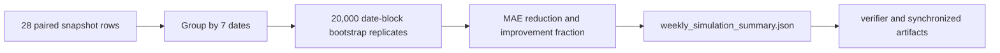

# Research and Technical Design

## Context

The weekly simulation already writes paired raw and calibrated absolute errors for every snapshot. The change adds a pure analysis layer to the same producer so the aggregate and uncertainty statistics cannot drift across separate scripts.

## Traceability

| Decision / component | Requirement | RQ / H / experiment |
| --- | --- | --- |
| date-block resampling | `EVD-010` | `RQ-E7-UNC-01` |
| deterministic percentile interval | `EVD-010` | `H-E7-UNC-01` |
| bounded synchronized wording | `EVD-010` | `CLM-E7-UNC-01`, E7 |

## Data Flow

## Decisions

### Decision: Bootstrap complete dates

- Choice: resample dates and retain all within-date snapshots.
- Rationale: morning, afternoon, night, and sleep observations share date-level conditions.
- Alternative: resample 28 snapshots independently.
- Consequence: wider and more defensible interval under repeated daily sampling.

### Decision: Keep uncertainty in the existing summary

- Choice: write the analysis under `aggregate.paired_day_block_bootstrap`.
- Rationale: one producer owns both point estimates and intervals.
- Alternative: create a separate analysis file.
- Consequence: verifier and presentation can load one evidence artifact.

## Failure Modes and Safeguards

| Failure mode | Detection | Handling |
| --- | --- | --- |
| missing date or error field | explicit validation exception | fail run; do not silently drop rows |
| nondeterministic results | rerun equality test | fixed seed and deterministic percentile |
| misleading independence | output metadata | resampling unit explicitly set to date |
| overclaim from positive interval | claim audit | preserve one-room/one-point/seven-day boundary |

## Artifact Synchronization

- Chinese thesis: abstract, E7 section/table/interpretation, conclusion, builder and generated outputs.
- IEEE paper: abstract, E7 analysis, validity boundary, generated PDF.
- Presentation: E7 result slide, outlines, speaker notes, both PPTX outputs.
- OpenSpec: add and accept `EVD-010`.
- Figures: no new figure required.
