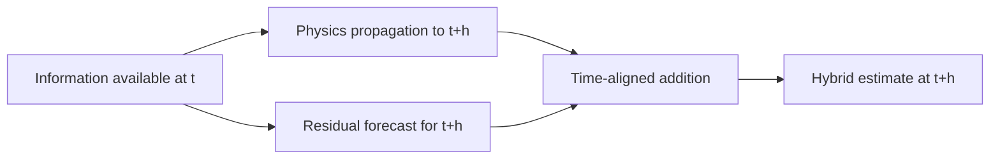

# Research and Technical Design

## Context

The project already implements an additive residual corrector for current scenario states. This change adds one literature source and an explicit time-semantics boundary without changing code, data, metrics, or the estimator.

## Traceability

| Decision / component | Requirement | RQ / H / experiment |
| --- | --- | --- |
| forecast-generalized equation | `HRL-007` | `RQ-HRL-TIME-01` |
| future-data exclusion | `HRL-007` | `CLM-HRL-TIME-01` |
| current implementation remains `h=0` | `HRL-007` | `B-HRL-TIME-01` |

## Architecture and Data Flow

## Decisions

### Decision: Condition the forecast on `I_t`

- Choice: use `ŷ(t+h | I_t)` for both additive terms.
- Rationale: target time and information availability become separately visible.
- Alternatives considered: omit conditioning and explain only in prose.
- Consequences: slightly longer formula, substantially lower leakage ambiguity.

### Decision: Preserve current-time notation for implemented experiments

- Choice: retain `F(p,t)+R(p,t)` and call it the `h=0` case.
- Rationale: the existing project evaluates scenario-time spatial fields, not a newly implemented next-day forecaster.
- Alternatives considered: rename all existing times to `t+h`.
- Consequences: prevents a documentation-only change from overstating implementation scope.

## Data Contracts

- Inputs and schemas: unchanged.
- Outputs and schemas: unchanged.
- Units and coordinate system: unchanged.
- Error and missing-data behavior: unchanged.

## Failure Modes and Safeguards

| Failure mode | Detection | Handling |
| --- | --- | --- |
| physics `t+h` interpreted as future truth | missing `I_t` or leakage sentence | require explicit forecast-origin information set |
| current estimator mislabeled as forecasting | `h>0` claim without forecast experiment | state `h=0` and current-state spatial-estimation boundary |
| citation added only to one artifact | DOI/source search | rebuild and inspect all synchronized artifacts |
| page or slide overflow | render QA and page count | shorten explanatory text without weakening leakage boundary |

## Compatibility and Migration

- Backward compatibility: full; no code or data-format change.
- Data migration: none.
- Rollback: remove only excess prose; retain citation and `I_t` leakage definition.

## Artifact Synchronization

- Chinese thesis/source/build/output impact: related work, formula explanation, bibliography, rebuild.
- IEEE source/output impact: related work, method notation, BibTeX, rebuild.
- Presentation source/outline/output impact: hybrid formula walkthrough and notes, rebuild.
- Figure impact: none.
