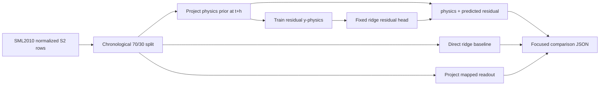

# Research and Technical Design

## Context

The existing E9 pipeline already provides normalized SML2010 samples, a pseudo-room physics mapping, a trained residual checkpoint, a direct linear baseline, and a chronological 70/30 split. The new evaluator reuses those contracts but creates a focused temperature-only report so the existing E9 headline counts remain stable.

## Traceability

| Decision / component | Requirement | RQ / H / experiment |
| --- | --- | --- |
| focused SML2010 S2 evaluator | `EVD-012` | `RQ-PHB-01`, `E9` |
| fixed additive residual head | `EVD-012` | `H-PHB-01` |
| five-comparator parity report | `EVD-012` | `EQ-PHB-01` |
| explicit non-reproduction label | `EVD-012` | `CLM-PHB-01` |

## Architecture and Data Flow

## Decisions

### Decision: Use a linear surrogate for the residual learner

- Choice: ridge `1e-3`, standardized on training rows only.
- Rationale: reproducible with repository dependencies, isolates additive residual logic, and avoids pretending to recreate an unavailable CNN--LSTM.
- Alternatives considered: installing TensorFlow and approximating the paper architecture; rejected because exact code/data and full hyperparameter details are unavailable.
- Consequences: result evaluates method transfer, not architectural fidelity.

### Decision: Keep the main E9 headline unchanged

- Choice: write a separate focused JSON for two temperature targets and three horizons.
- Rationale: the current 24 SML2010 target--horizon headline covers 15/60-minute multi-factor tasks; silently adding 1440-minute temperature rows would change its meaning.
- Alternatives considered: overwrite the main E9 output with a third horizon.
- Consequences: synchronized text must distinguish main E9 results from the supplementary published-method transfer.

## Data Contracts

- Inputs and schemas: existing normalized SML2010 CSVs and hybrid residual checkpoint.
- Outputs and schemas: JSON with provenance, method-fidelity statement, horizons, split counts, per-target metrics, MAE reductions, win counts, and hypothesis/claim decisions.
- Units and coordinate system: temperature in °C; horizons in minutes; spatial coordinates are inherited but no full-field claim is made.
- Error and missing-data behavior: missing inputs fail visibly; too few samples produce `NOT_EVALUATED`; non-finite values are excluded before split and counted.

## Failure Modes and Safeguards

| Failure mode | Detection | Handling |
| --- | --- | --- |
| target-time leakage | feature contract audit/test | fail evaluator |
| mismatched test rows | per-case count and index parity | fail verification |
| singular regression | ridge solver and finite coefficient test | fail visibly |
| paper reproduction overclaim | synchronized stale-text search | remove or weaken |
| 1440-minute data gaps | exact timestamp inclusion counts | record exclusions |

## Compatibility and Migration

- Backward compatibility: no existing output keys or task counts are changed.
- Data migration: none.
- Rollback: remove the focused runner/output and synchronized result text; keep literature reference.

## Artifact Synchronization

- Chinese thesis/source/build/output impact: add focused method-transfer protocol, results, and limitation.
- IEEE source/output impact: add concise public-task transfer result.
- Presentation source/outline/output impact: add/adjust method comparison content and speaker notes.
- Figure impact: none planned.
