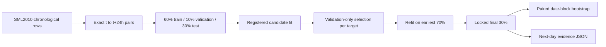

# Research and Technical Design

## Data Flow

## Core Formulation

The residual candidate uses

`y_hat(t+24h) = y(t) + delta_hat(t+24h | I_t)`.

This preserves the strong daily persistence baseline and asks the model to
learn only inter-day change. The registered feature vector combines current
indoor state, lagged indoor trends, origin-time boundaries and forecast,
timestamp cycles, and the project physics estimate. Standardization is fitted
on the current fit partition only.

## Selection and Refit

Every registered candidate produces validation predictions on identical rows.
The lowest-MAE candidate is selected separately for dining and room. The
selected candidate and hyperparameter are then refitted on the first 70% of
rows without revisiting the model choice. The latest 30% is evaluated exactly
once by the official runner.

The protocol 2.0 exploratory path is separate. It computes an online correction
from same-slot daily deltas that have completed by each forecast origin. This
allows adaptation to seasonal drift without future leakage, but its evidence
level is explicitly post-primary exploratory.

## Output Contract

The JSON SHALL include:

- input hashes and sample timestamps;
- split indices and counts;
- registered feature names and candidate grid;
- validation metrics for every candidate/hyperparameter;
- selected candidate per target;
- final-test predictions summarized by all registered metrics;
- identical-row and leakage audits;
- paired bootstrap intervals;
- hypothesis and bounded-claim decisions.
- separately labeled adaptive-online exploratory selection and metrics.

## Failure Modes

| Failure | Detection | Handling |
| --- | --- | --- |
| missing 24h or 7d lag | exact timestamp lookup | allowed-history fallback plus availability flag; count by partition |
| target-time leakage | explicit feature provenance audit and tests | fail evaluator |
| selection on test | selection trace contains test metric | fail tests/verifier |
| unstable regression | ridge solver/finite checks | visible failure |
| no improvement | hypothesis decision | preserve negative result |

## Synchronization

If executed, the result and its limitations SHALL be synchronized across the
Chinese thesis source/build/output, IEEE source/output, presentation source,
outlines, speaker notes, verifier, and archived OpenSpec evidence.
