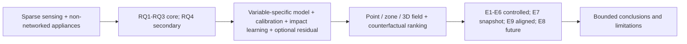

# Research and Technical Design

## Context

The existing top-down system tree answers “what responsibilities exist,” while the new overview must answer “why the thesis proceeds from gap to question, method, evidence, and bounded conclusion.”

## Traceability

| Decision / component | Requirement | RQ / H / experiment |
| --- | --- | --- |
| Core logic lane | `SYN-007` | `RQ1`--`RQ3` |
| Secondary service lane | `SYN-007` | `RQ4` |
| Evidence lane | `SYN-007` | `E1`--`E9` |
| Claim boundary | `RGV-005` | `H1`--`H5` |

## Architecture and Data Flow

## Decisions

### Decision: Add a thesis-level logic map

- Choice: create a new figure rather than overloading the existing system tree.
- Rationale: research argument and runtime architecture are different relationships.
- Alternatives considered: replace Figure 3-1; annotate every existing figure.
- Consequences: one additional figure and synchronized placements.

### Decision: Use a deterministic local SVG renderer

- Choice: extend `build_architecture_diagrams.py`.
- Rationale: matches existing typography, dimensions, and offline reproducibility.
- Alternatives considered: Mermaid CLI only; raster-only artwork.
- Consequences: source and rendered output stay versioned and testable.

## Data Contracts

- Inputs and schemas: current RQ registry, E1--E9 registry, method names, claim boundaries.
- Outputs and schemas: 1600×900 SVG and derived PNG assets.
- Units and coordinate system: SVG viewBox pixels; no research measurement units.
- Error and missing-data behavior: missing renderer mapping or unreadable output fails tests/QA.

## Failure Modes and Safeguards

| Failure mode | Detection | Handling |
| --- | --- | --- |
| labels too dense | visual PNG inspection | shorten labels or enlarge placement |
| E8 appears completed | source audit | explicitly mark future intervention |
| RQ4 dominates novelty | source audit | use secondary/dashed service relationship |
| output drift | rebuild and stale-text search | update all sources together |

## Compatibility and Migration

- Backward compatibility: retain all existing architecture figures and filenames.
- Data migration: none.
- Rollback: remove new placements and renderer entry.

## Artifact Synchronization

- Chinese thesis/source/build/output impact: add overview and caption.
- IEEE source/output impact: use overview as early architecture/logic figure.
- Presentation source/outline/output impact: use overview in early narrative.
- Figure impact: add SVG and derived PNG.
