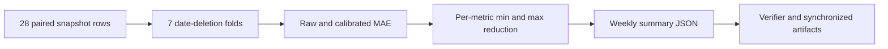

# Research and Technical Design

## Context

The weekly producer already retains per-snapshot date, raw pillow error, and calibrated pillow error. The new analysis is a pure deterministic reduction over those rows and does not rerun or tune the spatial model.

## Traceability

| Component | Requirement | Research ID |
| --- | --- | --- |
| date grouping and deletion | `EVD-014` | `RQ-E7-LODO-01` |
| minimum reduction decision | `EVD-014` | `H-E7-LODO-01` |
| bounded synchronized wording | `EVD-014` | `CLM-E7-LODO-01` |

## Data Flow

## Decisions

- Reuse `_paired_metric_summary` so point estimates and sensitivity folds share the same MAE definition.
- Store every fold, not only extrema, so adverse results remain auditable.
- Keep the output under `aggregate` beside the existing block bootstrap.

## Failure Modes and Safeguards

| Failure | Detection | Handling |
| --- | --- | --- |
| missing date/error | explicit validation | fail instead of dropping rows |
| only one date | date-count check | fail because deletion leaves no comparison |
| non-positive fold | summary flag and verifier | preserve result and reject hypothesis |
| overclaim | synchronized wording search | keep one-room/one-point/seven-date boundary |

## Artifact Synchronization

- Chinese thesis Markdown and DOCX builder plus DOCX/PDF outputs.
- IEEE source and PDF.
- Presentation builder, both outlines, speaker notes, and both PPTX outputs.
- Professor-facing weekly report.
- Main evaluation spec after evidence acceptance.
- No new figure is required.
