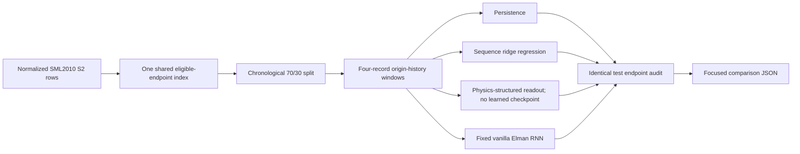

# Research and Technical Design

## Context

The existing E9 pipeline already builds chronological SML2010 S2 samples and physics-mapped features. The new evaluator reuses those samples but creates a focused same-data sequence comparison. A separate application-fit note and Kalman design note keep future research positioning distinct from current experimental evidence.

## Traceability

| Component | Requirement | Research ID |
| --- | --- | --- |
| same-row comparator audit | `EVD-015`, `RPD-007` | `RQ-RNN-01`, `CLM-RNN-01` |
| vanilla Elman RNN | `HRL-008` | `RQ-RNN-01` |
| `20–30 °C` hard boundary | `SFE-007`, `RGV-007` | `EQ-APP-01`, `CLM-APP-01` |
| tolerance-based human comfort wording | `ACT-007` | `EQ-APP-01` |
| Kalman future protocol | `HRL-009` | `EQ-KF-01`, `CLM-KF-01` |

## RNN Data Flow

## Decisions

### Decision: Use a fixed small vanilla RNN

- Choice: one tanh recurrent layer, six hidden units, four-step history, multi-output head.
- Rationale: directly answers the professor's request while remaining executable in the repository's standard-library environment.
- Consequence: this is a low-capacity baseline, not an optimized LSTM/GRU claim.

### Decision: Disable learned synthetic residual weights in the primary parity ranking

- Choice: the project comparator uses fixed physics structure plus a public-data readout trained on the same rows.
- Rationale: other data-driven methods must not be disadvantaged by the project's additional synthetic learned checkpoint.
- Consequence: the comparison tests structured physics versus raw-sequence baselines, not the full optional hybrid stack.

### Decision: Separate candidate application from validated application

- Choice: dynamic plant growth chamber/plant-factory modules inside `20–30 °C` are a candidate direction only.
- Rationale: they match dynamic environmental recipes, but the present project lacks plant-light and biological variables.
- Consequence: thesis wording may motivate future work but cannot claim cultivation performance.

### Decision: Keep Kalman as registered future work in this round

- Choice: literature synthesis plus an executable future protocol, no project metric yet.
- Rationale: state equations, observation equations, and noise models must be chosen before seeing results.
- Consequence: status remains `NOT_EVALUATED`.

## Failure Modes and Safeguards

| Failure mode | Detection | Handling |
| --- | --- | --- |
| comparator row mismatch | endpoint count/hash audit | no ranking, `NOT_EVALUATED` |
| target-time leakage | feature/timestamp tests | fail experiment |
| RNN divergence | finite-loss and finite-prediction tests | preserve failed status |
| history-only advantage | same-window sequence linear baseline | disclose comparison |
| application exceeds range | min/max temperature audit | mark `out_of_domain` |
| lux treated as PPFD | construct audit | mark `needs_extension` |
| Kalman assumed beneficial | adverse-literature review | retain conditional wording |

## Compatibility and Migration

- Existing E9 headline files and counts remain unchanged.
- The focused RNN comparison is an additional JSON output.
- Existing service interfaces are unchanged.
- If the RNN evaluator is removed, the OpenSpec direction and literature notes may remain with status `NOT_EVALUATED`.

## Artifact Synchronization

- Chinese thesis and build source: add professor-guidance subsection, RNN result, application boundary, and Kalman future work.
- IEEE paper: concise RNN parity result and application/temperature boundary; cite only sources used.
- Presentation: add comparator and scope-direction bullets; update both outlines and notes.
- Weekly report: add this week's professor directions and executed response.
- Generated DOCX/PDF/PPTX/IEEE PDF: rebuild and visually check affected pages/slides.
