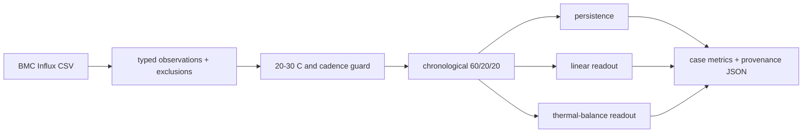

# Research and Technical Design

## Context

The room estimator models temperature, humidity and illuminance fields, while the enclosure transfer currently has no executable contract. `E11A` introduces a separate temperature-only public-task adapter so enclosure assumptions cannot silently alter the validated room pipeline.

## Traceability

| Decision / component | Requirement | RQ / H / experiment |
| --- | --- | --- |
| BMC parser and provenance | `ENC-001` | `RQ-ENC-01`, `E11A` |
| shared chronological examples | `ENC-002` | `H-ENC-01`, `E11A` |
| domain and claim guard | `ENC-003` | `CLM-ENC-01` |
| AAU/HazardNet source routing | `ENC-004` | `RQ-ENC-03` |

## Architecture and Data Flow

## Decisions

### Decision: Separate temporal transfer from spatial transfer

- Choice: `E11A` predicts outlet air temperature only；AAU 3-D geometry and airflow become a later `E11B` change。
- Rationale: BMC provides the variables needed for temporal thermal balance but not dense spatial truth。
- Alternatives considered: shrinking the room model or claiming BMC sensors form a 3-D field。
- Consequences: early evidence is narrow but defensible；room model remains unchanged。

### Decision: Fit outlet-temperature change in the thermal model

- Choice: model `T_out(t+1)-T_out(t)` from boundary difference, power, and fan-modulated difference。
- Rationale: these terms mirror a first-order lumped energy balance while allowing coefficients to be identified from data。
- Alternatives considered: CFD, unrestricted neural model, direct reuse of room AC device equations。
- Consequences: model is lightweight and interpretable but cannot resolve local component hotspots。

### Decision: Keep raw public data local

- Choice: CLI accepts explicit source paths and writes only summary evidence。
- Rationale: source files are large and have independent provenance/license requirements。
- Alternatives considered: commit a copied sample from the dataset。
- Consequences: clean-room runs require separately acquired data and recorded checksums。

## Data Contracts

- Inputs and schemas: InfluxDB-style CSV; comment rows beginning `#` ignored; aliases are case-insensitive。
- Outputs and schemas: JSON with `protocol`, `cases`, `summary`, per-split hashes, exclusions and all method metrics。
- Units and coordinate system: °C, W, RPM, seconds；no spatial coordinate in `E11A`。
- Error and missing-data behavior: missing files produce an error; insufficient eligible pairs produce a visible non-`ok` case。

## Failure Modes and Safeguards

| Failure mode | Detection | Handling |
| --- | --- | --- |
| PID 35 °C or other out-of-domain trace | current/next air-state guard | exclude and report；do not broaden range |
| irregular logging gap | gap > 3× median positive cadence | exclude pair and count |
| fan/power field absent | parser required-channel check | exclude row and report |
| singular features | standardized ridge regression | fixed ridge `1e-3`; preserve metrics |
| thermal model loses | lowest-MAE comparison | retain adverse case; hypothesis may fail |

## Compatibility and Migration

- Backward compatibility: no existing room, MCP, Web or manuscript interface changes。
- Data migration: none；future normalized enclosure schema must be a separate OpenSpec delta。
- Rollback: remove the isolated enclosure package, runner and active change without changing room evidence。

## Artifact Synchronization

- Chinese thesis/source/build/output impact: only after `E11A` evidence changes status or claims。
- IEEE source/output impact: only after evidence acceptance。
- Presentation source/outline/output impact: only after evidence acceptance。
- Figure impact: none in setup phase；future result figure must preserve public-task label。
