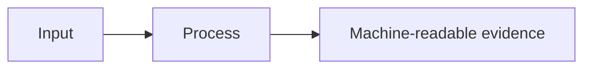

# Research and Technical Design

## Context

<!-- Current architecture, evidence state, and constraints. -->

## Traceability

| Decision / component | Requirement | RQ / H / experiment |
| --- | --- | --- |
| <!-- --> | `CAP-???` | `RQ?`, `H?`, `E?` |

## Architecture and Data Flow

## Decisions

### Decision: <!-- name -->

- Choice:
- Rationale:
- Alternatives considered:
- Consequences:

## Data Contracts

- Inputs and schemas:
- Outputs and schemas:
- Units and coordinate system:
- Error and missing-data behavior:

## Failure Modes and Safeguards

| Failure mode | Detection | Handling |
| --- | --- | --- |
| <!-- --> | <!-- --> | <!-- --> |

## Compatibility and Migration

- Backward compatibility:
- Data migration:
- Rollback:

## Artifact Synchronization

- Chinese thesis/source/build/output impact:
- IEEE source/output impact:
- Presentation source/outline/output impact:
- Figure impact:
